# About React JS

- **React.js** is a JavaScript library and not a framework for building user interfaces, primarily for single-page applications where the data dynamically updates without requiring a full page reload. 
- It's component-based, which means it lets developers create reusable UI components that manage their own state. React was originally developed by Facebook (now Meta), which introduced it in 2013 to solve the challenges of managing complex and interactive user interfaces.

## Component Based 

### What does **component-based** means??

- Lets say you wanna build below page


- Traditionally , you would write several HTML, CSS and JS files. These files will be separately maintained. Any change in design or function , the corresponding CSS or JS file would be modified. This is an overhead task where developer needs to switch between these files.
- The idea behind React is to break the page into several components. Referring above image, you will have component for menu bar, you will have component for *Read* , Similarly you will have component for *Practice* and so on.
- Each component will have its own CSS and JS. So whenever you wanna change any part of your page, you just require to edit that particular component CSS or JS.

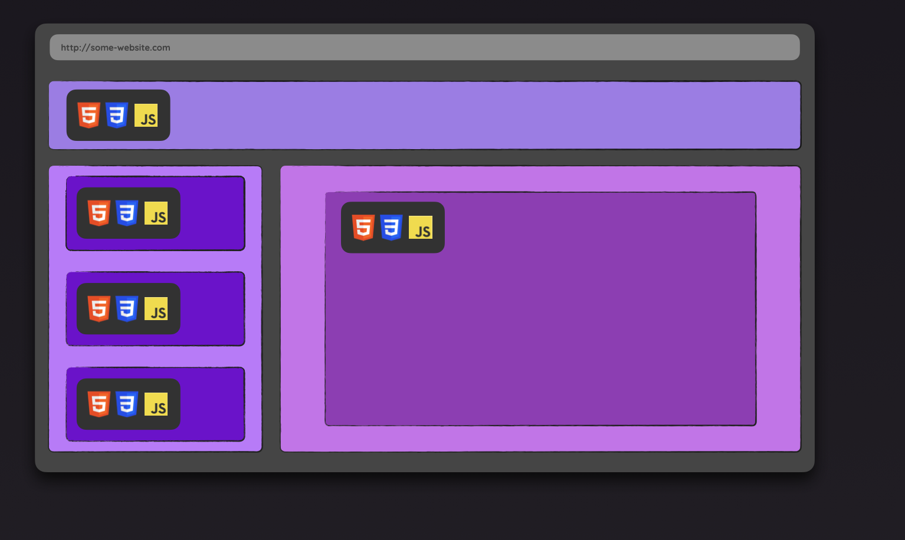

- These component can be reuse as well. Lets say in the above image, there are 3 widgets (**Read, Practice and Learn**). If you observer the styling and layout are same. Only the content and images are being varying, so you can make a generalize component of that widget and reuse it by passing the content and images. Any change require will be affected to 3 of them.
- That's why React is a component based library. Each component is a small, reusable piece of UI that manages its own state and renders as needed.


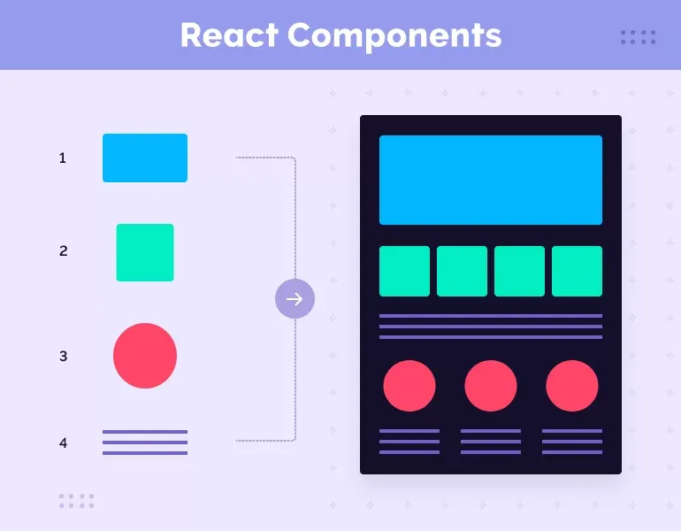


- Components are reusable and independent building blocks of a React application's user interface. They divide the UI into smaller, manageable parts, making development, testing, and maintenance easier. Each component manages its own logic and appearance, allowing for modular and organized code.

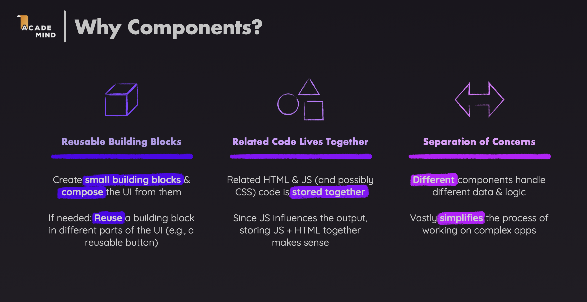

- Components promote reusability, reducing code duplication and development time. A component can be used multiple times throughout the application, even in different projects, ensuring consistency and efficiency. When changes are needed, updating a single component automatically reflects those changes everywhere it's used.
- Lets start create a project using React JS.

```
npx create-react-app textutilities              OR          npm create-react-app textutilities 
```

- Whats the difference between **npx** and **npm**?

### `npx (Node Package eXecute)`

- `npx create-react-app my-app`
    - One-time use: `npx` lets you use `create-react-app` without installing it on your computer.
    - Always up-to-date: It will always get the latest version automatically.
    - Recommended for most people: Since it doesn’t leave extra files on your computer, it’s a cleaner and easier option if you don’t make React apps every day.

### `npm (Node Package Manager)`
- `npm install -g create-react-app` and then `create-react-app my-app`
    - Permanent install: You’re adding create-react-app to your computer, so it’s ready whenever you want to make a new React app.
    - You’re responsible for updates: It stays at that version until you update it yourself.
    - Useful if you create React apps often: This makes the setup a bit faster if you’re working on multiple projects.


>[!NOTE]
> - For most people, `npx create-react-app my-app` is easier and recommended. It keeps things simple by always using the latest version without installing extra stuff on your computer. 
> - For most developers, using `npx create-react-app my-app` is recommended because:
>   - It saves space by not permanently installing the tool.
>   - It ensures you’re always using the latest version.
> - `create-react-app` is deprecated in latest react version so you need to use vite `npm create vite@latest my-react-app -- --template react`

### Create React Project

- Post running the `npx` command we can see below folder structure gets created.

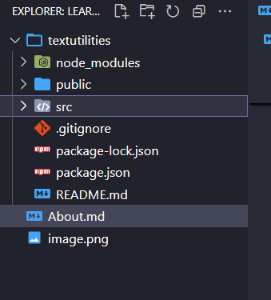

- Here’s a simple breakdown of each part:
    - **node_modules**: This is a folder that contains all the code libraries (called `packages`) your app needs to run. When you install libraries with npm, they go here. You usually don’t touch this folder directly. Basically the dependencies.
    - **package.json**: **This file keeps track of the libraries and versions your app uses**. It also contains some basic information about your app, like its name and version. It’s like the app’s “table of contents” for dependencies.
    - **package-lock.json**: **This file “locks” the specific versions of each library** so that if someone else installs your app, they get the exact same versions. It helps make sure everything works the same on different computers.
    - **src** (Source): This folder is where you write most of your code! It contains the app’s main logic and components. You’ll find files like **`App.js`** here, which is the main file for your app’s code.
    - **public**: This folder holds files that won’t change, like images or the main HTML file (`index.html`). React injects your code into this HTML file so it can show up on the web page.
    - **README.md**: This file usually has information about your app, like what it does and how to run it. It’s helpful for others who might work on your app later.

- Lets open **index.html** file

```
<!DOCTYPE html>
<html lang="en">
  <head>
    <meta charset="utf-8" />
    <link rel="icon" href="%PUBLIC_URL%/favicon.ico" />
    <meta name="viewport" content="width=device-width, initial-scale=1" />
    <meta name="theme-color" content="#000000" />
    <meta
      name="description"
      content="Web site created using create-react-app"
    />
    <link rel="apple-touch-icon" href="%PUBLIC_URL%/logo192.png" />
    <link rel="manifest" href="%PUBLIC_URL%/manifest.json" />
    <title>React App</title>
  </head>
  <body>
    <noscript>You need to enable JavaScript to run this app.</noscript>
    <div id="root"></div>
  </body>
</html>
```

- Under the `public/` folder this **index.html** file is present, all other files are static which are redundant.
- Under the `src/` folder if you see there is an **index.js** file

```
import React from 'react';
import ReactDOM from 'react-dom/client';
import './index.css';
import App from './App';
import reportWebVitals from './reportWebVitals';

const root = ReactDOM.createRoot(document.getElementById('root'));
root.render(
  <React.StrictMode>
    <App />
  </React.StrictMode>
);
reportWebVitals();
```

- There is one more file called **App.js**.

```
import logo from './logo.svg';
import './App.css';

function App() {
  return (
    <div className="App">
      <header className="App-header">
        
        <p>
          Edit <code>src/App.js</code> and save to reload.
        </p>
        <a
          className="App-link"
          href="https://reactjs.org"
          target="_blank"
          rel="noopener noreferrer"
        >
          Learn React
        </a>
      </header>
    </div>
  );
}

export default App;
```

- **`App.js`**
    - **Main Component**: `App.js` is the main component of your React app. Think of it as the “home” for your app’s code, where you can organize what’s displayed on the page.
    - **What It Does**: This file has the main structure and styling for your app. Inside `App.js`, you can add other smaller HTML components or write the main content you want users to see.
- **`index.html`** (in the Public Folder)
    - **Static HTML Page**: This is a simple HTML file with a `<div>` element with an `id="root"`.
    - **React Injection Point**: React uses JavaScript to inject everything from `App.js` and other components into this root `div`. So, instead of having lots of HTML files, React puts everything inside this single `index.html` through JavaScript.
- **`index.js`** (in the src Folder)
    - **Starting Point**: `index.js` is where React’s code starts running. It’s like the “control center” that tells React what to display.
    - **Connecting `App.js` to `index.html`**: `index.js` imports `App.js` and then uses a React function (`ReactDOM.render`) to load everything from `App.js` into the root div in `index.html`. If you see in `index.js` there is an `<App/>` tag , this is a component

- Inside **`index.js`** file we can see below code

```
const root = ReactDOM.createRoot(document.getElementById('root'));

root.render(
  <React.StrictMode>
    <App />
  </React.StrictMode>
);
```

- `document.getElementById('root')` it finds the `<div>` in `index.html` with `id="root"` inside `index.html`. It's just plain JavaScript DOM manipulation — like you do in vanilla JS.
- `ReactDOM.createRoot(...)` creates a "root" React container. New in React 18 this uses "concurrent rendering", which is faster and smarter than the old `ReactDOM.render(...)`. It tells React *Hey React, this is the area of the page (the 'root' div) where you will take control and manage everything.*
- `.render(...)` injects and renders your entire React component tree inside that root div. Here you're saying *Render the `<App /> `component inside `<div id="root"></div>`.*
- What is `<React.StrictMode>`? It’s a helper component (does not render anything visible). It enables additional checks and warnings for:
  - Detecting side effects.
  - Warning about deprecated APIs.
  - Double-invoking some lifecycle methods (only in development mode, not in production).

```
// index.html
<body>
  <div id="root">
    <!-- React will inject App here -->
  </div>
</body>

index.jsx:
- find div#root
- create a React "root" inside that div
- render <App /> inside that root
Result after rendering looks like:

<body>
  <div id="root">
    <div> <!-- All your App component and its children are here --> </div>
  </div>
</body>
```

- Lets run our simple app

```
  cd texutilities
  npm start
```

>[!NOTE]
> - `node_modules` folder is required to start your application and **it is not usually committed in github repositories because it can be regenerated again by using `npm install`**. So first generate the `node_modules` by running command `npm install` then start your application.

- In Terminal

```
You can now view texutilities in the browser.

  Local:            http://localhost:3000
  On Your Network:  http://192.168.1.6:3000

Note that the development build is not optimized.
To create a production build, use npm run build.
```

- On browser we can see 

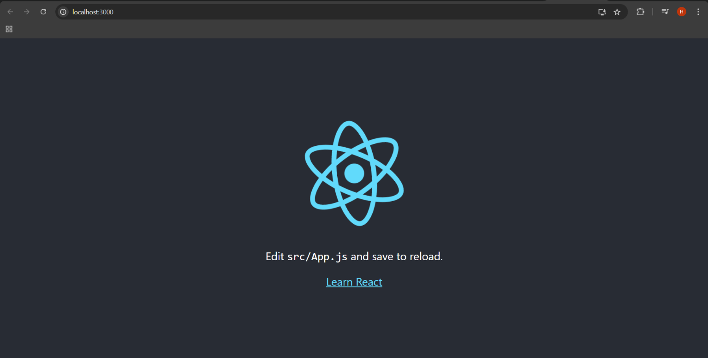

- In the **App.js** file, if we change the content, its get reflected automatically

```
import logo from './logo.svg';
import './App.css';

function App() {
  return (
    <div className="App">
      <header className="App-header">
        
        <p>
          Hello World
        </p>
        <a
          className="App-link"
          href="https://reactjs.org"
          target="_blank"
          rel="noopener noreferrer"
        >
          Learn React
        </a>
      </header>
    </div>
  );
}

export default App;
```

- On browser

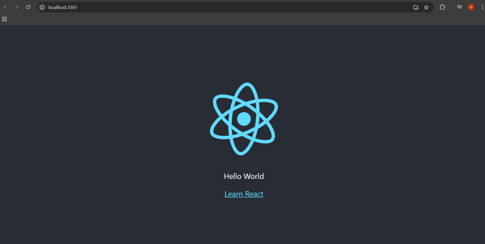

- Using `{}` curly braces in React's JSX syntax are used to embed JavaScript expressions, allowing for the dynamic passing of values. These expressions can include variables, function calls, and even inline operations, providing flexibility in rendering dynamic content.
- So below is `App.js` file

```
import React from 'react';
import './App.css';

function App() {
  const greeting = `Hello, Harsh!`;
  const randomNumber = Math.floor(Math.random() * 10);

  return (
    <div>
      <p>{greeting}</p>
      <p>Random Number: {randomNumber}</p>
      <p>2 + 2 = {2 + 2}</p>
    </div>
  );
}

export default App;
```

- On browser

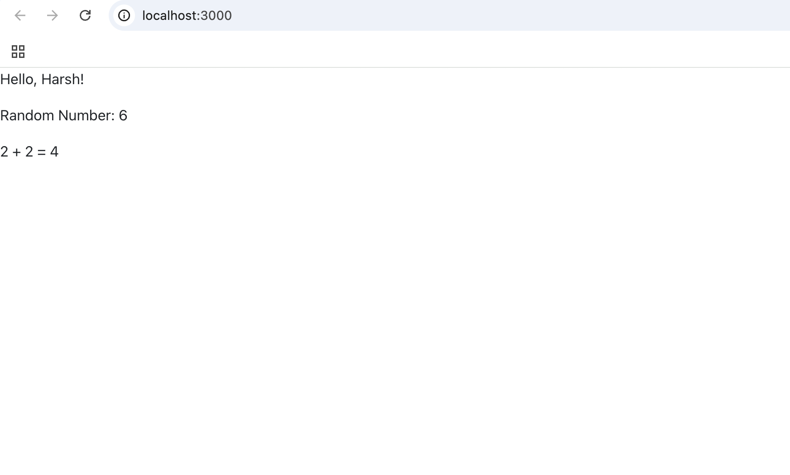

- We can import images or any assets in react

```
import React from 'react';
import './App.css';
import reactImage from './logo.svg';

function App() {
  const greeting = `Hello, Harsh!`;
  const randomNumber = Math.floor(Math.random() * 10);
  const style ={
   height : 400,
   width : 400,
  }

  return (
    <div>
      
      <p>{greeting}</p>
      <p>Random Number: {randomNumber}</p>
      <p>2 + 2 = {2 + 2}</p>
    </div>
  );
}

export default App;
```

- On browser

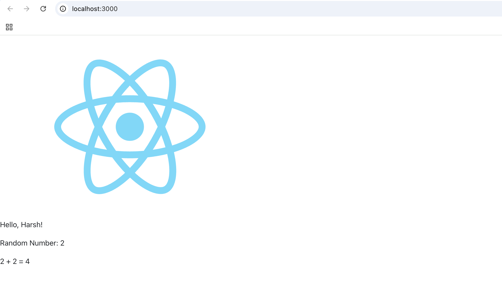

- It is possible to import various types of assets in React, including images, and they are handled as objects. When you import an image (or other file types) in React using the `import` statement, it doesn't directly embed the file's content into your code. Instead, it creates a reference, which acts like an object containing information about the imported asset, such as its path.
- `reactImage` becomes an object that holds the resolved path to the image file. In a React project (especially with bundlers like Webpack, Vite, Create React App), you can import not just `.js` or `.jsx` files - you can also import images, CSS files, JSON files, SVGs, and more.
- When you import these files, they don’t behave like raw files, they behave like JavaScript objects or URLs that point to the final processed file.
- `reactImage` is not the image itself. It's a string that contains the URL to the optimized image file after build. React (and Webpack) bundle it properly so it works even when you deploy.
- Lets edit the **App.js** file and lets some implement basic elements

```
import './App.css';


let h1Content="ABC"
function App() {
  return (
    <div className="App">
      <h1>Hello!, My name is {h1Content}</h1>
      <p>Lorem ipsum dolor sit amet consectetur adipisicing elit. Consectetur aspernatur a recusandae omnis consequuntur, impedit officiis at quae aut dignissimos nisi corporis fuga! Deserunt eum omnis voluptatum minus in adipisci.</p>
    </div>
  );
}

export default App;
```

- On browser 

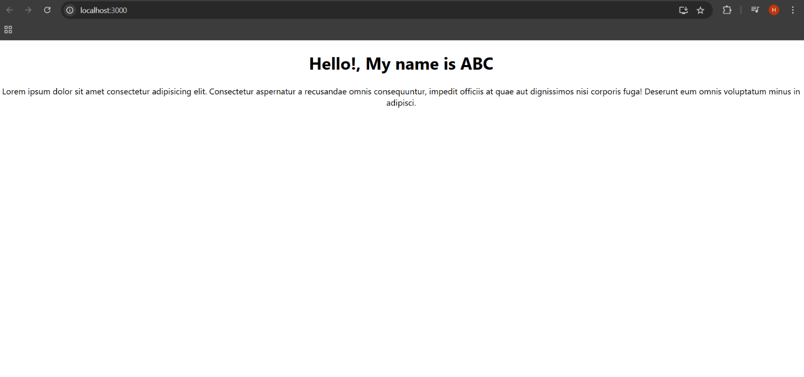

- If you observer , we have defined Javascript variable `let h1Content="ABC"` and used it inside the HTML `<h1>Hello!, My name is {h1Content}</h1>`. The `return` function thus gives us HTML, CSS and JS code, the component that is returned by `App` function is called **JSX (JavaScript XML or JavaScript syntax eXtension)**.
- JSX stands for JavaScript XML. It’s a syntax that lets you write HTML-like code directly in JavaScript files. Even though it looks like HTML, it’s actually JavaScript under the hood. JSX makes it easy to combine JavaScript logic and HTML structure within your components, so your code stays readable and organized.


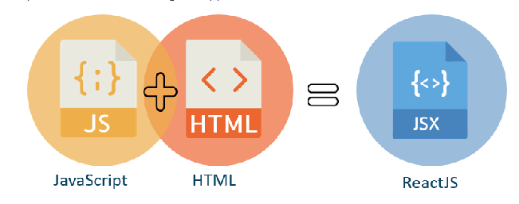


- JSX makes it easy to see both the structure (HTML-like) and logic (JavaScript) of your components in one place. Instead of splitting code between HTML files and JavaScript files, JSX lets you:
    - Build UI components directly in JavaScript.
    - Embed logic (like `{h1Content}`) alongside your HTML structure.
    - Style elements directly with className or inline CSS.
- JSX is very similar to HTML, but it has a few key differences in how attributes are named as we are writing HTML code inside javascript file, there will be conflict in the keywords preserved by both of them.
-  In JavaScript, `class` is a reserved keyword used to define classes (for example, `class MyComponent {}`). So, React uses `className`, to avoid conflicts. Similarly, `for` is a reserved word in JavaScript (used in `for` loops). So, React uses `htmlFor` instead when setting labels for inputs in JSX. In HTML, `tabindex` is all lowercase, but in JSX, it’s `tabIndex` with camelCase, which matches JavaScript naming conventions.
- Most other HTML attributes remain the same (like `src`, `alt`, `title`, etc.), as they don’t conflict with JavaScript syntax. However, custom attributes or event handlers are camelCased, like `onClick` and `onChange`.
- Behind the scenes, JSX is **transformed by tools like Babel** into JavaScript `React.createElement() `calls. When you use JSX, the compiler transforms it into React function calls that the browser can understand.

```
import './App.css';

let h1Content = "ABC";
function App() {
  return React.createElement(
    'div',
    { className: 'App' },
    React.createElement('h1', null, `Hello!, My name is ${h1Content}`),
    React.createElement(
      'p',
      null,
      'Lorem ipsum dolor sit amet consectetur adipisicing elit. Consectetur aspernatur a recusandae omnis consequuntur, impedit officiis at quae aut dignissimos nisi corporis fuga! Deserunt eum omnis voluptatum minus in adipisci.'
    )
  );
}

export default App;
```

- Using JSX isn’t mandatory, but it’s popular because it makes React code more readable and expressive. If you don’t use JSX, you’ll need to use pure JavaScript to define elements. To make this work, React elements must be created using `React.createElement()`. Additionally, you need to defined a compiler like Babel (a JavaScript compiler) which is required to convert your code into JavaScript that the browser understands.
- JSX code is a non-standard feature. It's not supported by the browser directly and therefore the code you write is not the code that ends up in the browser with all your custom tags.

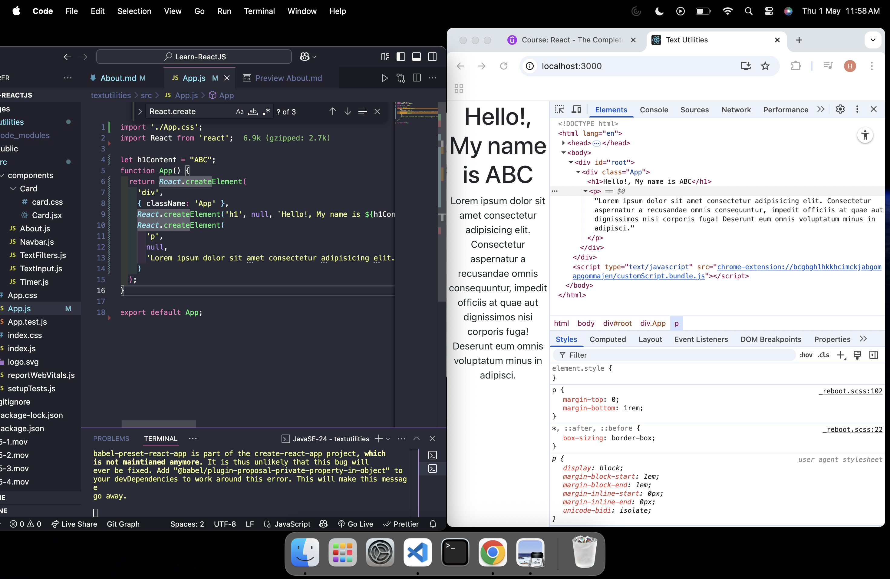

- Babel, a build process that's running behind the scenes that actually transforms and potentially also optimizes our code such that it does work in the browser.
- In theory, you could also build React apps without using JSX. You technically don't need JSX to build a React project. It's just convenient. Referring the below code

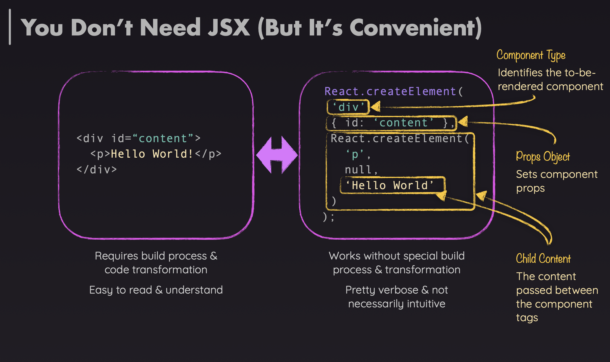


- To create component you need to use the `createElement` method exposed by `React` to create that same structure, that same HTML code in the end. For that, this `createElement` method takes the component type that should be created, so to say, as the first argument, then takes the props object you might want to pass to that component or element. And then you can also have child elements as the third argument so that you can control which content goes between the opening and closing tag of that component.
- JSX approach is typically easier to use and definitely easier to read and understand because this non-JSX approach, of course, is pretty verbose and not necessarily intuitive.
- Consider below **App.js** file

```
import logo from './logo.svg';
import './App.css';

function App() {
  return (
    <div className="App">
      <header className="App-header">
        
        <p>
          Hello World
        </p>
        <a
          className="App-link"
          href="https://reactjs.org"
          target="_blank"
          rel="noopener noreferrer"
        >
          Learn React
        </a>
      </header>
    </div>
  );
}

export default App;
```


- Here **`App()` is component and it is just a javascript function returning a renderable content**.
- **In React, component function names must start with a Capital Letter.** If you are writing your own React component, the name must start with a capital letter like `MyComponent`, `Header`, `LoginForm`, etc.
- Why so? React depends on capitalization to decide:
  - If a tag is a custom component (like `<MyComponent />`)
  - Or a normal HTML tag (like `<div>`, `<h1>`, etc.)
- If you start with a lowercase (like `loginform`), React will treat it like an HTML element — and will not render your component properly (or might throw a warning).
- Wrong way of writing components

```
function loginform() {
  return <h1>Login Form</h1>;
}

// In App.jsx
export default function App() {
  return (
    <div>
      <loginform /> {/* React thinks 'loginform' is an HTML tag. */}
    </div>
  );
}
```

- Correct way of writing components

```
function LoginForm() {
  return <h1>Login Form</h1>;
}

// In App.jsx
export default function App() {
  return (
    <div>
      <LoginForm /> {/* React knows this is a component */}
    </div>
  );
}
```

- In React, you can use both `.jsx` and `.js` file extensions for components.
  - `.jsx` — This is the official extension for files containing JSX (i.e., JavaScript + HTML syntax like `<div>Hello</div>`).
  - `.js` — Many projects still use `.js` even if they contain JSX. This is very common
- Modern React setups (like Create React App, Vite, Next.js) are already configured to parse both `.js` and `.jsx` files with JSX inside.
- React does not care about the file extension itself — it's the build tool (like Babel) that parses your code and converts JSX into regular JavaScript.
- Use `.jsx` if the file mostly contains React components with JSX — it makes it easier for other developers (and yourself) to understand the file purpose at a glance.
- But using `.js` is perfectly fine too — just be consistent across your project.
- Lets create another `h1` tag

```
import './App.css';

let h1Content="ABC"
function App() {
  return (
    <div className="App">
      <h1>Hello!, My name is {h1Content}</h1>
      <p>Lorem ipsum dolor sit amet consectetur adipisicing elit. Consectetur aspernatur a recusandae omnis consequuntur, impedit officiis at quae aut dignissimos nisi corporis fuga! Deserunt eum omnis voluptatum minus in adipisci.</p>
    </div>
    <h1> Hello </h1>
  );
}

export default App;
```

- The above code will give error

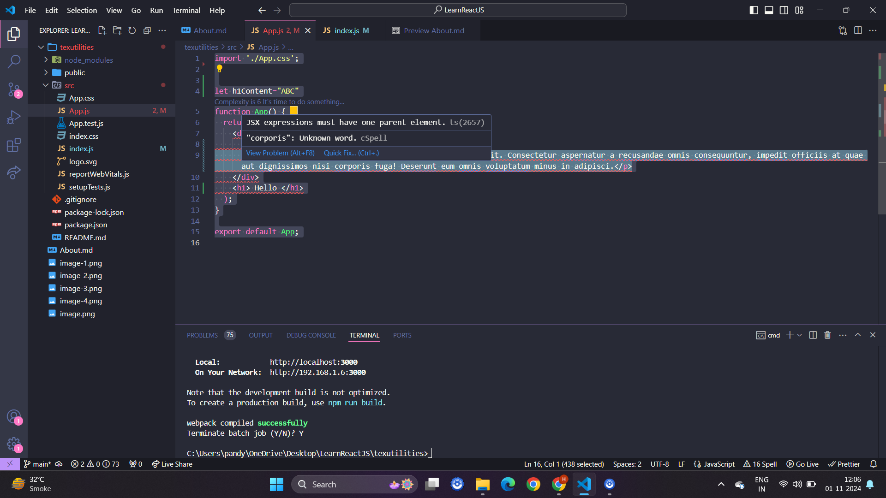

- Why so? In React, every component can return only one single parent element. This is a design decision because React needs a single “container” element to manage each component **effectively within the Virtual DOM**, which keeps rendering updates efficient. Fewer DOM elements mean lighter page structure, which can improve page load times and rendering.

*We will learn about Virtual DOM later*.

- To return multiple elements without an extra wrapper like a `<div>` like below 

```
import './App.css';


let h1Content="ABC"
function App() {
  return (
    <div className="App">
      <h1>Hello!, My name is {h1Content}</h1>
      <p>Lorem ipsum dolor sit amet consectetur adipisicing elit. Consectetur aspernatur a recusandae omnis consequuntur, impedit officiis at quae aut dignissimos nisi corporis fuga! Deserunt eum omnis voluptatum minus in adipisci.</p>
      <h1> Hello </h1>
    </div>
  );
}

export default App;
```

- If we inspect the HTML, we can see all the HTML elements are bundled under `<div className="App">`. 

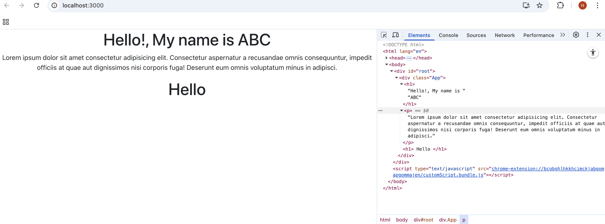

- However, adding unnecessary `<div>` can clutter your HTML structure and impact styling or layout. Now if you try to remove `div` you will get an compilation error.

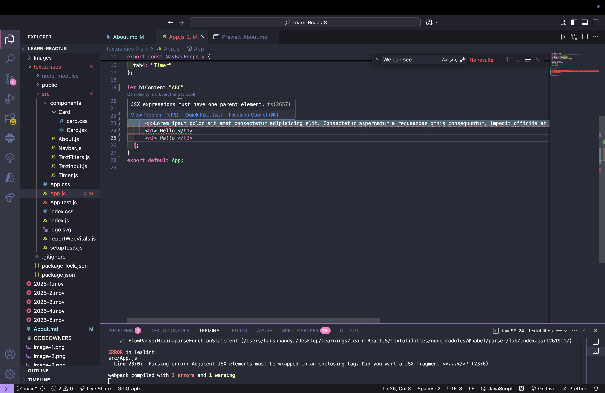

- Traditionally, React components were limited to returning a single root element, leading to developers often using div as a placeholder. However, fragments enable you to group multiple elements without adding unnecessary wrapper tags to the DOM. React Fragments allow you to avoid wrapping multiple elements in a div when returning from a component.
- React Fragments (`<></>`) allow you to group elements without adding extra nodes to the DOM. When you don’t want extra `div` wrappers that might mess up your styling or create unnecessary DOM nodes. You can use **`Fragments`**. A fragment lets you group multiple elements.

```
import './App.css';
import { Fragment } from 'react';

let h1Content="ABC"
function App() {
  return (
    <Fragment>
    <div className="App">
      <h1>Hello!, My name is {h1Content}</h1>
      <p>Lorem ipsum dolor sit amet consectetur adipisicing elit. Consectetur aspernatur a recusandae omnis consequuntur, impedit officiis at quae aut dignissimos nisi corporis fuga! Deserunt eum omnis voluptatum minus in adipisci.</p>
    </div>
    <h1> Hello </h1>
    </Fragment>

  );
}

export default App;
```

- On browser 

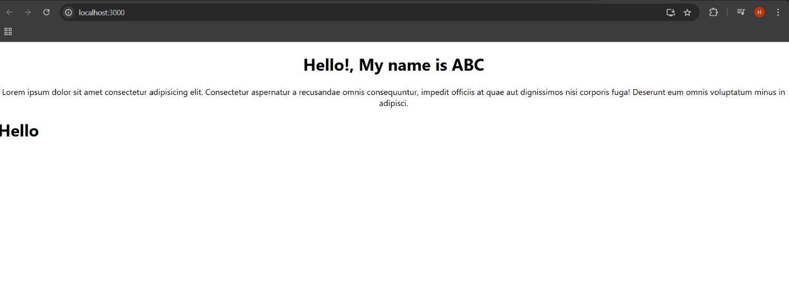

- When we inspect the HTML, we can see there is no extra `div`.

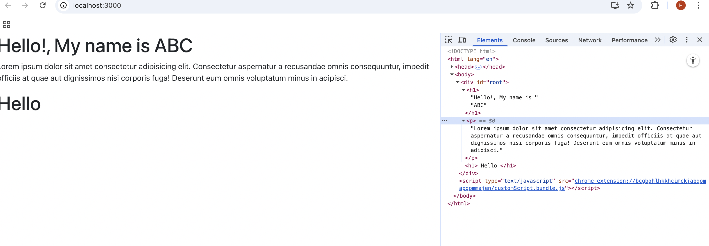

- This behaves exactly like the example with `<div>`, but no extra wrapper is added to the DOM. `Fragments` make your code more readable by removing the need for an extra div in many cases. 
- Alternatively you can use `<>..</>` short syntax for fragments.

```
import './App.css';

let h1Content="ABC"
function App() {
  return (
    <>
    <div className="App">
      <h1>Hello!, My name is {h1Content}</h1>
      <p>Lorem ipsum dolor sit amet consectetur adipisicing elit. Consectetur aspernatur a recusandae omnis consequuntur, impedit officiis at quae aut dignissimos nisi corporis fuga! Deserunt eum omnis voluptatum minus in adipisci.</p>
    </div>
    <h1> Hello </h1>
    </>

  );
}

export default App;
```


- When we inspect the HTML file we can see all the HTML elements are containerized under the `<div id='root'>` element

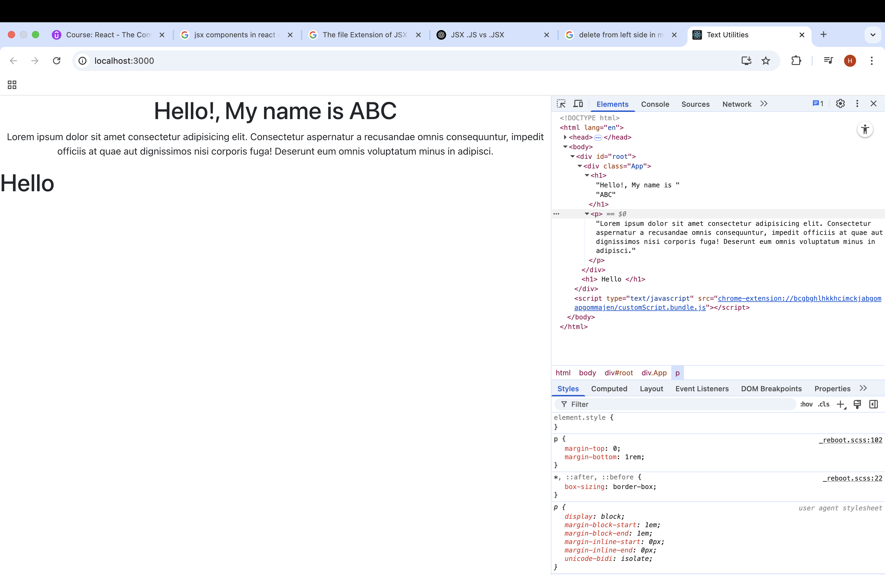

- Let's create our own simple header component for `h1` which will display `Hello`.

```
import './App.css';

function Headers() {
  return (
      <h1>Hello</h1>
  );
}

let h1Content="ABC"
function App() {
  return (
    <>
    <div className="App">
      <h1>Hello!, My name is {h1Content}</h1>
      <p>Lorem ipsum dolor sit amet consectetur adipisicing elit. Consectetur aspernatur a recusandae omnis consequuntur, impedit officiis at quae aut dignissimos nisi corporis fuga! Deserunt eum omnis voluptatum minus in adipisci.</p>
    </div>
    <Headers />
    </>

  );
}

export default App;
```


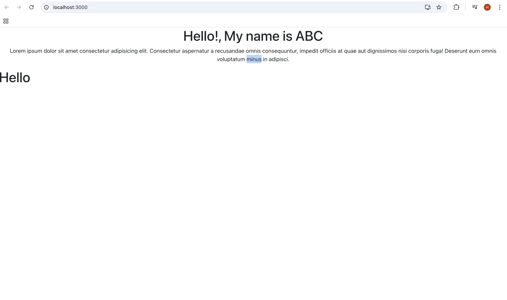

- So the header and the paragraphy section, in the App component and our custom `Header` component are inside of that `div` with the `id` `root`. So the `createRoot` and `render` methods are responsible for rendering a single root component, the App component in this case, which then in turn may contain as many nested components as needed. And those nested components, it may include like this `Header` component in this case, could then contain even more child components. And with that, ultimately you end up with a component hierarchy, which is often called a tree of components, a structure of components, which is then rendered to the screen via React.

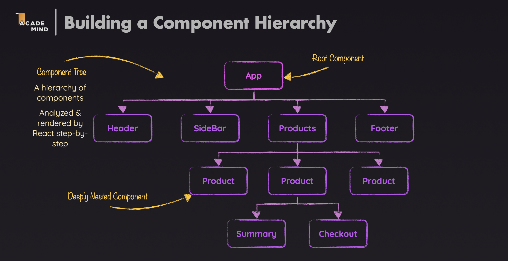

- Let's inspect the HTML, can we see our own custom HTML tag which is `<Header>`?

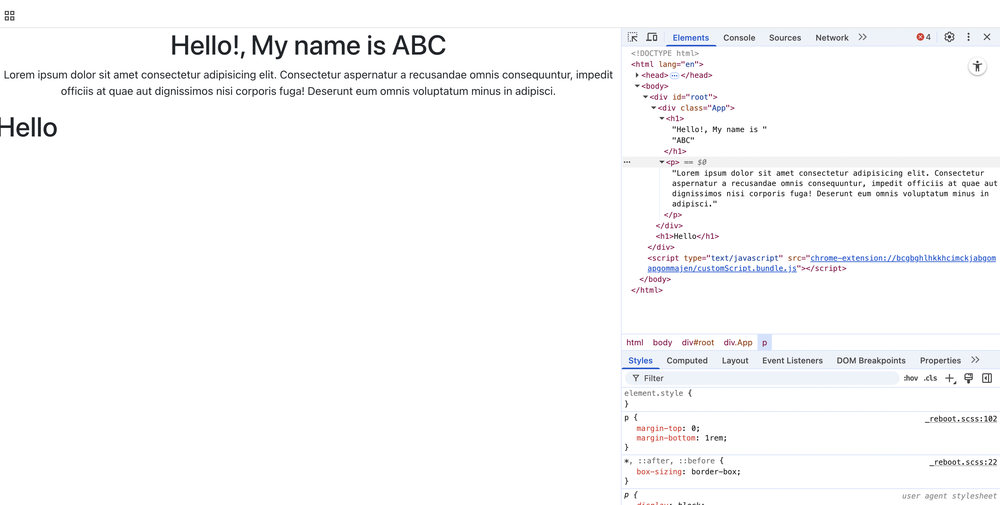

- There you only find default HTML elements, for example, here, the `h1` tag & `div` which is the built-in header element, not our custom component, not our `<Headers>` component. We also don't see the `<App>` component in here.
- So your tree of components is, in the end, just analyzed by React. And React then combines all the JSX code from all those components to generate the overall DOM and then these elements that are showing up on the screen.
- React translates your JSX into a component tree that represents the UI structure, which it then uses to efficiently update the actual webpage by changing the DOM, helping you build dynamic interfaces smoothly.

## Import Export

- In JS, `import` and `export` are used to share code between files. They allow you to organize your code into smaller, reusable pieces and then bring those pieces into other files as needed.
- **export**: When you want to make a variable, function, or component available for use in another file, you export it.
- **import**: When you need something that was defined in another file, you import it.
- There are two main types of exports:
    - Named Export: You can export multiple things from a file, and you have to import them by the exact name they were exported with.
    - Default Export: Each file can have one default export, and you can import it with any name you like.

- Example

```
// utils.js
export const add = (a, b) => a + b; // Named export
export const subtract = (a, b) => a - b; // Named export
export default multiply = (a, b) => a * b; // Default export


// main.js
import multiplyDefaultExport from './utils'; // Default import, can be named anything
import { add, subtract } from './utils'; // Named import, must use exact names
```

- We have given our project name as **textutilities**, so basically it will accept a string from user, perform some operations like making the entered string to upper case or lower case or count characters or words etc.. Now first lets add some bootstrap into our **index.html** file.

```
<!DOCTYPE html>
<html lang="en">
  <head>
    <meta charset="utf-8" />
    <link rel="icon" href="%PUBLIC_URL%/favicon.ico" />
    <meta name="viewport" content="width=device-width, initial-scale=1" />
    <meta name="theme-color" content="#000000" />
    <meta
      name="description"
      content="Web site created using create-react-app"
    />
    <link rel="apple-touch-icon" href="%PUBLIC_URL%/logo192.png" />
    <link rel="manifest" href="%PUBLIC_URL%/manifest.json" />
    <title>Text Utilities</title>

    <!-- Bootstrap -->
    <link rel="stylesheet" href="https://cdn.jsdelivr.net/npm/bootstrap@4.4.1/dist/css/bootstrap.min.css" integrity="sha384-Vkoo8x4CGsO3+Hhxv8T/Q5PaXtkKtu6ug5TOeNV6gBiFeWPGFN9MuhOf23Q9Ifjh" crossorigin="anonymous">
  </head>
  <body>
    <div id="root"></div>

  </body>
</html>
```

## `props`

- Now we wanted to build first this below Navigation bar.

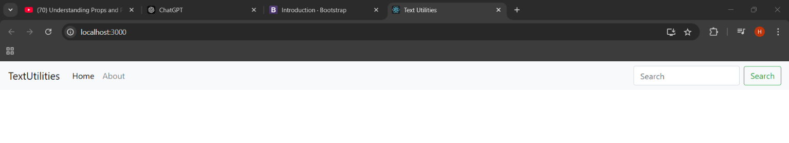

- So lets consider that we will be having navigation bar as one of the component. First create a component folder (`/src/components`) which will consist all your components of your web page.
- Lets create `Navbar.js` file and export the function `Navbar` as default export. Since navigation requires list of items, the below code snip of HTML elements you gonna get it from [bootstrap](https://getbootstrap.com/docs/4.4/components/navbar/#supported-content). Using the template , tweaking it little bit we modify as per the require page above.

```
import React from 'react';


export default function Navbar(){
    return (
        <>
        <nav className="navbar navbar-expand-lg navbar-light bg-light">
        <a className="navbar-brand" href="/">TextUtilities</a>
        <button className="navbar-toggler" type="button" data-toggle="collapse" data-target="#navbarSupportedContent" aria-controls="navbarSupportedContent" aria-expanded="false" aria-label="Toggle navigation">
            <span className="navbar-toggler-icon"></span>
        </button>

        <div className="collapse navbar-collapse" id="navbarSupportedContent">
            <ul className="navbar-nav mr-auto">
            <li className="nav-item active">
                <a className="nav-link" href="/">Home <span className="sr-only">(current)</span></a>
            </li>
            <li className="nav-item">
                <a className="nav-link" href="/">About</a>
            </li>
            </ul>
            <form className="form-inline my-2 my-lg-0">
            <input className="form-control mr-sm-2" type="search" placeholder="Search" aria-label="Search"/>
            <button className="btn btn-outline-success my-2 my-sm-0" type="submit">Search</button>
            </form>
        </div>
        </nav>
        </>
    );
}
```

- Import this `Navbar` into **App.js**.

```
import './App.css';
import Navbar from './components/Navbar';

function App() {
  return (
    <Navbar/>
  );
}

export default App;
```

- The values like `TextUtilities`, `Home` and `About` are hardcoded, can you make it dynamic ? yes using properties (`props`). In React, props (short for properties) are a way to pass data from a parent component to a child component. Think of them as the arguments you pass to a function. Props are arguments passed into React components. Props are passed to components via HTML attributes.
- Modifying the **App.js** and **Navbar.js**.

```
//App.js

import './App.css';
import Navbar from './components/Navbar';

function App() {
  return (
    <Navbar navTitle="Text Utilities" tab1="Home" tab2="About"/>
  );
}

export default App;

//Navbar.js

import React from 'react';


export default function Navbar(props){
    return (
        <>
        <nav className="navbar navbar-expand-lg navbar-light bg-light">
        <a className="navbar-brand" href="/">{props.navTitle}</a>
        <button className="navbar-toggler" type="button" data-toggle="collapse" data-target="#navbarSupportedContent" aria-controls="navbarSupportedContent" aria-expanded="false" aria-label="Toggle navigation">
            <span className="navbar-toggler-icon"></span>
        </button>

        <div className="collapse navbar-collapse" id="navbarSupportedContent">
            <ul className="navbar-nav mr-auto">
            <li className="nav-item active">
                <a className="nav-link" href="/"> {props.tab1} <span className="sr-only">(current)</span></a>
            </li>
            <li className="nav-item">
                <a className="nav-link" href="/"> {props.tab2} </a>
            </li>
            </ul>
            <form className="form-inline my-2 my-lg-0">
            <input className="form-control mr-sm-2" type="search" placeholder="Search" aria-label="Search"/>
            <button className="btn btn-outline-success my-2 my-sm-0" type="submit">Search</button>
            </form>
        </div>
        </nav>
        </>
    );
}
```

- The `navTitle`, `tab1` and `tab2` are custom attributes we defined in the tag `Navbar`. The `props` is an object. `props` are passed as a single object to the child component. **Child components cannot modify the props they receive. They are immutable.**
- `props` facilitate a top-down data flow in React applications, meaning data flows from parent components to child components. `props` allow you to create reusable components that can be customized with different data.

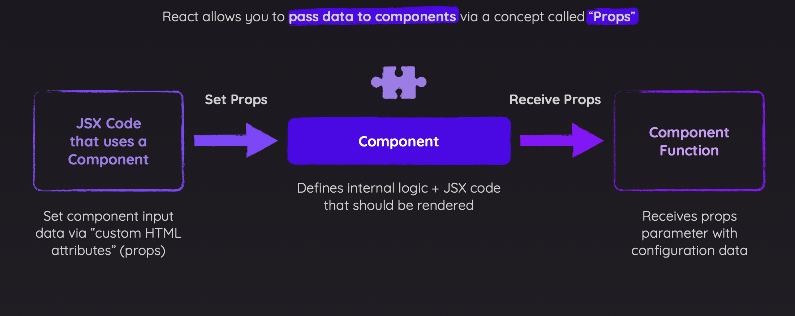


- In React, `props` are indeed passed as an object to a component. When multiple properties are passed, they effectively merge into a single object, where each prop name becomes a key in the object and its value becomes the corresponding value.


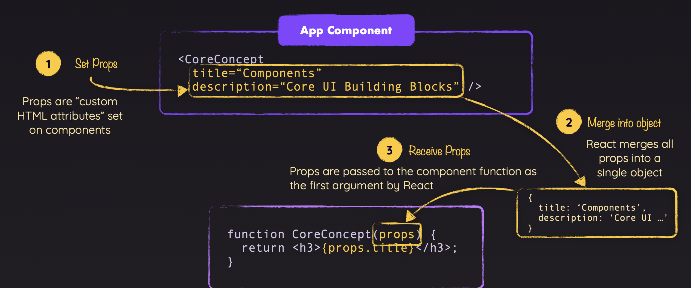


- Instead of writing `prop.attributeName (e.g prop.tab1)` we can also write `attributeName (e.g {tab1})` providing the function accepts object of attributes like below.

```
export default function Navbar({navTitle,tab1,tab2}){
    return (
        <>
        <nav className="navbar navbar-expand-lg navbar-light bg-light">
        <a className="navbar-brand" href="/">{navTitle}</a>
        <button className="navbar-toggler" type="button" data-toggle="collapse" data-target="#navbarSupportedContent" aria-controls="navbarSupportedContent" aria-expanded="false" aria-label="Toggle navigation">
            <span className="navbar-toggler-icon"></span>
        </button>

        <div className="collapse navbar-collapse" id="navbarSupportedContent">
            <ul className="navbar-nav mr-auto">
            <li className="nav-item active">
                <a className="nav-link" href="/"> {tab1} <span className="sr-only">(current)</span></a>
            </li>
            <li className="nav-item">
                <a className="nav-link" href="/"> {tab2} </a>
            </li>
            </ul>
            <form className="form-inline my-2 my-lg-0">
            <input className="form-control mr-sm-2" type="search" placeholder="Search" aria-label="Search"/>
            <button className="btn btn-outline-success my-2 my-sm-0" type="submit">Search</button>
            </form>
        </div>
        </nav>
        </>
    );
}
```

- Object destructuring allows you to extract specific properties from the props object and assign them to variables. This makes your code cleaner and more readable, especially when dealing with multiple props.
- Consider below code

```
// App.js
const NavBarProps = {
  navTitle: "Text Utilities",
  tab1: "Home",
  tab2: "About",
  tab3: "Text Filtration",
  tab4: "Timer"
};

function App() {
  return (
    <Router>
      <Navbar {...NavBarProps}/>
      <div className="container">
        <Routes>
          <Route path="/" element={<TextInput />} />
          <Route path="/about" element={<About />} />
          <Route path="/filter" element={<TextFilters />} />
          <Route path="/timer" element={<Timer />} />
        </Routes>
      </div>
    </Router>
  );
}
```

- The spread operator can be passed to a React component, and it will automatically distribute the object's properties as attributes to the element. This functionality is a feature of JSX and is commonly used to pass props to components in a concise way.
- The spread operator effectively unpacks the key-value pairs from the props object and applies them as attributes to the react component element. This is particularly useful when dealing with a large number of props or when you want to dynamically pass props from a parent component to a child component.
- Similarly we can also use object destructing inside the rendering function

```

export default function Navbar({...NavBarProps}) {
    const {navTitle, tab1, tab2, tab3, tab4} = NavBarProps;
    return (
        <>
        <nav className="navbar navbar-expand-lg navbar-light bg-light">
            <Link className="navbar-brand" to="/">{navTitle}</Link>
        <button className="navbar-toggler" type="button" data-toggle="collapse" data-target="#navbarSupportedContent" aria-controls="navbarSupportedContent" aria-expanded="false" aria-label="Toggle navigation">
            <span className="navbar-toggler-icon"></span>
        </button>

        <div className="collapse navbar-collapse" id="navbarSupportedContent">
            <ul className="navbar-nav mr-auto">
            <li className="nav-item active">
                <Link className="nav-link" to="/"> {tab1} <span className="sr-only">(current)</span></Link>
            </li>
            <li className="nav-item">
                <Link className="nav-link" to="/about"> {tab2} </Link>
            </li>

            <li className="nav-item">
                <Link className="nav-link" to="/filter"> {tab3} </Link>
            </li>
            <li className="nav-item">
                <Link className="nav-link" to="/timer"> {tab4} </Link>
            </li>
            </ul>
            <form className="form-inline my-2 my-lg-0">
            <input className="form-control mr-sm-2" type="search" placeholder="Search" aria-label="Search"/>
            <button className="btn btn-outline-success my-2 my-sm-0" type="submit">Search</button>
            </form>
        </div>
        </nav>
        </>
    );
}
```

- Component Composition in React just means building bigger components by combining smaller ones — like using small LEGO pieces to build a big LEGO castle.
- Instead of making one huge component that does everything, you make small, reusable components and then compose (put) them together.
- React encourages composing components together, making them more reusable and easier to manage. This composition is primarily achieved by nesting components and utilizing `props`, especially the `children` prop.


### `props.children`

- In React, `props.children` is whatever you put between the opening and closing tags of a component. Let's see an simple example

```
// App.js

import React from 'react';


function HeaderButtons(props){
  console.log(props.children)
  return (<h1>{props.children}</h1>);
}

function App() {
  return (
    <div>
    <HeaderButtons>
      Hello World
    </HeaderButtons>
    <HeaderButtons>
      Welcome to React
      <p>This is a new Para</p>
      </HeaderButtons>
</div>
  );
}

export default App;
```

- Here, inside `<HeaderButtons>...</ˇ>`, you placed `Hello World` and `<p>`. These elements become `props.children` inside the `HeaderButtons` component.

- On browser

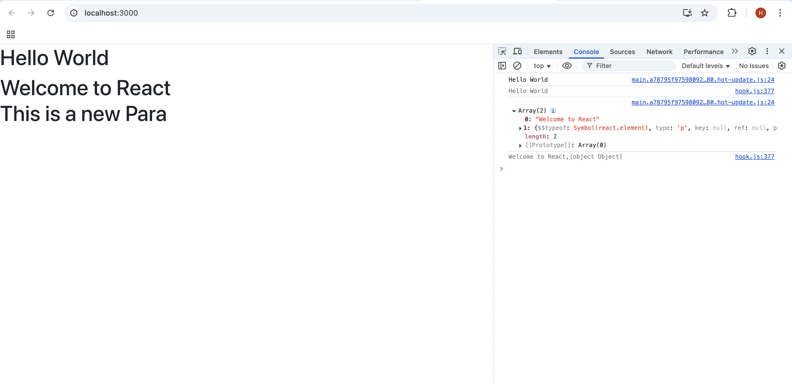

- `props.children` are content you nest inside a component when you use it.

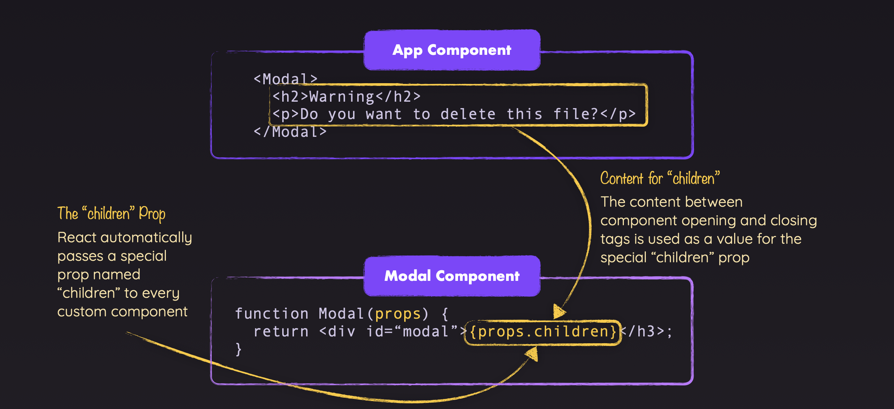


>[!NOTE]
> - You can also use object destructing and only pass `children` as attribute like below
> ```
> function HeaderButtons({children}){
>  return (<h1>{children}</h1>);
> }
> ```

- We can also use attributes like `<HeaderButtons content="Hello World"/>`? then why to use `props.children`? Attributes (`props` like `content="Hello World"`) are good for small, simple values. But if you **want to pass full JSX content (like HTML elements, multiple things)**, you need `props.children`.
- Use normal `props` for small stuff, use `props.children` for passing real "content" inside components.


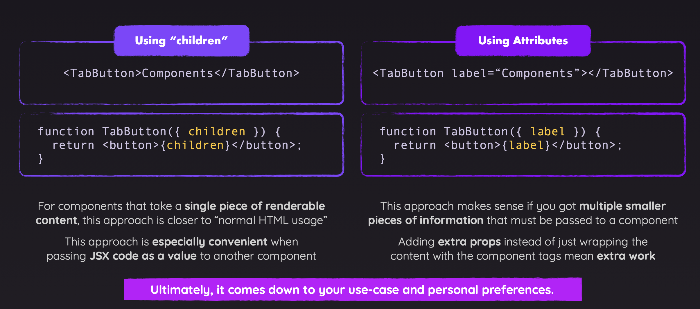


- Lets see another example, lets create a folder under `/components` and create two files `Card.jsx` & `card.css`

```
// Card.jsx

import index from './card.css'

export default function Card(props){
    return(
        <div className='card'>
        <h2>{props.name}</h2>
        {props.children}
        </div>
        
        );
}

// App.js

import Card from './components/Card/Card';


function App() {
  return (
    <div id="app">
      <h1>Available Experts</h1>
      <Card name="Anthony Blake">
        <p>
          Blake is a professor of Computer Science at the University of
          Illinois.
        </p>
        <p>
          <a href="mailto:blake@example.com">Email Anthony</a>
        </p>
      </Card>

      <Card name="Maria Miles">
        <p>
          Maria is a professor of Computer Science at the University of
          Illinois.
        </p>
        <p>
          <a href="mailto:blake@example.com">Email Maria</a>
        </p>
      </Card>
    </div>
  );
}

export default App;
```

- On browser 

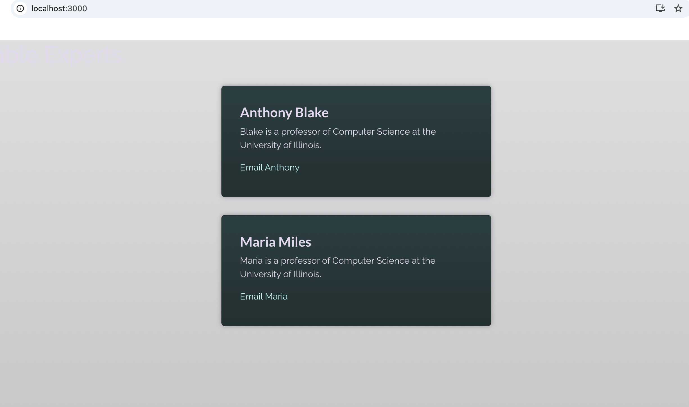

### `propTypes`

- In React, `propTypes` is a library that allows you to define the types of props that a component should receive. This is helpful for validating the props that are passed to your components, ensuring that they receive the correct data types and preventing bugs. PropTypes are especially useful for larger applications where components can have many props.
- Adding `propTypes` in the `Navbar.js`

```
import React from 'react';
import PropTypes from 'prop-types';


export default function Navbar(props){
    return (
        <>
        <nav className="navbar navbar-expand-lg navbar-light bg-light">
        <a className="navbar-brand" href="/">{props.navTitle}</a>
        <button className="navbar-toggler" type="button" data-toggle="collapse" data-target="#navbarSupportedContent" aria-controls="navbarSupportedContent" aria-expanded="false" aria-label="Toggle navigation">
            <span className="navbar-toggler-icon"></span>
        </button>

        <div className="collapse navbar-collapse" id="navbarSupportedContent">
            <ul className="navbar-nav mr-auto">
            <li className="nav-item active">
                <a className="nav-link" href="/"> {props.tab1} <span className="sr-only">(current)</span></a>
            </li>
            <li className="nav-item">
                <a className="nav-link" href="/"> {props.tab2} </a>
            </li>
            </ul>
            <form className="form-inline my-2 my-lg-0">
            <input className="form-control mr-sm-2" type="search" placeholder="Search" aria-label="Search"/>
            <button className="btn btn-outline-success my-2 my-sm-0" type="submit">Search</button>
            </form>
        </div>
        </nav>
        </>
    );
}

Navbar.propTypes={
    navTitle: PropTypes.string.isRequired,
    tab1: PropTypes.string.isRequired,
    tab2: PropTypes.string.isRequired
}
```

- Now if we try to enter number or any other type of attribute value in **App.js** , it will give error in browser console.

```
import './App.css';
import Navbar from './components/Navbar';

function App() {
  return (
    <Navbar navTitle={2} tab1="Home" tab2="About"/>
  );
}

export default App;
```

- On browser console

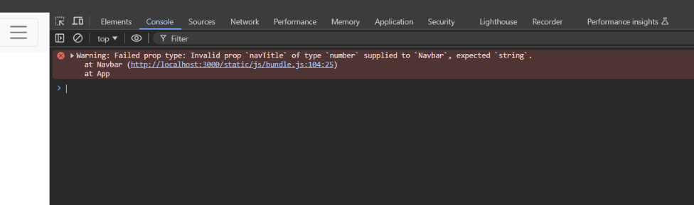


- You can also add some default values. To specify a default value for a prop if it’s not provided, you can use the `defaultProps` property. This is helpful for props that can have a fallback value.

```
// Snip of Navbar.js
Navbar.defaultProps={
    navTitle: "Some Default Value",
    tab1: "Some Tab1",
    tab2: "Some Tab2"
}
```

- When we not pass any attributes into the **App.js**

```
import './App.css';
import Navbar from './components/Navbar';

function App() {
  return (
    <Navbar/>
  );
}

export default App;
```

- On browser

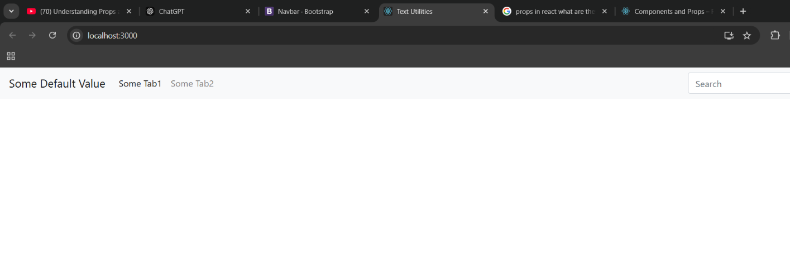


>[!WARNING]
> - In future version the `functionName.defaultProps` will be deprecated. Instead you can assign default value in the argument for those properties.
> - Example
> ```
> import React from 'react';
> 
> function Navbar({ title = 'Default Title' }) {
>  return <h1>{title}</h1>;
> }
> 
> export default Navbar;
> ```


- Here are some of the most commonly used Basic PropTypes:
    - `PropTypes.string`: A string
    - `PropTypes.number`: A number
    - `PropTypes.bool`: A boolean
    - `PropTypes.func`: A function
    - `PropTypes.object`: An object
    - `PropTypes.array`: An array
    - `PropTypes.node`: Anything that can be rendered (numbers, strings, elements, etc.)
    - `PropTypes.element`: A single React element

## React Events

- React Events are just React’s way of handling user interactions — like when users, Click a button, Type in an input box, Move the mouse, Press a key, Submit a form etc.
- They enable dynamic and interactive user interfaces by allowing components to react to user input.
- Let's see an example

```
// App.js

import React from 'react';

function onClickedHanlder() {
  console.log('Button clicked');
}

function onMouseUpHandler() {
  console.log('Mouse up');
}
function App() {
  return (

    <div>
      <button onClick={onClickedHanlder}>Click me</button>
      <p onMouseOver={onMouseUpHandler}>Click me</p>

    </div>
  );
}

export default App;
```

- On browser

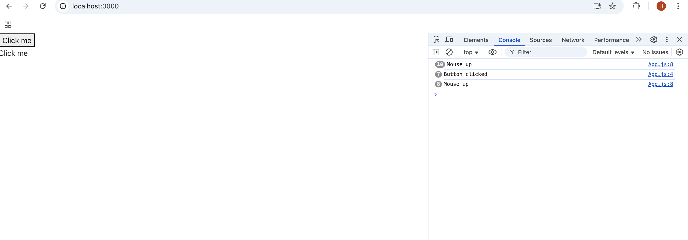


- In React, you add event listeners directly in your JSX — similar to HTML but with a few important differences:
  - CamelCase event names (like `onClick`, not *`onclick`*).
  - You pass a function, not a string.
- So here, we have added two events `onClick` and `onMouseOver` which calls two different methods `onClickedHanlder` and `onMouseUpHandler` respectively. React provides built-in event handlers (props) for most common DOM events, like:

| **Type**             | **Examples**                                                    |
|----------------------|-----------------------------------------------------------------|
| **Mouse Events**     | onClick, onDoubleClick, onMouseEnter, onMouseLeave, onMouseMove |
| **Keyboard Events**  | onKeyDown, onKeyPress, onKeyUp                                  |
| **Form Events**      | onChange, onSubmit, onInput, onFocus, onBlur                    |
| **Touch Events**     | onTouchStart, onTouchMove, onTouchEnd                           |
| **UI Events**        | onScroll, onResize                                              |
| **Drag Events**      | onDrag, onDragStart, onDrop                                     |
| **Clipboard Events** | onCopy, onCut, onPaste                                          |
| **Media Events**     | onPlay, onPause, onEnded, onVolumeChange                        |


- You don't need to manually attach listeners like `addEventListener` — React does it behind the scenes for you. Here, you are passing function as a props in your component.
- How does react handles these events? React uses something called Synthetic Events — a lightweight wrapper around native browser events — to make sure events work the same way across all browsers.
- In plain JavaScript (without React), if you write:

```
<button onclick="alert('Clicked!')">Click me</button>
or


document.getElementById('btn').addEventListener('click', function() {
  alert('Clicked!');
});
```

- The browser directly gives you a native DOM Event. Different browsers (Chrome, Firefox, Safari) may handle tiny details a bit differently — which can cause bugs.
- In React, you would have written

```
<button onClick={handleClick}>Click Me</button>

function handleClick(event) {
  console.log(event);  // SyntheticEvent!
}
```

- A Synthetic Event is React’s own wrapper around the browser's native event.
  - React catches the real browser event.
  - Then wraps it inside a SyntheticEvent object.
  - This object behaves almost exactly like the native event, but it’s consistent across all browsers
- So basically when you click:
  - Browser fires the native event (`click`).
  - React catches it behind the scenes.
  - React wraps it inside a SyntheticEvent.
  - React gives your `handleClick(event)` this SyntheticEvent.
- React’s Synthetic Events make your event handling reliable, clean, and faster across all browsers — without you worrying about browser differences.
- React batches multiple events together (better for speed). It also automatically cleans up event objects after use, to avoid memory leaks.
- Now let's say you wanted to pass some arguments into you event handler function

```
<button onClick={onClickedHanlder('name')}>Click me</button>
```

- You cannot write this ❌ , here you are executing the function immediately and passing its result. When you add an event handler like `onClick`, React expects you to give it a function, NOT the result of a function.
- You need to use **anonymous function**. You are giving React a function to call later. When user clicks, the anonymous function `(() => sayHello('John'))` runs. Inside that, it calls `sayHello('John')`.

```
//App.js

import React from 'react';

function saHello(name) {
  alert('Button clicked by ' + name);
}

function onMouseUpHandler() {
  console.log('Mouse up');
}
function App() {
  return (

    <div>
      <button onClick={()=> saHello('Harsh')}>Click me</button>

    </div>
  );
}

export default App;
```

- On browser

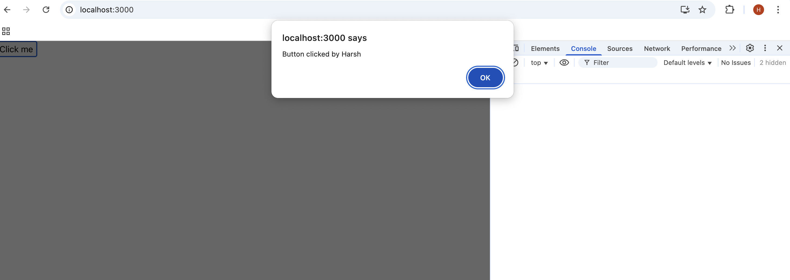


## State (`useState`)

- Consider below `App.jsx` file 

```
import React from 'react';
import Card from './components/Card/Card.jsx';

function App() {

  let initialText = "Learning about React is fun!";

  function onClickHandler() {
    initialText = "You clicked the button!";
    console.log(initialText);
  }

  return (
      <div>
      <Card name="Click the button to change text">
        {initialText}
        
        <div>
        <button onClick={onClickHandler}>Click Me</button>
        </div>
      </Card>
      </div>
  );
}

export default App;

// Card.jsx
import index from './card.css'

export default function Card(props){
    return(
        <div className='card'>
        <h2>{props.name}</h2>
        {props.children}
        </div>
        
        );
}
```

- On browser when we click on the button, the value of text `Learning about React is fun!` does not gets changed to `You clicked the button!`.

<video controls src="Images/about/2025-1.mov" title="title"></video>


- The `onClick` hanlder `onClickHandler` is getting executed by the on the page it does not shows up the latest content of variable `initialText`. Why so? **In React, components only load once initially.** If you want to reload your component or execute the component again, you need to tell this to React. It will not automatically execute and show up the contents.
- To manage dynamic data within a component and trigger re-renders to reflect changes, React provides the state mechanism.
- State is like a component's memory. It’s a way to store information that can change over time as the user interacts with the app. Think of state as a variable that "remembers" values between renders of your component.
- For example, if you have a counter component that displays a number on the screen and you want it to increase every time the user clicks a button, that number needs to be stored somewhere. That’s where state comes in—it holds the current value of the counter and can be updated every time the button is clicked.
- React provides `useState` function, which manages the state of component. `useState()` yields an array of with two elements and it will be always exactly two elements.
- Let's see an simple example of `useState()`

```
import React, { useState } from 'react';
import Card from './components/Card/Card.jsx';


let number_ofClicks = 0;

function App() {

  const [ initialText, setInitialText ] = useState("Learning about React is fun!");

  function onClickHandler() {
    const text = "You clicked the button! " + number_ofClicks;
    setInitialText(text);
    number_ofClicks++;
    console.log(text);
  }

  return (
      <div>
      <Card name="Click the button to change text">
        {initialText}
        
        <div>
        <button onClick={onClickHandler}>Click Me</button>
        </div>
      </Card>
      </div>
  );
}

export default App;
```

- On browser

<video controls src="Images/about/2025-2.mov" title="title"> </video>


- Here, `initialtext` is stored as state, When you call `setInitialText`, React:
  - Updates the value.
  - Re-renders the component.
  - Shows the new text on the screen!
- We cannot update like this, for updating the value we need to use the set method

```
this.initialText = "New Content" ❌
```


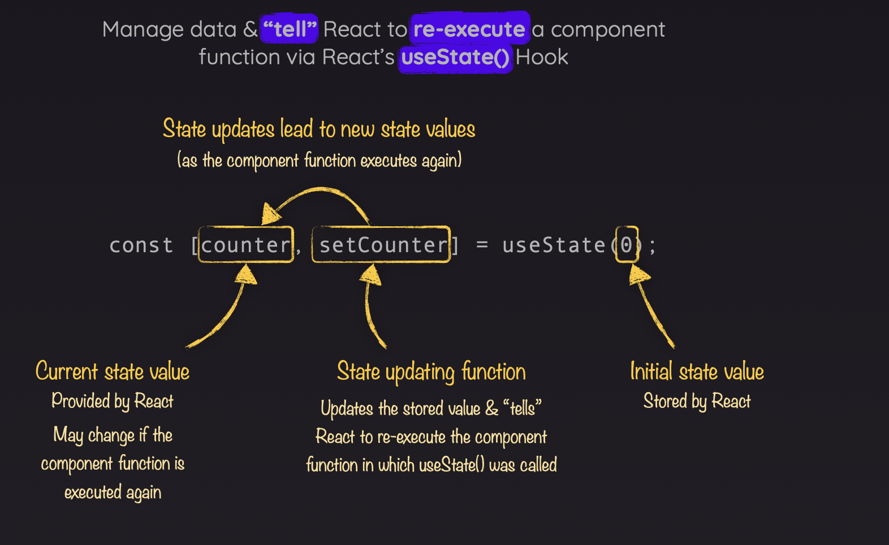

>[!NOTE]
> - Rules for `useState()`
> 
> 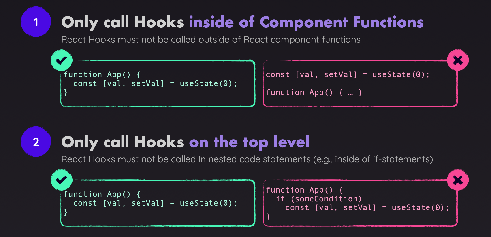

- Consider below JSX files

```
// App.js

import React, { useState } from 'react';
import Card from './components/Card/Card.jsx';


let number_ofClicks = 0;

function App() {

  const [ initialText, setInitialText ] = useState("Learning about React is fun!");

  function onClickHandler() {
    const text = "You clicked the button! " + number_ofClicks;
    setInitialText(text);
    number_ofClicks++;
    console.log(text);
  }

  return (
      <div>
      <Card name="Click the button to change text">
        {initialText}
        
        <div>
        <button onClick={onClickHandler}>Click Me</button>
        </div>
      </Card>
      </div>
  );
}

export default App;


// Card.jsx

import index from './card.css'

export default function Card(props){

    console.log("Card component rendered");
    return(
        <div className='card'>
        <h2>{props.name}</h2>
        {props.children}
        </div>
        
        );
}
```

- When we execute it, on browser we can see


<video controls src="Images/about/2025-3.mov" title="title"></video>

- Whenever we click on the button, the `Card` component also gets rendered. So does state reload the whole component?
  - ✅Yes, the entire component function runs again! But not the whole page, just this component.
- Every tag inside the component of `App` (`div`, `Card` etc..) will be re-rendered. So **state reloads the whole component**.
- Continuing out text utility website, now our page will accept input text from the user, and based on it will perform operation on it like upper case etc.., So lets create a **TextInput.js**.

```
import React from 'react'

export default function TextInput(){
    return(
        <div>
        <div className="form-group">
        <label htmlFor="exampleFormControlTextarea1">Enter your Text Here </label>
        <textarea className="form-control" id="exampleFormControlTextarea1" rows="3"></textarea>
        </div>
        <button type="button" className="btn btn-primary">Convert to UPPERCASE</button>
        </div>
    );
}
```

- Lets add the component `TextInput` into the **App.js** file.

```
import './App.css';
import Navbar from './components/Navbar';
import TextInput from './components/TextInput';

function App() {
  return (
    <>
    <Navbar navTitle="Text Utilities" tab1="Home" tab2="About"/>
    <div className="container">
    <TextInput/>
    </div>
    </>
  );
}

export default App;
```

- Now whatever the input entered by the user becomes the state. So lets defined `useState` in our function `TextInput`. 

```
import React,{useState} from 'react'

export default function TextInput(){
    const [inputUser,SetInputUser]=useState(" ");
    const OnChangeEvent=(event)=>{
        SetInputUser(event.target.value);
    }
    const OnClickEvent=()=>{
        SetInputUser(inputUser.toUpperCase());
    }
    return(
        <div>
        <div className="form-group">
        <label htmlFor="exampleFormControlTextarea1">Enter your Text Here </label>
        <textarea className="form-control" value={inputUser}  onChange={OnChangeEvent} id="exampleFormControlTextarea1" rows="3"></textarea>
        </div>
        <button type="button" onClick={OnClickEvent} className="btn btn-primary">Convert to UPPERCASE</button>
        </div>
    );
}
```

- Here `useState` will be used to manage the state of the `inputUser` within the functional component `TextInput`. 

```
export default function TextInput() {
  const [inputUser, SetInputUser] = useState(" ");
  ..}
```

- `inputUser` is a piece of state that will store the current value of the text entered by the user. `SetInputUser` is the function we use to update `inputUser`. `useState(" ")` initializes `inputUser` with an empty string, `" "`. Each time `SetInputUser` is called with a new value, `inputUser` updates, and the component re-renders with the new value.

```
const OnChangeEvent = (event) => {
  SetInputUser(event.target.value);
};
```

- `OnChangeEvent` is a function that gets triggered whenever the text area’s content changes. The `event` parameter is automatically passed to the function when the event is triggered. `event.target.value` refers to the current text entered in the text area. By calling `SetInputUser(event.target.value)`, the `inputUser` state is updated with the latest text input.

```
const OnClickEvent = () => {
  SetInputUser(inputUser.toUpperCase());
};
```

- `OnClickEvent` is a function that gets triggered when the button is clicked. It uses `inputUser.toUpperCase()` to convert the current text to uppercase and then updates the state using `SetInputUser`. Once `SetInputUser` updates the state, the component re-renders, and the uppercase text appears in the text area.
- **`onChange` event listener is essential for capturing user input as it's typed in the text area. Every time the user types a character, `OnChangeEvent` updates `inputUser` with the current text, so `inputUser` always has the latest text value. `onClick` event listener is necessary to handle the button's functionality. When clicked, `OnClickEvent` is triggered to change the text to uppercase, providing the interactive "Convert to UPPERCASE" feature. `useState` initializes and updates state (`inputUser`) in the component. Event handlers (`onChange`, `onClick`) allow interaction with the text area and button.**


<video controls src="Images/2024-1.mp4" title="title"></video>

>[!NOTE]
> - We cannot directly change the state mode by re-assigning new value like `inputUser="New Text"`, we need to always use the set method (`SetInputUser`)


- Lets add more utilities like counting words and characters.

```
import React,{useState} from 'react'

export default function TextInput(){
    const [inputUser,SetInputUser]=useState(" ");
    const OnChangeEvent=(event)=>{
        SetInputUser(event.target.value);
    }
    const OnClickEvent=()=>{
        SetInputUser(inputUser.toUpperCase());
    }
    return(
        <div>
        <div className="form-group">
        <label htmlFor="exampleFormControlTextarea1">Enter your Text Here </label>
        <textarea className="form-control" value={inputUser}  onChange={OnChangeEvent} id="exampleFormControlTextarea1" rows="3"></textarea>
        </div>
        <button type="button" onClick={OnClickEvent} className="btn btn-primary">Convert to UPPERCASE</button>

        <div className="container my-3">
            <p> Number of Words - {inputUser.split(" ").length} , Number of Characters - {inputUser.length}</p>
        </div>

        </div>
    );
}
```

- On browser

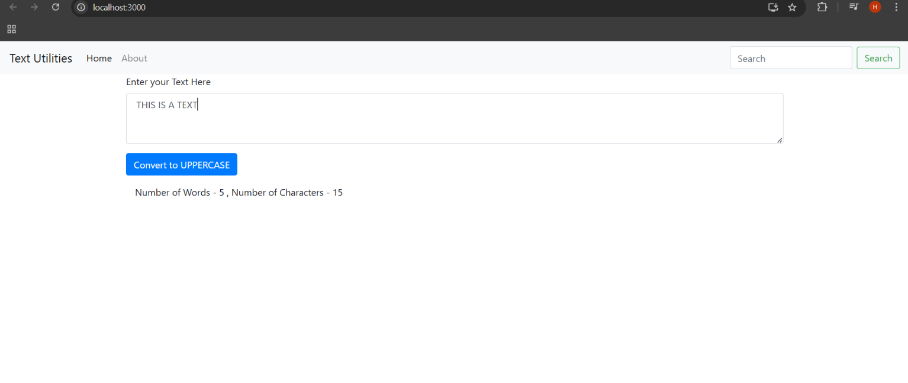

### Updating New State Based on Old State

- When working with React’s `useState`, it’s important to understand the asynchronous nature of state update. Let's say we wanted to display the number of times a button is being clicked and along with increase the value 3 times by calling the `set` function.
- So below is `App.jsx` code.

```
import { useState } from "react";
function App() {
  const [count, setCount] = useState(0);
  const handleClick = () => {
    //  be careful it's the old value
    setCount(count + 1);
    setCount(count + 1);
    setCount(count + 1);
    // so if you have any functionality
    // that relies on the latest value
    // it will be wrong !!!
    console.log(count);
  };

  return (
    <div>
      <h1>you click {count} times</h1>
      <button onClick={handleClick}>button</button>
    </div>
  );
}

export default App;
```

- On browser

<video controls src="Images/about/2025-8.mov" title="title"></video>

- Here, we are calling the `setCount` method 3 times but only one gets executed properly. Why so? it is due to **React's state batching behavior**.

```
setCount(count + 1);
setCount(count + 1);
setCount(count + 1);
```

- You expect the count to go up by 3, but it only increases by 1. React batches state updates that happen during the same event loop (like inside an event handler). And when you call `setCount(count+1)` using the old value of `count`.
- Assume current `count = 0`. Here’s what happens:

| Call | Evaluated Expression | Scheduled New Count |
| ---- | -------------------- | ------------------- |
| 1    | `count + 1 = 0 + 1`  | 1                   |
| 2    | `count + 1 = 0 + 1`  | 1 (again)           |
| 3    | `count + 1 = 0 + 1`  | 1 (again)           |

- All 3 calls use `count = 0` because React hasn’t re-rendered yet — the count value hasn’t changed in memory. So, the final state after all three `setCount` calls is just 1, because each one overwrites the previous with the same value.
- The reason the count doesn’t increase by 3 with a single click is that the state updates in React are asynchronous. When you call `setCount`, React batches the state updates and performs them in a single batch before the next render. This is done for performance optimization.
- So, when you call `setCount` three times in a row with the same value, React only takes the last value and performs the update. In our case, count is incremented by 1, but it's done three times sequentially, so the result is an increment of 1.
- Solution is to use **Functional Updater**.

```
setCount((prev) => prev + 1);
setCount((prev) => prev + 1);
setCount((prev) => prev + 1);
```

- Now, each update will receive the latest updated value.

| Call | Previous Value | New Count |
| ---- | -------------- | --------- |
| 1    | 0              | 1         |
| 2    | 1              | 2         |
| 3    | 2              | 3         |


- Modifying `App.jsx`

```
import { useState } from "react";
function App() {
  const [count, setCount] = useState(0);
  const handleClick = () => {
    setCount((prev) => prev + 1);
    setCount((prev) => prev + 1);
    setCount((prev) => prev + 1);
    console.log(count);
  };

  return (
    <div>
      <h1>you click {count} times</h1>
      <button onClick={handleClick}>button</button>
    </div>
  );
}

export default App;
```

- On browser

<video controls src="Images/about/2025-9.mov" title="title"></video>

- Instead of directly updating the state with a new value, the `setCount` function is now called with a callback function as an argument. This callback function receives the previous value of the state as a parameter (in this case, `prev`), and it returns the new value based on the previous value.
- Since each `setCount` call is performed separately from the previous value, the count is incremented by 1 for each call. Therefore, when you click the button, the count will increase by 3 because each `setCount` call increments the count by 1 individually.
- Why does react do so? React may batch multiple state updates together for performance reasons (especially during concurrent rendering or inside event handlers). When this happens, the value of `count` might be stale (outdated), because it was captured when the component was first rendered.
- React queues state updates. When using the functional form, React pulls the latest state value from the queue, ensuring your update is based on the right version.
- Even though you call `setCount`, `console.log(count)` still prints 0 — because state updates are asynchronous and don't take effect immediately. That's why in the console, we can see the previous value rather than the update value of the page.

### Two-Way Binding

- When you change the input field, the state updates, and when the state changes, the input field reflects the new value.
- Simple example

```
import { useState } from 'react';

function App() {
  const [name, setName] = useState('');

  const handleChange = (e) => {
    setName(e.target.value); // updates state from input
  };

  return (
    <div>
      <input type="text" value={name} onChange={handleChange} />
      <p>Your name is: {name}</p>
    </div>
  );
}
```

- On browser

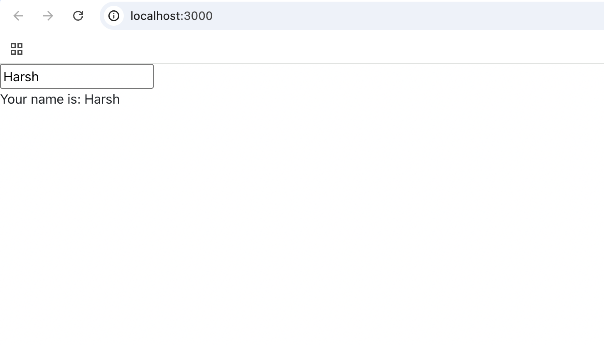

### Updating Object's State Immutably

- In React, state updates with objects can sometimes lead to unexpected behavior due to the shallow copy nature of objects.
- Consider below code of `App.jsx`.

```
import React from 'react';

function App() {
  const [user, setUser] = React.useState({ name: 'John', age: 30 });

  const incrementAge = () => {
    user.age++; // Direct mutation of state
    setUser(user); // Passing same object reference
  };

  return (
    <div>
      <p>Name: {user.name}</p>
      <p>Age: {user.age}</p>
      <button onClick={incrementAge}>Increment Age</button>
    </div>
  );

}

export default App;
```

- On browser

<video controls src="Images/about/2025-10.mov" title="title"></video>

- In this example, we attempt to increment the user’s age directly by mutating the `user` object. It won't increase because inside the `setUser(user);` you are passing the same object reference even though you have change `user.age`. And react does shallow comparison of previous object and current object. Since previous object is same as current object, we don't see any changes on browser.
- To avoid, we need to give a new object along with our changes to react.

```
  const incrementAge = () => {
    setUser({ ...user, age: user.age + 1 });
  };
```

- On browser

<video controls src="Images/about/2025-11.mov" title="title"></video>

- When you're creating a new object React re-renders properly.

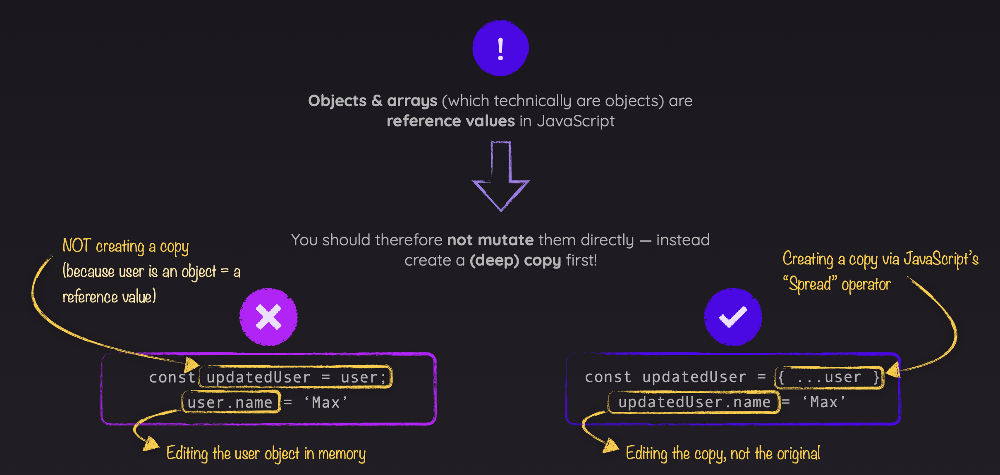


>[!NOTE]
> - If any nested objects are present, you need to also copy that manually (JavaScript concept). Example
> ```
> const [userData, setUserData] = useState({
>   profile: {
>     name: 'John',
>     age: 30,
>     address: {
>       street: '123 Main St',
>       city: 'Anytown',
>       country: 'USA'
>     }
>   }
> });
> ```
>
> - Copying deeply nested objects
>
> ```
> setUserData(prev => ({
>   ...prev,
>   profile: {
>     ...prev.profile,
>     address: {
>       ...prev.profile.address,
>       city: 'New City'
>     }
>   }
> }));
> ```

- Updating deeply nested objects requires traversing multiple levels of nesting, which can become cumbersome and error-prone. It also makes it challenging to track state changes and increases the risk of inadvertently mutating the state.
- Best Practices for State Management
  - Follow the copy-then-update approach: Always create a copy of the state object before making any updates to ensure immutability.
  - Avoid deeply nested object structures: Flatten state whenever possible to simplify state updates and improve code readability.


>[!TIP]
> - It’s advisable to keep your state minimal. Only store in `useState` what cannot be computed or derived.
> - ❌ Bad Example
>
> ```
> const [firstName, setFirstName] = useState("John");
> const [lastName, setLastName] = useState("Doe");
> const [fullName, setFullName] = useState("John Doe"); // ❌ Unnecessary state
> ```
> 
> - Here, fullName can be derived:
> - ✅ Better
>
> ```
> const fullName = `${firstName} ${lastName}`;
> ```
> 
> - When number of states are minimun it is easier to debug and test, less chance of state getting out of sync and importantly it reduces number of re-renders. So manage as little state as possible and derived or compute as many values as you needed.
> - **Only use state for data that changes over time and cannot be derived from other state or props.**
> - **Incase of multiple components need to share or update the same piece of data, you should lift the state up to their nearest common parent, and pass the data + setters as props to the children. This keeps everything centralized, in sync, and easy to manage.**
> - **Because React state is local to a component. So if two siblings (or a child and a parent) need to share or sync state, the state must live in a common ancestor.**
>
> - ❌ Wrong (Separate states = out of sync)
>
> ```
> function FormA() {
>     const [name, setName] = useState('');
>     return <input value={name} onChange={(e) => setName(e.target.value)} />;
>   }
>   
>   function SummaryB() {
>     const [name, setName] = useState(''); // separate state — not in sync!
>     return <p>Name is: {name}</p>;
>   }  
> ```
>
> - ✅ Correct (Lifted state in parent)
>
> ```
> function Parent() {
>     const [name, setName] = useState('');
>   
>     return (
>       <>
>         <FormA name={name} setName={setName} />
>         <SummaryB name={name} />
>       </>
>     );
>   }
>   
>   function FormA({ name, setName }) {
>     return <input value={name} onChange={(e) => setName(e.target.value)} />;
>   }
>   
>   function SummaryB({ name }) {
>     return <p>Name is: {name}</p>;
>   }
>  ```
>
> - `name` state is shared and consistent. All updates go through the single source of truth in `Parent`.
> - If the parent component owns the state, it can pass down values and setters to children, giving them access to read or modify the shared data.


## Conditional Rendering

- Conditional rendering in React allows for displaying different UI elements or components based on certain conditions. This dynamic rendering ensures that the user interface updates in response to changes in application state or user interactions. Several approaches facilitate conditional rendering in React.
- Let's see you need to render below image in case of, when `delete` button is clicked.

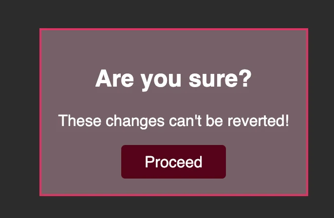

- So current **App.jsx**

```
// App.jsx

import React from 'react';
import indexcss from './index.css';

function App() {
  return (
      <div>
        <div data-testid="alert" id="alert">
          <h2>Are you sure?</h2>
          <p>These changes can't be reverted!</p>
          <button>Proceed</button>
        </div>
      <button>Delete</button>
      </div> 
  );
}

export default App;


//index.css


body {
  font-family: sans-serif;
  margin: 0;
  padding: 3rem;
  background-color: #2d2c2c;
  color: #959090;
  text-align: center;
}

#alert {
  margin: 3rem auto;
  padding: 1rem;
  width: 15rem;
  border: 2px solid #dd3562;
  background-color: #776167;
  color: white;
}

#alert button {
  font: inherit;
  border: none;
  padding: 0.5rem 1.5rem;
  background-color: 540218;
  color: rgb(244, 240, 240);
  border-radius: 4px;
  cursor: pointer;
  background-color: #651329;

}
```

- On browser

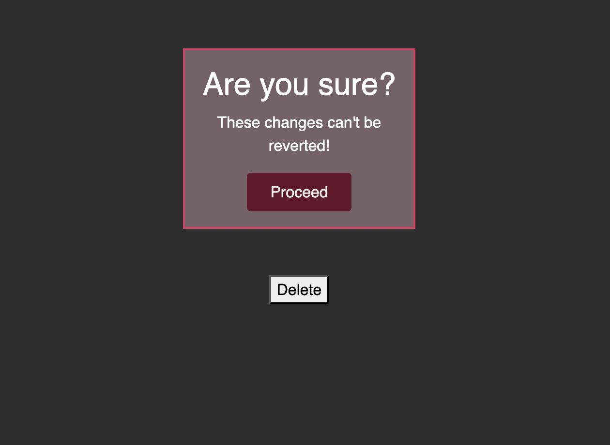

- So here, both component are getting rendered. So we want only one component to render at a particular time, when we click on `delete` button, the warning card must appear and when click on `Proceed` button, again the `delete` button must appear. This type of conditional rendering can be done in multple ways.

### 1. Simple If/Else Statement

- Below is an example in `App.js`

```
import React from 'react';
import indexcss from './index.css';


function App() {
  const [isDeleteButtonClicked, setIsDeleteButtonClicked] = React.useState(false);
  let content = null;
if(isDeleteButtonClicked) {
  content =  (<div data-testid="alert" id="alert">
    <h2>Are you sure?</h2>
    <p>These changes can't be reverted!</p>
    <button onClick={()=>setIsDeleteButtonClicked(false)}>Proceed</button></div>)
}
else{
  content = (<button onClick={()=>setIsDeleteButtonClicked(true)}>Delete</button>)
}
  return (
      <div>
        {content}
      </div> 
  );
}

export default App;
```

- On browser

<video controls src="Images/about/2025-4.mov" title="title"></video>

### 2. Ternary Operator

- Below is an example in `App.js`

```
import React from 'react';
import indexcss from './index.css';


function App() {
  const [isDeleteButtonClicked, setIsDeleteButtonClicked] = React.useState(false);

  return (
      <div>
        {isDeleteButtonClicked ?
        (<div data-testid="alert" id="alert">
          <h2>Are you sure?</h2>
           <p>These changes can't be reverted!</p>
          <button onClick={()=>setIsDeleteButtonClicked(false)}>Proceed</button></div>)
          : 
          (<button onClick={()=>setIsDeleteButtonClicked(true)}>Delete</button>)}
      </div> 
  );
}

export default App;
```

- On browser

<video controls src="Images/about/2025-4.mov" title="title"></video>

### 3. Logical Operator (`&&` or `||`)

- Below is an example in `App.js`

```
import React from 'react';
import indexcss from './index.css';

function App() {
  const [isDeleteButtonClicked, setIsDeleteButtonClicked] = React.useState(false);

  return (
      <div>
        {isDeleteButtonClicked &&
        (<div data-testid="alert" id="alert">
          <h2>Are you sure?</h2>
           <p>These changes can't be reverted!</p>
          <button onClick={()=>setIsDeleteButtonClicked(false)}>Proceed</button></div>)}

          
          {!isDeleteButtonClicked && (<button onClick={()=>setIsDeleteButtonClicked(true)}>Delete</button>)}
      </div> 
  );
}

export default App;
```

- On browser

<video controls src="Images/about/2025-4.mov" title="title"></video>

- Similarly we can also apply conditional styling 

```
//App.js
import React from 'react';

export default function App() {
    const [isToggled, setIsToggled] = React.useState(undefined)
    return (
        <div>
            <p className={isToggled}>Style me!</p>
            <button onClick={() => setIsToggled((isToggled)? undefined:'active')}>Toggle style</button>
        </div>
    );
}


//index.css
body {
    font-family: sans-serif;
    margin: 0;
    padding: 3rem;
    background-color: #2d2c2c;
    color: #959090;
    text-align: center;
}

.active {
    color: red;
}
```

- On browser

<video controls src="Images/about/2025-5.mov" title="Title"></video>

## Dynamic List Rendering


- Dynamic list content in React refers to rendering lists of items where the content or the number of items can change during the application's runtime. Instead of hardcoding list elements, React uses data-driven approaches to generate and update lists based on data changes.
- Now consider below code 


```
//App.js

import React from 'react';
import Todo from './Todo'

export const DUMMY_TODOS = [
    'Learn React',
    'Practice React',
    'Profit!'
];

export default function App() {
  return (
      <div>
      <Todo content={DUMMY_TODOS[0]}/>
      <Todo content={DUMMY_TODOS[1]}/>
      <Todo content={DUMMY_TODOS[2]}/>
      </div>
      );
}

//index.css
body {
    font-family: sans-serif;
    margin: 0;
    padding: 3rem;
    background-color: #2d2c2c;
    color: #959090;
    text-align: center;
}

ul {
    list-style: none;
    margin: 0;
    padding: 0;
}

li {
    list-style: none;
    margin: 1rem;
    padding: 1rem;
    background-color: #8567fd;
    color: white;
    border: 2px solid #8567fd;
    border-radius: 6px;
}

//Todo.js
import React from 'react';

export default function Todo({content}) {
    return <li>{content}</li>;
}
```

- On browser 

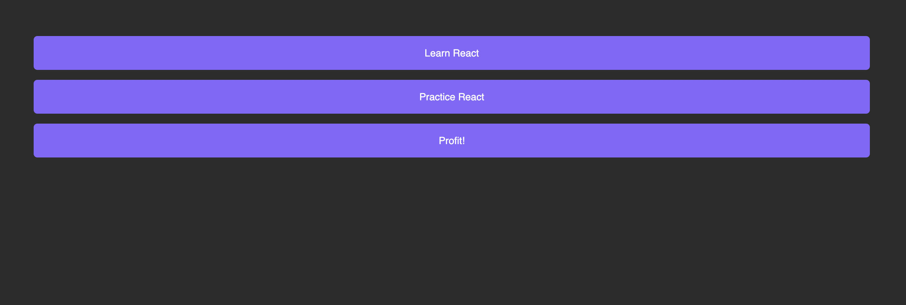

- Now if we mistakenly removed any items from the list `DUMMY_TODOS`, it would break the UI layout

```

//App.js

import React from 'react';
import Todo from './Todo'

export const DUMMY_TODOS = [
    'Learn React',
    'Practice React',
];

export default function App() {
  return (
      <div>
      <Todo content={DUMMY_TODOS[0]}/>
      <Todo content={DUMMY_TODOS[1]}/>
      <Todo content={DUMMY_TODOS[2]}/> // gives empty value
      </div>
      );
}
```

- On browser

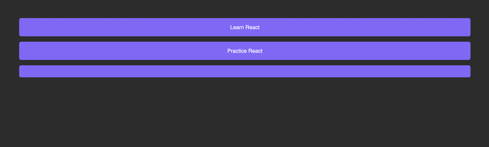


- If you add or remove an item, you have to change the code yourself. If you miss adding an item, your layout may break (missing items, wrong structure).
- In such scenario, we can dynamically just update the data (array), UI updates automatically. Consider below code

```
//App.js

import React from 'react';

import Todo from './Todo'

export const DUMMY_TODOS = [
    'Learn React',
    'Practice React',
    'Profit!'
];

export default function App() {
  return (
      <div>
      {
          
          DUMMY_TODOS.map(items=>(<Todo content={items}/>))
      }
      </div>
      );
}
```

- On browser


- To render dynamic lists, React utilizes the `map()` method on arrays. This method iterates through each item in an array and applies a function to transform it into a React element, typically a JSX structure.
- If we inpsect the HTML, in the console we get below error message

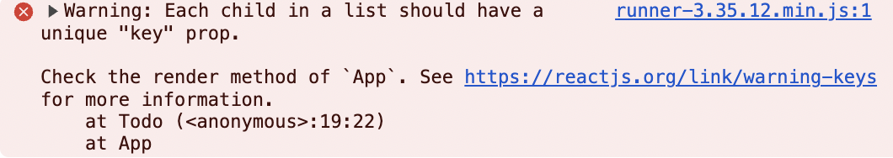

- Each item in the list should also have a unique `key` prop to help React efficiently update the list when changes occur. `key` helps React track which item changed, added, or removed — for fast updates.
- Example

```
function App() {
  const users = [
    { id: 1, name: 'John' },
    { id: 2, name: 'Alice' },
    { id: 3, name: 'Bob' }
  ];

  return (
    <div>
      <h1>Users</h1>
      <ul>
        {users.map((user) => (
          <li key={user.id}>{user.name}</li>
        ))}
      </ul>
    </div>f
  );
}
```

## Splitting Components

- In React, you need to split your component into smaller components. Splitting components in React is very important for performance, reusability, and clarity, especially when using hooks like `useState`. 
- Breaking down React components (splitting components) is a crucial practice for creating well-organized, maintainable, and reusable code, and it's not directly related to whether `useState` will update all components. While `useState` updates only the component it's used in, component splitting helps prevent the need for unnecessary re-renders in the first place.
- Let's see an example without splitting the component

```
//App.js

import React from 'react';
import './App.css';

function App() {
  let randomText ="";
  const [name, setName] = React.useState('');
  const [displayName, setDisplayName] = React.useState('');

  const greetings = ["Hi", "Hello", "How are you?", "Goodbye", "See you later"];

  const getRandomGreeting = () => {
    const randomIndex = Math.floor(Math.random() * greetings.length);
    randomText = greetings[randomIndex];
    return randomText;
  };

  const handleInputChange = (event) => {
    setName(event.target.value);
  };

  const handleSubmit = () => {
    setDisplayName(name);
  };

  return (
    <div className="App">
      <h1>{getRandomGreeting()}</h1>
      <input type="text" value={name} onChange={handleInputChange} placeholder="Enter your name" />
      <button onClick={handleSubmit}>Submit</button>
      {displayName && <p>Your name: {displayName}</p>}
    </div>
  );
}

export default App;
```
- On browser

<video controls src="Images/about/2025-6.mov" title="title"></video>

- Here, all the components which are in one place, due to `useState` all components are rendered that's why the function `getRandomGreeting()` gets executed whenever `onChange` event is triggered. Now below is the code where we split these components.

```
//App.js

import React from 'react';
import './App.css';

//AcceptInput component
function AcceptInput({displayText}){
  const [displayName, setDisplayName] = React.useState('');

  const [name, setName] = React.useState('');

  const handleInputChange = (event) => {
    setName(event.target.value);
  };

  const handleSubmit = () => {
    setDisplayName(name);
  };
  return(
    <div>
            <input type="text" value={name} onChange={handleInputChange} placeholder="Enter your name" />
            <button onClick={handleSubmit}>Submit</button>
            {displayName && <p>{displayText} {displayName}</p>}

            </div>
  )
}

//App component
//This component will display a random greeting message
//and accept user input
function App() {
  let randomText ="";

  const greetings = ["Hi", "Hello", "How are you?", "Goodbye", "See you later"];

  const getRandomGreeting = () => {
    const randomIndex = Math.floor(Math.random() * greetings.length);
    randomText = greetings[randomIndex];
    return randomText;
  };


  return (
    <div className="App">
      <h1>{getRandomGreeting()}</h1>
      <AcceptInput displayText={randomText}/>
    </div>
  );
}

export default App;
```

- On browser

<video controls src="Images/about/2025-7.mov" title="title"> </video>

- Here we have splitted up the input component, thus `onChange` event affects or render the `AceeptInput` component and not `App` Component.
- Splitting components into smaller, single-purpose units makes your codebase easier to understand and navigate.

1. Enhanced Reusability:
    - Reusable components can be used in multiple parts of your application, reducing code duplication.

2. Better Testability:
    - Smaller, focused components are easier to test individually, leading to more reliable code.

3. Reduced Complexity:
    - By breaking down complex logic into smaller, manageable pieces, you make your application less prone to errors and easier to debug. 

- Component splitting helps prevent unnecessary re-renders by ensuring that only the relevant parts of the UI are updated when necessary. This can significantly improve performance, especially in large and complex applications. 
 
## Properties of HTML elements are not automatically Forwarded

- Consider below code

```
//App.js
import React from 'react';
import './App.css';


function App() {
  return (
    <div id="new-div" className="App" style={{  color: 'blue', textAlign: 'center', marginTop: '50px' }}>
      <h1>Hello World!</h1>
      </div>
  );
}

export default App;
```

- On browser we get

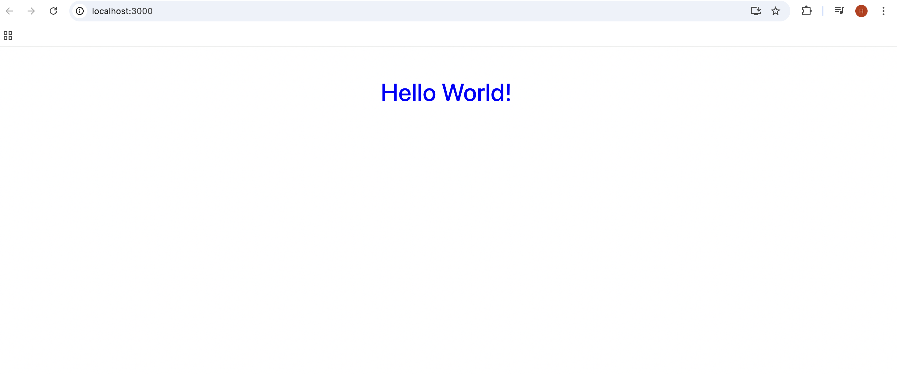

- Now let's say, if we create a custom div and pass it into the `App` component

```
import React from 'react';
import './App.css';

function MyDiv(){
  return (
    <div>
      <h1>Hello World!</h1>
    </div>
  );

}

function App() {
  return (
    <MyDiv id="new-div" className="App" style={{  color: 'blue', textAlign: 'center', marginTop: '50px' }}>
      </MyDiv>
  );
}

export default App;
```

- On browser

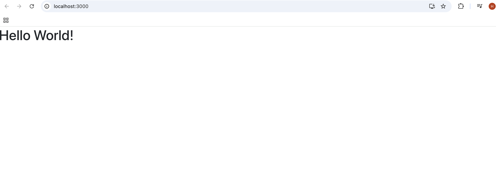

- Why so? properties of HTML elements, like those set using the `innerHTML` property or passed as `props`, are not automatically forwarded to the wrapped elements within the `innerHTML` content. `props` are not automatically forwarded to inner HTML elements unless you explicitly pass them.
- If you write a wrapper component like this:

```
function MyButton() {
  return <button>Click me</button>;
}
```

- And use it like this:

```
<MyButton className="primary" />
```

- The `className` prop is ignored because it is not passed to the `<button>` inside `MyButton`. You need to explicity pass it to `innerHTML`. Either you can pass it as with attribute name as we passed in fuction. 

```
function MyDiv({{id}}){
  return (
    <div id={id}>
      <h1>Hello World!</h1>
    </div>
  );

}
```

- Or else you can pass it via `props`.

```
import React from 'react';
import './App.css';

function MyDiv(props){
  return (
    <div {...props}>
      <h1>Hello World!</h1>
    </div>
  );

}

function App() {
  return (
    <MyDiv id="new-div" className="App" style={{  color: 'blue', textAlign: 'center', marginTop: '50px' }}>
      </MyDiv>
  );
}

export default App;
```

- On browser


- If you have any custom attributes, you need to used **Rest Operator** on `props`.

```
import React from 'react';
import './App.css';

function MyDiv({customAttribute, ...rest}){
  return (
    <div {...rest}>
      <h1>{customAttribute}</h1>
      <h1>Hello World!</h1>
    </div>
  );

}

function App() {
  return (
    <MyDiv id="new-div" className="App" style={{  color: 'blue', textAlign: 'center', marginTop: '50px' }} customAttribute="customValue">
      </MyDiv>
  );
}

export default App;
```

- On browser

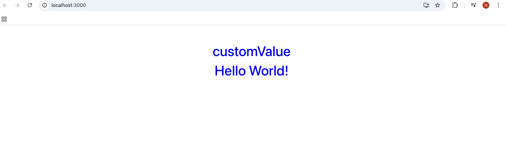

- When building components that accept both:
  - Custom props (e.g., `customAttribute`) 
  - And native HTML attributes (e.g., `className`, `onClick`, `id`, etc.)
- You usually extract the custom ones first, and then use the rest operator (`...rest`) to pass the remaining (HTML) attributes to the underlying element.
- You destructure custom props like `customAttribute`, icon, etc. using `{}`, `...rest` collects everything else (e.g., `onClick`, `type`, `id`, etc..)
- You spread `...rest` on the inner DOM element to forward parent HTML attributes.

## Passing JSX into Props

- In React, you can pass whole JSX blocks as props. Consider below code

```
import React from 'react';
import './App.css';

function MyDiv({myJSX}){
  return (
    <div>{myJSX}</div>
  );
}

function MyHeader(){
  return (
    <h2>I am React Developer</h2>
  );
}

function App() {

  // Only one root element is allowed in JSX
  // So we need to wrap the elements in a fragment
  // or a div
  // or any other element
  const myJSX = (
    <>
    <h1>Hello World</h1>
    <h2>Hello</h2>
    </>
  )
  
  return (
    <>
    <MyDiv myJSX={myJSX}/>
    <MyDiv myJSX={<MyHeader/>}/>
    </>

  );
}

export default App;
```

- On browser

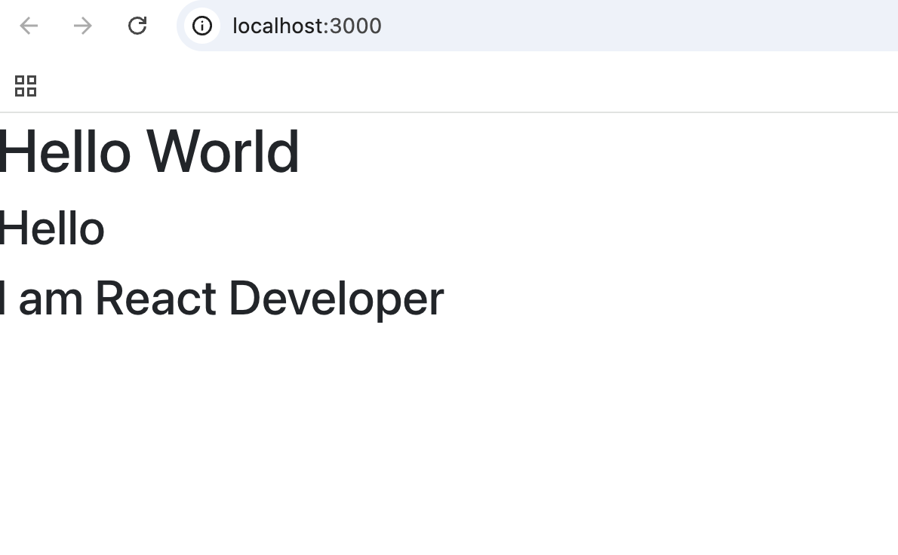

- This is a common pattern for creating reusable and flexible components. A parent component can pass a JSX element (or even a whole block of JSX) as a prop to a child component, and the child can then render that passed JSX. You can create reusable components that can display different content based on the JSX passed to them.
- This approach gives you a lot of control over the structure and content of the child component, making it adaptable to various use cases.

## Passing Component Types Dynamically

- What does *passing component type dynamically* mean? You pass a component itself (not its JSX), as a variable or prop, and then render it dynamically somewhere else.

```
import React from 'react';
import './App.css';

function MyHeader({componentToRender, children}){
  const CustomComponent = componentToRender;
  // If the componentToRender is a string, it will be rendered as a HTML element
  // If the componentToRender is a function, it will be rendered as a React component
  // We need to assign variable CustomComponent to the componentToRender and use it as a component or else if we use <componentToRender>
  // it will be treated as a normal component not passed from the function but imported via somewhere.
  // So we need to use the variable CustomComponent to render the component passed from the function
  return (
    <div>
    <CustomComponent>
    {children}
    </CustomComponent>
    </div>
  );
}

function MyCustomDiv(){
  return (
    <h2>Hi</h2>
  );
}

function App() {
// Rendering a HTML/Custom element by passing the element name in the props 
  return (
    <>
    <MyHeader componentToRender="h1">This Header Tag</MyHeader>
    <MyHeader componentToRender={MyCustomDiv}></MyHeader>
    </>

  );
}

export default App;
```

- On browser

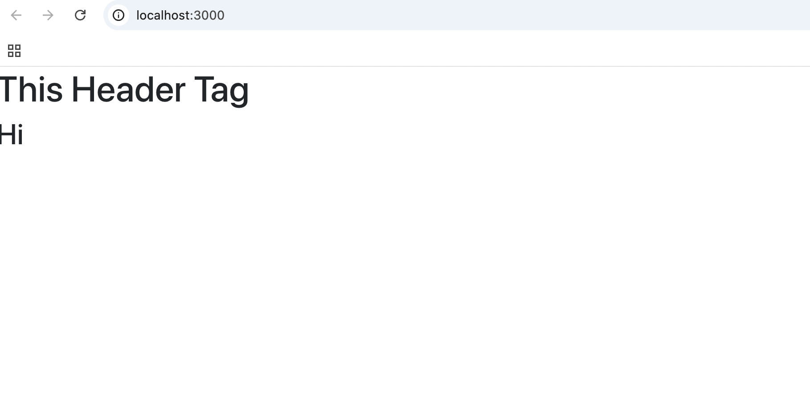

- You can pass components as variables or `props`. Helps create dynamic UIs that adapt based on conditions. 

>[!IMPORTANT]
> - One thing you should be aware of is that React components must start with a capital letter. If you want to render a component dynamically, you must assign it to a `const` with a capitalized name (e.g., `CustomComponent`) and then render it using `<CustomComponent />`.
> - If you try to use a lowercase variable or prop name directly in JSX, React will treat it as a built-in HTML element, not a custom component — which can cause an error like `Element type is invalid`.
>
>
> 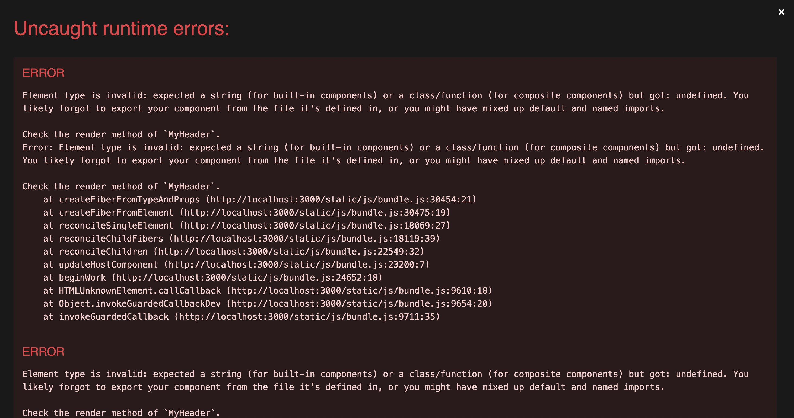

- We can set default value for the props , it can be HTML element or custom component like below

```
import React from 'react';
import './App.css';

// ComponentToRender = "div" or "h2" or "MyCustomDiv" providing default value
function MyHeader({componentToRender = MyCustomDiv, children}){
  const CustomComponent = componentToRender;
  return (
    <div>
    <CustomComponent>
    {children}
    </CustomComponent>
    </div>
  );
}
function MyCustomDiv(){
  return (
    <h2>My Custom Div</h2>
  );
}
function App() {
  return (
    <>
    <MyHeader >This Header Tag</MyHeader>
    </>
  );
}

export default App;
```

- On browser

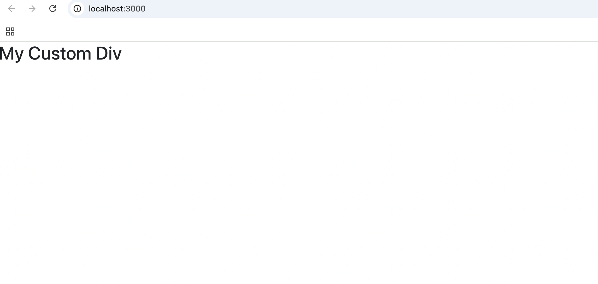

## `public` vs `/src/asset` folder

- In `public/` Folder you can store images and then directly reference them from inside your `index.html` or `index.css` files.
- Inside `index.html` file

```
  <body>
    
    <div id="root"></div>

  </body>
```

- On browser when we access images placed under `/public` folder

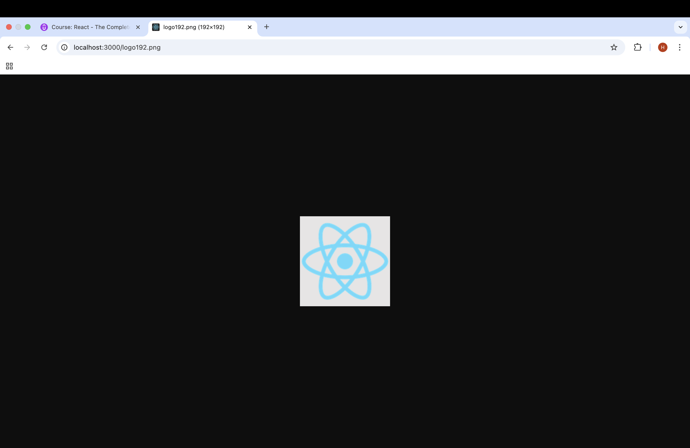

- The reason for that is that images (or, in general files) stored in `public/` are made publicly available by the underlying project development server & build process. Just like `index.html`, those files can directly be visited from inside the browser and can therefore also be requested by other files.
- The `src/assets/` folder can also store images (or, actually, anywhere in the `src` folder).

### So what's the difference compared to `public/`?

- Any files (of any format) stored in `src` (or subfolders like `src/assets/`) are not made available to the public. They can't be accessed by website visitors. If you try loading `localhost:3000/src/assets/any-image.png/jpg`, you'll get an error.
- Instead, files stored in `src/` (and subfolders) can be used in your code files. Images imported into code files are then picked up by the underlying build process, potentially optimized, and kind of "injected" into the `public/` folder right before serving the website. Links to those images are automatically generated and used in the places where you referenced the imported images.

#### So when to use which folder?

- You should use the `public/` folder for any images that should not be handled by the build process and that should be generally available. Good assets are images used directly in the `index.html` file or favicons.
- On the other hand, images that are used inside of components should typically be stored in the `src/` folder (e.g., in `src/assets/`).

## Styling in React (CSS)

- It's highly recommended to organize CSS in React by component to improve code maintainability, reusability, and prevent style clashes. Let's see an example of using vanilla or plain CSS in react.
- So here, we have our own component `MyPara.jsx` along with its `MyPara.css`

```
//MyPara.css

p{
    color: #e20b0b;
    font-size: 2em;
    margin: 0;
  }
  
//MyPara.jsx

import './MyPara.css';

export default function MyPara() {
    return (
        <div>
            <p>This is Paragraphy</p>
            <p>This is another paragraph</p>
            <p>This is a third paragraph</p>
        </div>
    );
}

//App.js

import React from 'react';
import MyPara from './components/MyPara/MyPara';
function App() {
  return (
    <div>
      <MyPara />
    </div>
  );
}

export default App;
```

- On browser, we can see our styling got affected for `MyPara` component.

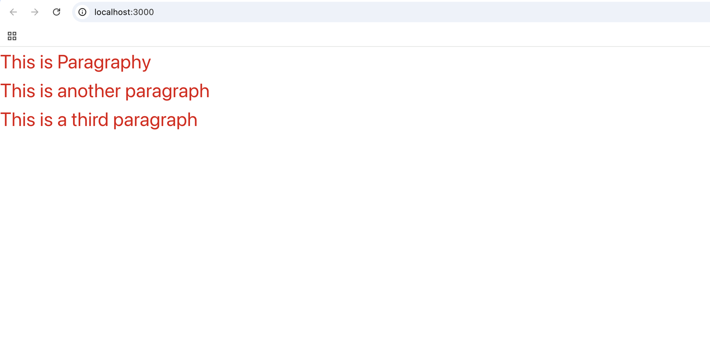

- Now let's add another paragraphy under **`App.js`**.

```
import React from 'react';
import MyPara from './components/MyPara/MyPara';
function App() {
  return (
    <div>
      <MyPara />
      <p> This is Paragraph under APP.JS</p>
    </div>
  );
}

export default App;
```

- On browser we can see, the `App,js` got the same styling for `p` written for `MyPara.css`.

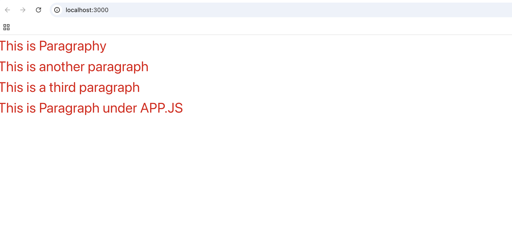

- Vanilla CSS in React is not scoped to components, meaning it affects all components and elements on the page. This can lead to styling conflicts and difficulties in managing styles across different parts of your application.

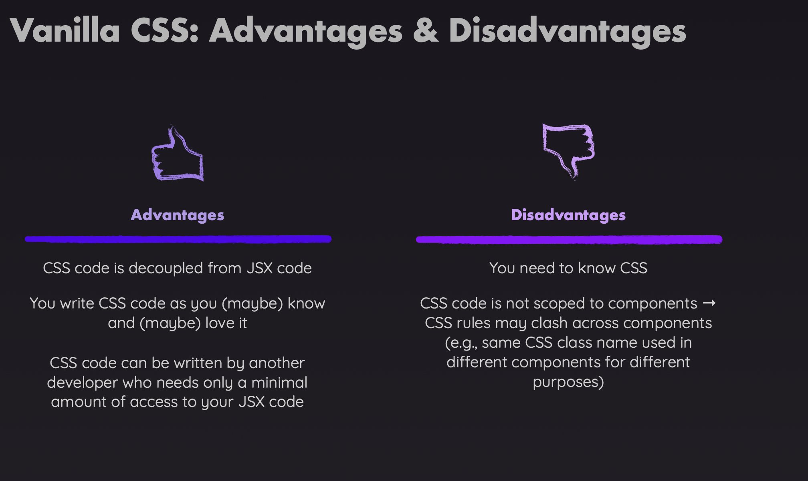

- We can overcome this using **inline style css**. Like below

```
//MyPara.jsx

const paraStyle={
        color: '#e20b0b',
        fontSize: '2em',
        margin: 0
        
}

export default function MyPara() {
    return (
        <div>
            <p style={paraStyle}>This is Paragraphy</p>
            <p style={{color: '#e20b0b',
                        fontSize: '2em',
                        margin: 0}}>
                    This is another paragraph</p>
            <p style={paraStyle}>This is a third paragraph</p>
        </div>
    );
}
```

- On browser, the `App.js` remains unaffected from the css used for `MyPara.jsx`

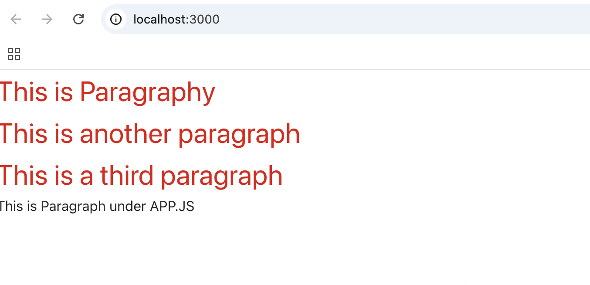

- React uses JavaScript objects to define inline styles (`paraStyle`). CSS property names that are normally hyphenated (like `background-color`, `font-size`) need to be written in camelCase (like `backgroundColor`, `fontSize`). So a normal css

```
.myDiv {
  background-color: red;
  font-size: 16px;
  margin-top: 10px;
}
```

- In React will be like

```
<div
  style={{
    backgroundColor: "red",
    fontSize: "16px",
    marginTop: "10px"
  }}
>
  Hello World
</div>
```

- Some CSS properties that are just one word stay the same `color`, `margin`, `padding`, `border` etc..
- React internally maps inline style objects to actual DOM styles. When you pass `style={{ backgroundColor: "red" }}`, React sets the DOM element’s `style.backgroundColor` property directly, which is JavaScript’s camelCase API for CSS.

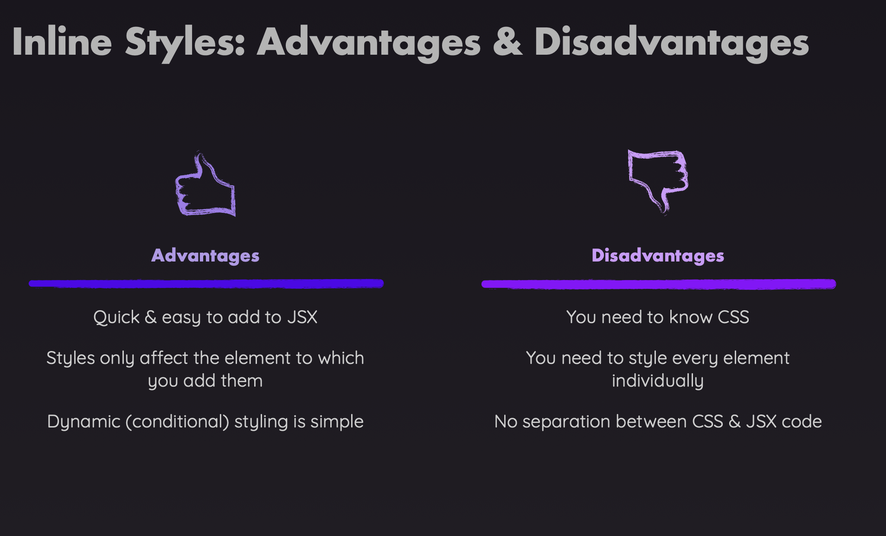


### Conditional Rendering in Styles

- We can also do conditional rendering in CSS using React

```
function App() {
    const [h1Color,setH1Color] =React.useState('white');
    
    return (
    <div id="app">
      <h1 style={{color: h1Color}}>CSS is great!</h1>
      <menu>
        <li>
          <button onClick={()=>setH1Color('green')}>Yes</button>
        </li>
        <li>
          <button onClick={()=>setH1Color('red')}>No</button>
        </li>
      </menu>
    </div>
  );
}

export default App;
```

- On browser

<video controls src="Images/about/2025-12.mov" title="title"></video>


### Styling using CSS class (`className`)

- CSS styling using `class` names in React is achieved by utilizing the `className` attribute within JSX. It serves the same purpose as the `class` attribute in standard HTML but is named differently due to `class` being a reserved keyword in JavaScript.

```
//App.jsx
import React from 'react';

function App() {

    let [h1Color,setH1Color] = React.useState();
    
  return (
    <div id="app">
      <h1 className={h1Color}>CSS is great!</h1>
      <menu>
        <li>
          <button onClick={()=>setH1Color('highlight-green')}>Yes</button>
        </li>
        <li>
          <button onClick={()=>setH1Color('highlight-red')}>No</button>
        </li>
      </menu>
    </div>
  );
}

export default App;

//index.css
@import url('https://fonts.googleapis.com/css2?family=Raleway:wght@400;700&family=Lato:wght@400;700&display=swap');

* {
  box-sizing: border-box;
}

body {
  margin: 0;
  font-family: 'Raleway', sans-serif;
  -webkit-font-smoothing: antialiased;
  -moz-osx-font-smoothing: grayscale;
  background: linear-gradient(#180d27, #0c0219);
  color: #e5d9f1;
  min-height: 100vh;
}

#app {
  margin: 2rem auto;
  padding: 1rem;
  max-width: 30rem;
  text-align: center;
  border-radius: 6px;
  background: linear-gradient(#341a89, #3a1967);
  box-shadow: 0 0 8px rgba(0, 0, 0, 0.3);
}

h1 {
  letter-spacing: 0.15rem;
  font-family: 'Lato', sans-serif;
  text-transform: uppercase;
  margin-bottom: 2.5rem;
}

menu {
  list-style: none;
  margin: 0;
  padding: 0;
  display: flex;
  gap: 1.5rem;
  justify-content: center;
}

menu button {
  width: 5rem;
  text-align: center;
  border: none;
  background: none;
  color: white;
  font-family: inherit;
  font-size: inherit;
  cursor: pointer;
  padding: 0.5rem 1rem;
  border-radius: 6px;
}

menu li:first-child button {
  background: linear-gradient(#147a42, #0b7555);
  box-shadow: 0 0 8px rgba(0, 0, 0, 0.3);
}

menu li:first-child button:hover {
  background: linear-gradient(#169d75, #13954e);
}

menu li:last-child button {
  background: linear-gradient(#ad2424, #8b2323);
  box-shadow: 0 0 8px rgba(0, 0, 0, 0.3);
}

menu li:last-child button:hover {
  background: linear-gradient(#bd4e4e, #cd3030);
}

div .highlight-green {
  color: green;
}

/* All the class irrespective of any parent HTML will get styled *.
.highlight-green {
  color: green;
}

div .highlight-red {
  color: red;
}
```

- On browser

<video controls src="Images/about/2025-12.mov" title="title"></video>

- So the class `highlight-green` under the `div` gets only styled when click on `YES` or `NO` button.

### CSS Modules

- CSS Modules in React are a way to write CSS that is scoped (local) to a specific component, so styles don’t leak or clash with other components.
- A CSS Module lets you use CSS in a way that works only for one component, even if other components have styles with the same class name.
- Without CSS modules (Vanilla CSS)

```
/* styles.css */
.button {
  background-color: red;
}
```

- With CSS Modules 

```
/* Button.module.css */
.button {
  background-color: red;
}
```

- You need to have file name as `cssFileName.modules.css`. Let's take an example

```
//MyPara.modules.css

.para{
    color: #e20b0b;
    font-size: 2em;
    margin: 0;
  }
  

// MyPara.jsx
import MyParaCSS from './MyPara.module.css';

export default function MyPara() {
    console.log(MyParaCSS); // JavaScript Object
    return (
        <div>
            <p className={MyParaCSS.para}>This is Paragraphy</p>
            <p className={MyParaCSS.para}>
                    This is another paragraph</p>
        </div>
    );
}

//App.js

import React from 'react';
function App() {
  return (
    <div>
      <MyPara />
      <p> This is Paragraph under APP.JS</p>
    </div>
  );
}

export default App;
```

- On browser

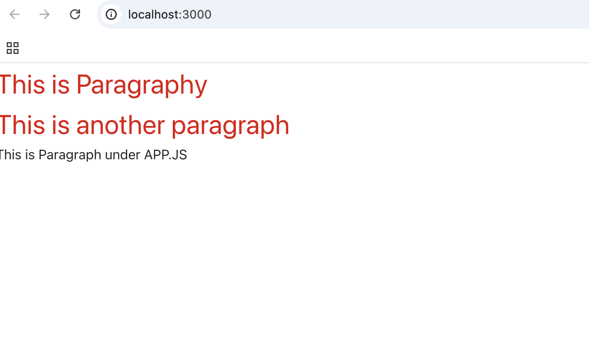

- `import MyParaCSS from './MyPara.module.css';` this line imports the CSS module file. But unlike normal CSS, it's not just imported for its side effects — it actually returns a JavaScript object. `MyParaCSS` is a JavaScript object. `MyParaCSS.para` contain your css styling class selectors which you call it (`MyPara.para`) inside the `className`.
- When you use a CSS Module, React (actually, the build tool like Webpack or Vite) processes it and generates a unique class name.
- Let's inspect the page.

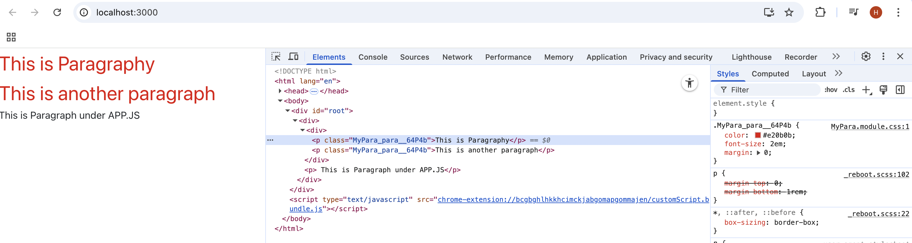

- On console

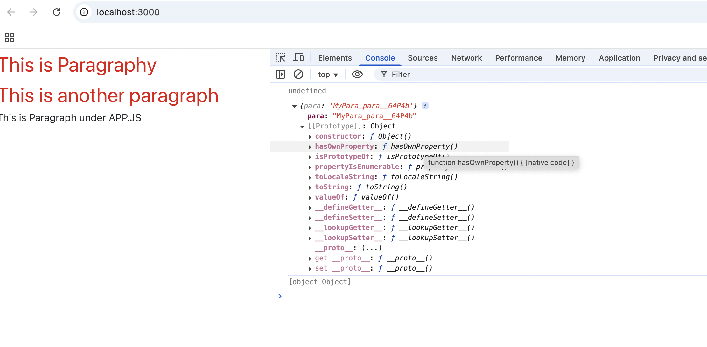


#### What React/Webpack does behind the scenes?

- It parses `MyPara.module.css` at build time. Converts class names into unique, hashed names.
- Creates a JavaScript object where:
  - Keys = your original class names
  - Values = generated unique class names
- So in code, MyParaCSS.para becomes a string like `MyPara_para__64P4b`. React then renders

```
<p class="MyPara_para__64P4b">This is Paragraph</p>
```

- This means, your class name is unique, even if other files have `.para`. The style applies only to this component.

>[!NOTE]
> - You typically use class selectors (`.className`) in CSS Modules. Element selectors (`div`, `p`, etc.) and ID selectors (`#id`) are not scoped, so they may still affect the global DOM and defeat the purpose of using CSS Modules.
> - Only class selectors are treated as scoped/local.
> 
> ```
> // Allowed Class Selectors
> .button {
>   color: white;
> }
> 
> /* ❌ These won't work the way you expect in CSS Modules */
> div {
>   color: red;
> }
> 
> #myId {
>   background: blue;
> }
> ```


- CSS Modules advantages & disadvantages

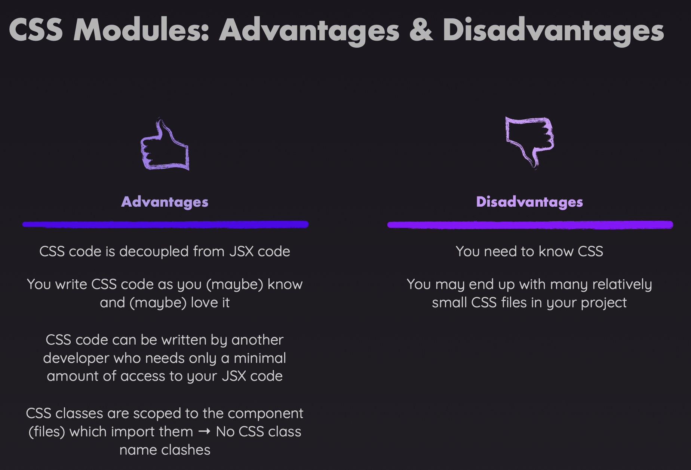


## Style Components (Third Party Package)

- Styled Components is a popular library in ReactJS for writing CSS directly in JavaScript, using a feature called tagged template literals.
- Styled Components is a library for React that enables the writing of CSS within JavaScript, a concept known as "CSS-in-JS." It utilizes tagged template literals to allow the creation of styled React components with standard CSS syntax. 
- This approach encapsulates styles within the component itself, promoting reusability and preventing naming conflicts.
- Let's install the library

```
npm install styled-components
```

- Let's see an example, currently we have `MyPara.module.css` with below styling

```
.para{
    color: #e20b0b;
    font-size: 2em;
    margin: 0;
  }

  .card {
    background-color: #f9f9f9; /* Light background */
    border-radius: 5px; /* Rounded corners */
    box-shadow: 0 2px 4px rgba(0, 0, 0, 0.1); /* Subtle shadow */
    padding: 16px; /* Space between content and border */
    width: 300px; /* Example width */
    transition: box-shadow 0.3s ease; /* Smooth hover effect */
  }
  
  .card:hover {
    box-shadow: 0 5px 10px rgba(0, 0, 0, 0.2); /* Larger shadow on hover */
  }
```

- Below is current `MyPara.jsx`.

```
import MyParaCSS from './MyPara.module.css';

export default function MyPara() {
    console.log(MyParaCSS)
    return (
        <div className={MyParaCSS.card}>
            <p className={MyParaCSS.para}>This is Paragraphy</p>
            <p className={MyParaCSS.para}>
                    This is another paragraph</p>
        </div>
    );
}
```

- Below is current `App.jsx`

```
import React from 'react';
import MyPara from './components/MyPara/MyPara.jsx';
function App() {
  return (
    <MyPara/>
    
  );
}

export default App;
```

- On browser

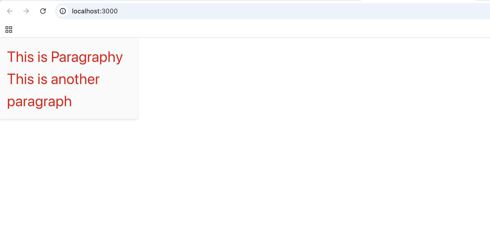

- Let's apply styled component, for `MyPara.jsx`

```

import styled from "styled-components";

const DivStyle = styled.div`
    background-color:rgb(139, 19, 214);
    padding: 20px;
    border-radius: 5px;
    margin: 10px;
    box-shadow: 0 2px 5px rgba(0, 0, 0, 0.1);
`;

const ParaStyle = styled.p`
    color:rgb(246, 242, 242);
    font-size: 16px;
    line-height: 1.5;
`;


export default function MyPara() {
    return (
        <DivStyle >
            <ParaStyle>This is Paragraphy</ParaStyle>
            <ParaStyle>This is another Paragraphy</ParaStyle>
        </DivStyle>
    );
}
```

- On browser

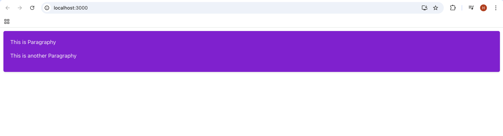

- `styled.div` is a tagged template literal that tells Styled Components to, create a new React component, apply the given styles to a `<div>`.
- Internally generate a unique class name (like `sc-a1234`). Inject that class name and style into the DOM.

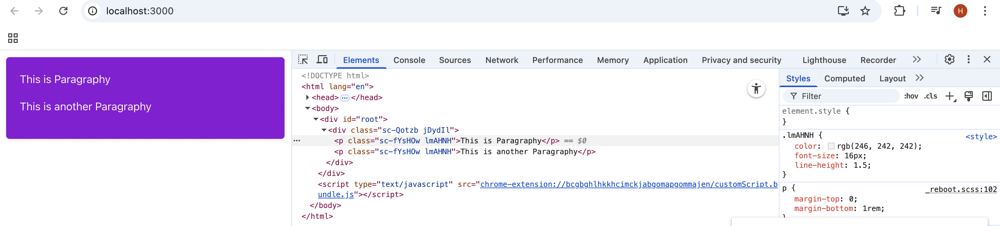

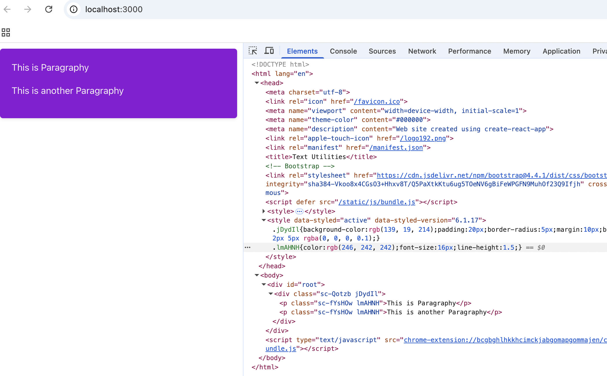

- So `DivStyle` becomes a custom React component that renders a `div` with styles already baked in. Similarly goes for `p` html.
- A `<div>` and two `<p>` tags are created — but with unique class names applied by Styled Components. The CSS rules (in your template literal) are added to a `<style>` tag in the HTML `<head>` at runtime.
- In CSS Modules, we had limitations, we can't style global selectors like `h1`, `p`, or `#id` directly in `.module.css` because all selectors are scoped and transformed into unique class names but in styled Components we can target:
  - HTML elements (`h1`, `a`, `button`, etc.)
  - ID selectors (though rarely needed)
  - Class selectors
  - Even nested selectors and pseudo-elements (`::before`, `:hover`, etc.)
- Example

```
const Wrapper = styled.div`
  padding: 20px;

  h1 {
    color: purple;
  }

  #custom-id {
    background: yellow;
  }

  .nested-class {
    border: 1px solid red;
  }
`;


export default function MyPara() {
    return (
        <>
        <Wrapper>
        <h1>Hello</h1>
        <p id="custom-id">ID styled</p>
        <div className="nested-class">Class styled</div>
        </Wrapper>
        </>
    );
}
```

- On browser

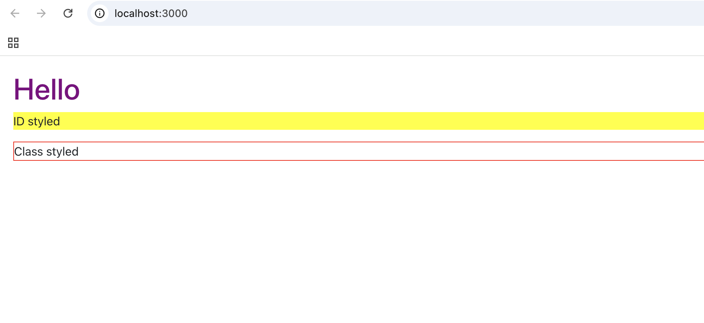


- We can also do conditional rendering in styled components and can pass props (`className`, event handlers etc..) to built-in HTML elements (like `div`, `p`, `button`, etc.) and use those props to apply conditional styles.

```

import React from "react";
import styled from "styled-components";

// Styled component using props
const DivStyle = styled.div`
    background-color: rgb(139, 19, 214);
    padding: 20px;
    border-radius: 5px;
    margin: 10px;
    box-shadow: 0 2px 5px rgba(0, 0, 0, 0.1);
`;

const ParaStyle = styled.p`
    color: ${props => props.isImportant ? "yellow" : "rgb(246, 242, 242)"};
    font-size: 16px;
    line-height: 1.5;
    font-weight: ${props => props.isImportant ? "bold" : "normal"}; //Conditional styling
`;


const Wrapper = styled.div`
  padding: 20px;

  h1 {
    color: purple;
  }

  #custom-id {
    background: yellow;
  }

  .nested-class {
    border: 1px solid red;
  }
`;


export default function MyPara() {
    const [changeOnOver , setChangeOnOver] = React.useState(false);
    return (
        <>
        <DivStyle >
            <ParaStyle isImportant={changeOnOver} onMouseOver={()=>setChangeOnOver(true)} onMouseLeave={()=>setChangeOnOver(false)}>This is Paragraphy</ParaStyle>
            <ParaStyle isImportant>This is another Paragraphy</ParaStyle>
        </DivStyle>
        <Wrapper>
        <h1>Hello</h1>
        <p id="custom-id">ID styled</p>
        <div className="nested-class">Class styled</div>
        </Wrapper>
        </>
    );
}
```

- On browser

<video controls src="Images/about/2025-13.mov" title="title"></video>


- The second `<ParaStyle isImportant>` receives a prop `isImportant={true}` (shorthand -> `IsImportant`). The `ParaStyle` definition reads that prop and:
  - Changes color to yellow.
  - Makes the font bold.
- For first para, we have event handler when hovered the it gets styling of `IsImportant`.
- Let's see an example of Pseudo selectors, nested queires and media queries using styled component.

```
//MyPara.jsx


import React from "react";
import styled from "styled-components";

// Styled component using props
// Parent styled div
const DivStyle = styled.div`
  background-color: rgb(139, 19, 214);
  padding: 20px;
  border-radius: 5px;
  margin: 10px;
  box-shadow: 0 2px 5px rgba(0, 0, 0, 0.1);

  // Nested styling - target all <p> inside this div
  p {
    margin-bottom: 10px;
  }

  // Media query: smaller padding on small screens
  @media (max-width: 600px) {
    padding: 10px;
  }
`;

// Styled paragraph
const ParaStyle = styled.p`
  color: rgb(246, 242, 242);
  font-size: 16px;
  line-height: 1.5;
  transition: all 0.3s ease;

  // Pseudo-selector: Hover effect
  &:hover {
    color: yellow;
    font-weight: bold;
    cursor: pointer;
  }

  // Pseudo-selector: First paragraph
  &:first-child {
    text-decoration: underline;
  }

  // Media query: Larger font size on big screens
  @media (min-width: 768px) {
    font-size: 18px;
  }
`;


const Wrapper = styled.div`
  padding: 20px;

  h1 {
    color: purple;
  }

  #custom-id {
    background: yellow;
  }

  .nested-class {
    border: 1px solid red;
  }
`;


export default function MyPara() {
    const [changeOnOver , setChangeOnOver] = React.useState(false);
    return (
        <>
        <DivStyle >
            <ParaStyle isImportant={changeOnOver} onMouseOver={()=>setChangeOnOver(true)} onMouseLeave={()=>setChangeOnOver(false)}>This is Paragraphy</ParaStyle>
            <ParaStyle isImportant>This is another Paragraphy</ParaStyle>
        </DivStyle>
        <Wrapper>
        <h1>Hello</h1>
        <p id="custom-id">ID styled</p>
        <div className="nested-class">Class styled</div>
        </Wrapper>
        </>
    );
}
```

- On browser

<video controls src="Images/about/2025-14.mov" title="title"></video>

- The `&` symbol is very important in Styled Components. It represents the current component selector (like a placeholder for the generated class name). It allows you to apply pseudo-selectors, nested rules, and combinators relative to the component.
- When you write this in Pseudo selectors

```
const ParaStyle = styled.p`
  &:hover {
    color: yellow;
  }
```
- What it really means:

```
.sc-xyz123:hover {
  color: yellow;
}
```
- `&` is replaced with the generated class name for that component. Without `&`, you’d write an invalid CSS selector.
- For Nested rules, you don't required `&`, example

```
const DivStyle = styled.div`
  p {
    margin-bottom: 10px;
  }
`;
```

- Similarly for media queries you don't require `&` , but if there pesudo selectors into it when you require `&`. Also we can write nested queries in it.

```
const Button = styled.button`
  background: purple;
  color: white;

  @media (hover: hover) {
    &:hover {
      background: violet;
    }
  }
`;
```

- Let's see advantages and disadvantages of styled component

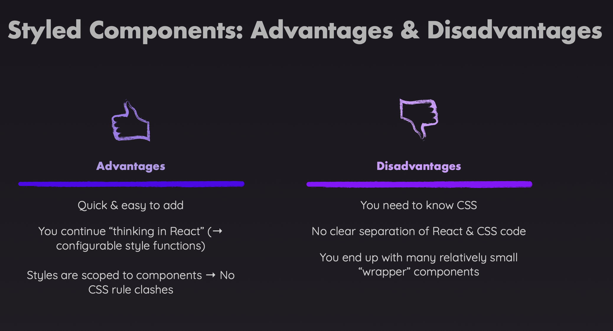

## React Developer Tools

- React Developer Tools is a browser extension (available for Chrome, Firefox, and Edge) created by the React team to help developers inspect and debug React applications more efficiently.
- Here, is the [chrome extension](https://chromewebstore.google.com/detail/react-developer-tools/fmkadmapgofadopljbjfkapdkoienihi?hl=en&pli=1) for it.
- React Developer Tools allows you to:

1. Inspect React Component Trees

    - See the component hierarchy (including nested components).
    - View props and state of each component in real-time.

2. Edit Component Props and State

  - Directly modify props and state to test how changes affect your app.

3. Highlight Component Renders

  - Visual indication of which components re-render and when.
  - Useful for performance tuning.

4. View Hooks Data

  - If you're using hooks (like `useState`, `useEffect`), you can inspect their current values.

5. Trace Component Renders (Profiler tab)

  - Profile performance: see how long each component takes to render

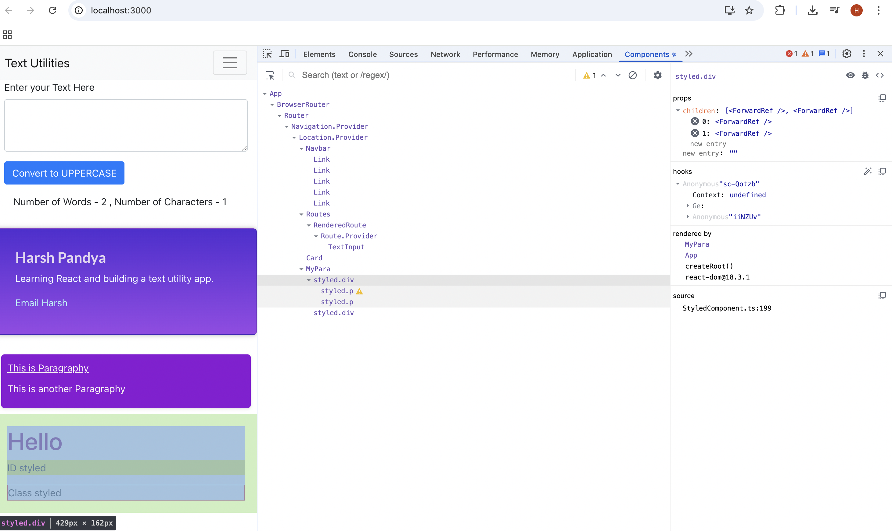


## Refs (`useRef`)

- The `useRef` hook in React is used to create a mutable object that persists across renders. It is a reference to a value or DOM element
- It hold mutable values that **don’t trigger re-renders when changed**. It refers the DOM elements directly.
- Let's create a new Time Challenger Game application, so we have below our `App.jsx` a new component, `Player.jsx`.

```
//App.js

import Player from './components/Player.jsx';

function App() {
  return (
    <>
      <Player />
      <div id="challenges"></div>
    </>
  );
}

export default App;

//Player.jsx


export default function Player() {

  return (
    <section id="player">
      <h2>Welcome unknown entity</h2>
      <p>
        <input type="text" />
        <button>Set Name</button>
      </p>
    </section>
  );
}

//index.css - refer /timerChallengeGame folder
```

- On browser

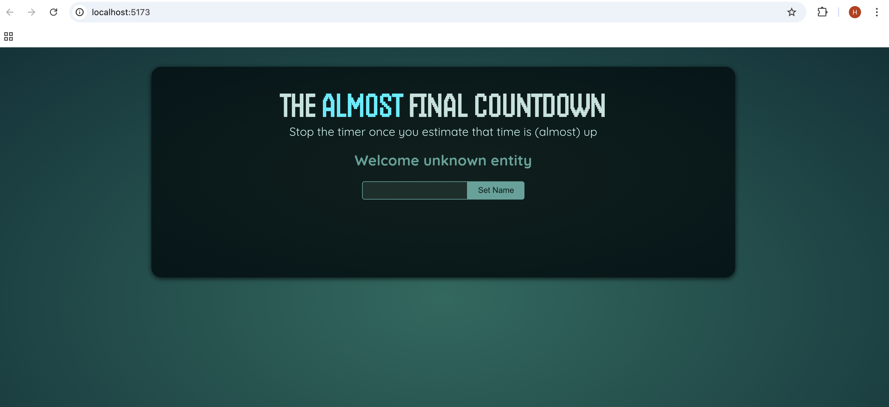

- Now in this application, there are no event handlers and when we want to set our name, it should be shown after the `Welcome` word when clicked on `Set Name` button. To do this we can use `useState`.

```
// Player.jsx
import React, { useState } from 'react';
export default function Player() {

  const [playerName, setPlayerName] = useState(null);
  const [buttonClicked, setButtonClicked] = useState(false);


  function handleChange(event) {
    setButtonClicked(false);
    setPlayerName(event.target.value);
  }

  function handleClick() {
    setButtonClicked(true);
  }

  return (
    <section id="player">
      <h2>Welcome {buttonClicked? playerName : 'unknown entity'}</h2>
      <p>
        <input type="text" onChange={handleChange} value={playerName}/>
        <button onClick={handleClick}>Set Name</button>
      </p>
    </section>
  );
}
```

- On browser

<video controls src="Images/about/2025-15.mov" title="title"></video>

- Here, we have use 2 `useState` which render our component unnecessarily. This add more complexity and rendering in our code. Let's use `useRef`.

```
//Player.jsx
import React, { useRef, useState } from 'react';
export default function Player() {

  const inputPlayerName = useRef(null);
  const [playerName, setPlayerName] = useState(null);

  return (
    <section id="player">
      <h2>Welcome {playerName ? playerName : 'unknown entity'}</h2>
      <p>
        <input type="text" ref={inputPlayerName}/>
        <button onClick={()=>{setPlayerName(inputPlayerName.current.value)}}>Set Name</button>
      </p>
    </section>
  );
}
```

- On browser

<video controls src="Images/about/2025-16.mov" title="title"></video>

- `const inputPlayerName = useRef(null);` creates a ref object using `useRef`. That object looks like `{ current: null }`. Inside the JSX `<input type="text" ref={inputPlayerName}/>`, connects the `ref` to the `<input>` element. Now, when the component renders, (`onClick` event) `inputPlayerName.current` becomes the actual DOM element of the input — like a handle to grab it.
- Now to get the actual value, we need to do `inputPlayerName.current.value`. So you're directly reading the value typed into the `<input>` without using state or an `onChange` handler which renders the whole component unnecessarily.
- `useRef` is used here for getting a reference to the `<input>` element. Reading its value on demand, when the button is clicked. You don’t need to update state on every keystroke entered in input text. You only care about the input once (when the user clicks `Set Name`).
- Once `ref` is assigned to DOM element like `<input ref={myRef} />`. Then React assign `myRef.current = <input type="text" ...>  // the real DOM element`. So now you can access any HTML properties on it, like, `myRef.current.value`, `myRef.current.focus()`, `myRef.current.classList`, etc. So `useRef().current` gives you full access to the native DOM element (like `document.querySelector(...)` in plain JS).


| Scenario                                                                                                         | Use `useState` | Use `useRef` |
| ---------------------------------------------------------------------------------------------------------------- | -------------- | ------------ |
| You want to **display or react to value changes** (like showing updated text on screen)?                         | ✅ Yes          | ❌ No         |
| You want to **track a value** but **not re-render** every time it changes (e.g. timer ID, previous value, etc.)? | ❌ No           | ✅ Yes        |
| You want to **access or control a DOM element** (like focus input, read value)?                                  | ❌ No           | ✅ Yes        |


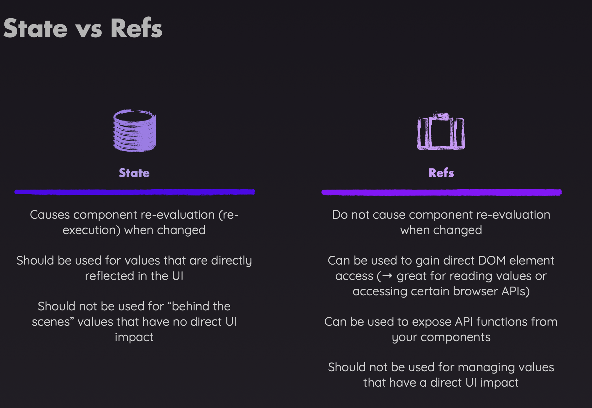


- Let's see an another example of `useRef` , where we need to upload images using `click()` event of HTML `input` element.

```
//App.jsx

import React from 'react';

function App() {
    const filePicker=React.useRef('');

  return (
    <div id="app">
      <p>Please select an image</p>
      <p>
        <input data-testid="file-picker" type="file" accept="image/*" ref={filePicker}/>
        <button onClick={()=>filePicker.current.click()}>Pick Image</button>
      </p>
    </div>
  );
}

export default App;

//index.css
@import url('https://fonts.googleapis.com/css2?family=Raleway:wght@400;700&family=Lato:wght@400;700&display=swap');

* {
  box-sizing: border-box;
}

body {
  margin: 0;
  font-family: 'Raleway', sans-serif;
  -webkit-font-smoothing: antialiased;
  -moz-osx-font-smoothing: grayscale;
  background: linear-gradient(#180d27, #0c0219);
  color: #e5d9f1;
  min-height: 100vh;
}

#app {
  margin: 2rem auto;
  padding: 1rem;
  max-width: 30rem;
  text-align: center;
  border-radius: 6px;
  background: linear-gradient(#341a89, #3a1967);
  box-shadow: 0 0 8px rgba(0, 0, 0, 0.3);
}

h1 {
  letter-spacing: 0.15rem;
  font-family: 'Lato', sans-serif;
  text-transform: uppercase;
  margin-bottom: 2.5rem;
}

input[type='file'] {
  display: none;
}

button {
  margin-top: 1rem;
  padding: 0.5rem 1rem;
  border: none;
  border-radius: 6px;
  background: #8f05c6;
  box-shadow: 0 0 8px rgba(0, 0, 0, 0.3);
  color: #e5d9f1;
  font-family: 'Lato', sans-serif;
  font-size: 1rem;
  cursor: pointer;
  transition: all 0.2s ease-in-out;
}

button:hover {
  background: #a80ad1;
}
```

- On browser

<video controls src="Images/about/2025-17.mov" title="title"></video>

- Here, we manually triggering the built-in HTML `click()` method of the `<input type="file" />` element using JavaScript. Normally the input file looks like this `<input type="file" />`

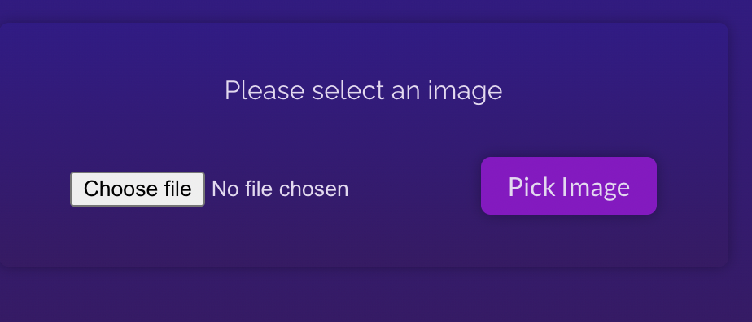

- It’s not easy to style, and often looks different across browsers. So instead, developers hide the actual file input and use a custom-styled button to trigger it.
- When you assigned `<input type="file" ref={filePicker} />`, you assign a `ref` to the file input. This gives you access to the actual DOM element via f`ilePicker.current.` Then `<button onClick={() => filePicker.current.click()}>Pick Image</button>`, when the user clicks the button, you programmatically call the `.click()` method on the file input. This opens the native file dialog, as if the user clicked the input directly.
- Now let's add the gaming function in our Time challenge game. So basically, there will be 4 cards, each card will consist of time (seconds written on it). Gamer will click on start and stop, if the stop button is clicked within the time interval mentioned on the card the player wins. So e.g if the card has 1 second as timer, then player will click on start and within 1 seconds of interval the player has to click on stop button to win the challenge.
- Let's develope the code for it. So we have created a new component `TimeChallenger.jsx`

```
//TimeChallenge.jsx

export default function TimeChallenge({title, targetTime}) {

    return(
        <section className="challenge">
            <h2>{title}</h2>
            <p className="challenge-time">
                {targetTime} second{targetTime > 1 ? 's' : ''}
            </p>
            <button>
                Start/Stop Challenge
            </button>
            <p>

                Time is running..../Time inactive
            </p>
        </section>
    )
}

// App.jsx

import Player from './components/Player.jsx';
import TimeChallenge from './components/TimeChallenge.jsx';

function App() {
  return (
    <>
      <Player />
      <div id="challenges">
        <TimeChallenge title="Easy" targetTime={1} />
        <TimeChallenge title="Medium" targetTime={5} />
        <TimeChallenge title="Hard" targetTime={10} />
        <TimeChallenge title="Extreme" targetTime={20} />
      </div>
      
    </>
  );
}

export default App;
```

- On browser, currently we have added the card into the `App.jsx` file.


- Now to calculate timer, we can use default function of JS which is `setTimeout`. So let's create a function , whenever user will click on the button, the function will execute `setTimeout`.

```
    function onStartButtonClick() {
        const milliseconds = targetTime * 1000;
        setTimeout(() => {
        }
        , milliseconds);
    }
```

- Now, whenever user clicks on the button, we need to have an indication that timer has started. We can do it using `useState`.

```
    const [timeStarted, setTimeStarted] = useState(false);
    function onStartButtonClick() {
        setTimeStarted(true);
        const milliseconds = targetTime * 1000;
        setTimeout(() => {
        }
        , milliseconds);
    }
```

- Now, the `setTimeout` will execute after some milliseconds, so we need to have a state which will tell there whether the timer execution is finished or not. So here again, we will use `useState` to know whether time has expired or not.

```
    const [timeExpired, setTimeExpired] = useState(false);
    function onStartButtonClick() {
        const milliseconds = targetTime * 1000;
        setTimeout(() => {
            setTimeExpired(true);
            // Post click and after some milliseconds, the time expired
        }
        , milliseconds);
    }
```

- Now based on `timeStarted` we need to toggle `Start` or `Stop` on button.

```
import React, { useState } from 'react';

export default function TimeChallenge({title, targetTime}) {

    const [timeExpired, setTimeExpired] = useState(false);
    const [timeStarted, setTimeStarted] = useState(false);
    function onStartButtonClick() {
        setTimeStarted(true);
        const milliseconds = targetTime * 1000;
        setTimeout(() => {
            setTimeExpired(true);
            // Post click and after some milliseconds, the time expired
        }
        , milliseconds);
    }


    return(
        <section className="challenge">
            <h2>{title}</h2>
            <p className="challenge-time">
                {targetTime} second{targetTime > 1 ? 's' : ''}
            </p>
            <button onClick={onStartButtonClick}>
                {timeStarted ? 'Stop' : 'Start'} Challenge
            </button>
            <p className={timeStarted ? 'active' : undefined}>
                {timeStarted ? 'Time is running' : 'Time inactive'}
            </p>
        </section>
    )
}
```

- On browser

<video controls src="Images/about/2025-18.mov" title="title"></video>

- We are able to start the timer, but not able to stop. So we need to define a stop function, but how will the stop function will stop the `setTimeout` timer? we will be using `useRef`.
- Now to stop the timer we will use `clearTimeout` function. It accepts the object saved for `setTimeout`.

```
//TimeChallenge.jsx

import React, { useRef, useState } from 'react';

export default function TimeChallenge({title, targetTime}) {

    const [timeExpired, setTimeExpired] = useState(false);
    const [timeStarted, setTimeStarted] = useState(false);
    const timer=useRef();

    function onStartButtonClick() {
        setTimeStarted(true);
        const milliseconds = targetTime * 1000;
        timer.current=setTimeout(() => {
            setTimeExpired(true);
            // Post click and after some milliseconds, the time expired
        }
        , milliseconds);
    }

    function onStopButtonClick() {
        // Clear the timer
        clearTimeout(timer.current);
    }


    return(
        <section className="challenge">
            <h2>{title}</h2>
            {timeExpired && <p>You lost!</p>}
            <p className="challenge-time">
                {targetTime} second{targetTime > 1 ? 's' : ''}
            </p>
            <button onClick={timeStarted ? onStopButtonClick : onStartButtonClick}>
                {timeStarted ? 'Stop' : 'Start'} Challenge
            </button>
            <p className={timeStarted ? 'active' : undefined}>
                {timeStarted ? 'Time is running' : 'Time inactive'}
            </p>
        </section>
    )
}
```

- So here we have create ref for `setTimeout` and that ref is been passed to `clearTimeout`. As ref does not gets re-rendered, we are able to retrieve the store object of `setTimeout`. It can persist across re-renders without triggering any re-render itself. Unlike `useState`, `useRef` does not cause a re-render when its value changes. This makes it ideal for storing mutable values like timer IDs or DOM references.
- Based on the `timeStarted` we are also able to toggle `onClick` event.
- On browser

<video controls src="Images/about/2025-19.mov" title="title"></video>

- Here, we are still facing one issue. We are able to start the timer independently but we are not able to show whether player lost or won the game. On click of stop we need to show the result whether player has won or lost the game. So let's create a `Result` component. The `Result` component will give a dialog box showing whether player has won or lost the game.

```
//Result.jsx


export default function Result({ result , targetTime }) {
  return (
    <dialog className="result-modal" open>
      <h2>You {result}</h2>
      <p>
        The target time was <strong>{targetTime} seconds.</strong>
      </p>
      <form method="dialog">
        <button>Close</button>
      </form>
    </dialog>
  );
};

//TimeChallenge.jsx

.......(Same as previous snippet)


    return(
        <>
        {timeExpired && <Result targetTime={targetTime} result="lost"/>} 
        <section className="challenge">
            <h2>{title}</h2>
            {timeExpired && <p>You lost!</p>}
            <p className="challenge-time">
                {targetTime} second{targetTime > 1 ? 's' : ''}
            </p>
            <button onClick={timeStarted ? onStopButtonClick : onStartButtonClick}>
                {timeStarted ? 'Stop' : 'Start'} Challenge
            </button>
            <p className={timeStarted ? 'active' : undefined}>
                {timeStarted ? 'Time is running' : 'Time inactive'}
            </p>
        </section>
        </>
    )
```

- On browser


<video controls src="Images/about/2025-20.mov" title="title"></video>

- The `<dialog>` tag is a native HTML element introduced in HTML5. It’s used to display modal dialogs or popup boxes. `Result` component accepts two props:
  - `result` → e.g., `won` or `lost`
  - `targetTime` → e.g., 10 seconds
- Under the popup, we have shown a `Close` button, which is under `form` tag. `<form method="dialog">` tells the browser when the button is clicked, close the dialog automatically. It’s a special feature built into the `<dialog>` tag.
- `open` is required to show up the dialog box after the timer as expired. 
- In `App.jsx`, `{timeExpired && <Result targetTime={targetTime} result="lost"/>}` when the time gets expired the `Result` component is called.
- Now when the `dailog` pop-ups, we can still interact with the elements behind the dailog. We wanted to make those element invisible and it must not be interactive. To do so we have `showModal()`. The `showModal()` method in HTML is used to display a `<dialog>` element as a modal, blocking interaction with the rest of the page until the dialog is closed. It's a simple and effective way to create modal dialogs without needing much JavaScript.
- See below example of `showModal()` in plain HTML.

<video controls src="Images/about/2025-21.mov" title="title"></video>

- Now to use this in React component? using `useRef`. `useRef` in React is a hook that creates a mutable value, which can be used to store any kind of data (string, boolean etc..), including references to DOM elements or HTML native methods like `showModal()`. The `current` property of the `useRef` object is where you store the value, and you can link it to a React element using the `ref` attribute. Let's create `ref` for `showModal()`.

```
//TimeChallenge.jsx

import React, { useRef, useState } from 'react';
import Result from './Result';
export default function TimeChallenge({title, targetTime}) {

    const timer=useRef();
    const dailogRef=useRef();
    
    const [timeExpired, setTimeExpired] = useState(false);
    const [timeStarted, setTimeStarted] = useState(false);


    function onStartButtonClick() {
        setTimeStarted(true);
        const milliseconds = targetTime * 1000;
        timer.current=setTimeout(() => {
            setTimeExpired(true);
            dailogRef.current.showModal();
            // Post click and after some milliseconds, the time expired
        }
        , milliseconds);
    }

    function onStopButtonClick() {
        // Clear the timer
        clearTimeout(timer.current);
    }


    return(
        <>
        <Result ref={dailogRef} targetTime={targetTime} result="lost" />
        <section className="challenge">
            <h2>{title}</h2>
            {timeExpired && <p>You lost!</p>}
            <p className="challenge-time">
                {targetTime} second{targetTime > 1 ? 's' : ''}
            </p>
            <button onClick={timeStarted ? onStopButtonClick : onStartButtonClick}>
                {timeStarted ? 'Stop' : 'Start'} Challenge
            </button>
            <p className={timeStarted ? 'active' : undefined}>
                {timeStarted ? 'Time is running' : 'Time inactive'}
            </p>
        </section>
        </>
    )
}

//Result.jsx

import React from "react";
export default function Result({  ref, result , targetTime}) {

  return (
    <dialog ref={ref} className="result-modal">
      <h2>You {result}</h2>
      <p>
        The target time was <strong>{targetTime} seconds.</strong>
      </p>
      <form method="dialog">
        <button>Close</button>
      </form>
    </dialog>
  );
};
```

- On browser

<video controls src="Images/about/2025-22.mov" title="title"></video>

- Here, we are forwarding `ref` to the `Result.jsx`.

### `forwardRef`

- In older versions of React (before React 19), you needed to import `forwardRef` from React to pass refs to functional components. However, in React 19 and later, this is no longer necessary. You can now directly pass the `ref` prop to functional components without using `forwardRef`.
- Let's see example for the time challenging game

```
import { forwardRef } from 'react';

const ResultModal = forwardRef(function ResultModal({ result, targetTime }, ref) {
  return (
    <dialog ref={ref} className="result-modal">
      <h2>You {result}</h2>
      <p>
        The target time was <strong>{targetTime} seconds.</strong>
      </p>
      <form method="dialog">
        <button>Close</button>
      </form>
    </dialog>
  );
})

export default ResultModal;
```

- On browser

<video controls src="Images/about/2025-22.mov" title="title"></video>

- By default, refs do not pass through custom components. If you try to attach a ref to a component you created, React doesn't automatically know where to apply it in the rendered DOM. `forwardRef` solves this by explicitly forwarding the ref down to the desired child.

<br/>
<br/>
<details>

<summary> Another example of forwardRef </summary>


- Let's say you are building a custom input component. The `Input` component, takes lable name, any type of input like `text`, 

```

//Input.jsx

import React from 'react';
 
const Input = React.forwardRef(function Input({ label, ...props }, ref) {
  return (
    <p className="control">
      <label>{label}</label>
      <input ref={ref} {...props} />
    </p>
  );
});
 
export default Input;

//App.jsx

import React from 'react';
 
import Input from './Input';
 
export const userData = {
  name: '',
  email: '',
};
 
export function App() {
  const name = React.useRef();
  const email = React.useRef();
 
  function handleSaveData() {
    const enteredName = name.current.value;
    const enteredEmail = email.current.value;
 
    userData.name = enteredName;
    userData.email = enteredEmail;
 
    console.log(userData);
  }
 
  return (
    <div id="app">
      <Input type="text" label="Your Name" ref={name} />
      <Input type="email" label="Your E-Mail" ref={email} />
      <p id="actions">
        <button onClick={handleSaveData}>Save Data</button>
      </p>
    </div>
  );
}

//index.css
@import url('https://fonts.googleapis.com/css2?family=Raleway:wght@400;700&family=Lato:wght@400;700&display=swap');

* {
  box-sizing: border-box;
}

body {
  margin: 0;
  font-family: 'Raleway', sans-serif;
  -webkit-font-smoothing: antialiased;
  -moz-osx-font-smoothing: grayscale;
  background: linear-gradient(#180d27, #0c0219);
  color: #e5d9f1;
  min-height: 100vh;
}

#app {
  margin: 2rem auto;
  padding: 1rem;
  max-width: 30rem;
  text-align: center;
  border-radius: 6px;
  background: linear-gradient(#341a89, #3a1967);
  box-shadow: 0 0 8px rgba(0, 0, 0, 0.3);
}

.control {
  margin-bottom: 1rem;
  text-align: left;
}

.control label {
  display: block;
  margin-bottom: 0.5rem;
  font-size: 0.9rem;
  font-weight: 700;
  text-transform: uppercase;
  letter-spacing: 0.1rem;
  color: #e5d9f1;
}

.control input {
  display: block;
  width: 100%;
  padding: 0.5rem;
  font-size: 1rem;
  font-family: 'Lato', sans-serif;
  border: 1px solid #e5d9f1;
  border-radius: 4px;
  background: transparent;
  color: #e5d9f1;
}

#actions {
  text-align: right;
}

#actions button {
  display: inline-block;
  padding: 0.5rem 1rem;
  margin: 0 0.25rem;
  font-size: 0.9rem;
  font-weight: 700;
  text-transform: uppercase;
  letter-spacing: 0.1rem;
  border: none;
  border-radius: 4px;
  background: none;
  color: #e5d9f1;
  cursor: pointer;
}

#actions button:hover {
  background: rgba(255, 255, 255, 0.1);
}
```


- On browser

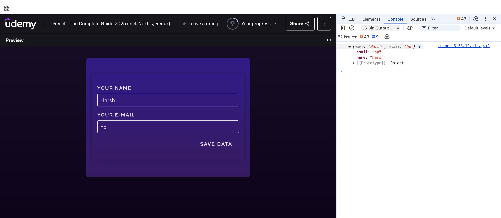

- Here, `React.forwardRef(...)` allows the `Input` component to accept a `ref` from its parent (`App`) and pass that `ref` directly to the `<input>` DOM element inside.
- So now `ref.current === <input>`. This enables the parent (`App`) to directly access `name` and `email`.

```
name.current.value  // gets the current value of the name input
email.current.value // gets the current value of the email input
```

- This helps to access the value inside custom `Input` components from the parent `App` component that's why to achieve this, `name` & `email` should point to the actual `<input>` HTML DOM elements, so that you can read their current values.
- Think of `forwardRef` as a tunnel that allows a parent to reach inside a custom component and touch an internal DOM element directly.


</details>
<br/>
<br/>


- `useRef` is a flexible tool, and what current refers to depends on how and where you use it. When you attach it to a `<dialog>` via `ref={ref}`, `ref.current` becomes that `dialog`. And that’s why you can then call `ref.current.showModal()` like you're using native HTML/JS.
- `useRef` gives you a container. React fills that container with the DOM element you point it at using `ref={...}`. Once filled, you can call native methods like `.focus()`, `.showModal()`, `.scrollIntoView()`, etc. It’s like putting a label on an HTML tag and using that label to control it later.

### `UseImperativeHook`

- `UseImperativeHook` hook allows the child component to expose certain values (like methods or variables) to the parent component, which can then use these values. It’s a React hook that lets you customize what a `ref` exposes to the parent component when using `forwardRef`.

```
//Result.jsx

import { forwardRef, useImperativeHandle, useRef } from 'react';

const ResultModal = forwardRef(function ResultModal({ result, targetTime }, ref) {

  const dialog = useRef();

  // Exposing only the open method to the parent component
  // This is done to prevent the parent from accessing the dialog element directly
  // and to keep the component encapsulated
  useImperativeHandle(ref, () => ({
    open: () => {
      dialog.current.showModal();
    }
  }));
  return (
    <dialog ref={dialog} className="result-modal">
      <h2>You {result}</h2>
      <p>
        The target time was <strong>{targetTime} seconds.</strong>
      </p>
      <form method="dialog">
        <button>Close</button>
      </form>
    </dialog>
  );
})

export default ResultModal;

// TimeChallenge.jsx

import React, { useRef, useState } from 'react';
import Result from './Result';
export default function TimeChallenge({title, targetTime}) {

    const timer=useRef();
    const dailogRef=useRef();
    
    const [timeExpired, setTimeExpired] = useState(false);
    const [timeStarted, setTimeStarted] = useState(false);


    function onStartButtonClick() {
        setTimeStarted(true);
        const milliseconds = targetTime * 1000;
        timer.current=setTimeout(() => {
            setTimeExpired(true);
            dailogRef.current.open();
            // Post click and after some milliseconds, the time expired
        }
        , milliseconds);
    }

    function onStopButtonClick() {
        // Clear the timer
        clearTimeout(timer.current);
    }


    return(
        <>
        <Result ref={dailogRef} targetTime={targetTime} result="lost" />
        <section className="challenge">
            <h2>{title}</h2>
            {timeExpired && <p>You lost!</p>}
            <p className="challenge-time">
                {targetTime} second{targetTime > 1 ? 's' : ''}
            </p>
            <button onClick={timeStarted ? onStopButtonClick : onStartButtonClick}>
                {timeStarted ? 'Stop' : 'Start'} Challenge
            </button>
            <p className={timeStarted ? 'active' : undefined}>
                {timeStarted ? 'Time is running' : 'Time inactive'}
            </p>
        </section>
        </>
    )
}
```


- On browser

<video controls src="Images/about/2025-22.mov" title="title"></video>

- With `useImperativeHandle` you choose exactly what to expose to the parent, which function or value. When you build reusable components (like timers, animations, or form inputs) and you want the parent to trigger methods on them directly but not expose the entire DOM node.
- When a parent component uses a ref on a child component wrapped in `forwardRef`, it typically gains access to the child's DOM node. However, `useImperativeHandle` allows the child to selectively expose only certain functions or values, creating a controlled API for the parent. This is useful for abstracting away implementation details and preventing the parent from directly manipulating the child's internal state or DOM structure in unintended ways.

<br/>
<br/>
<details>

<summary>Another example of useImperativeHandle</summary>


- Your working on a part of an application that contains a form which should be resettable from outside that form.

```
//App.js

import Form from './Form';
import React from 'react';

// Don't change the name of the 'App' 
// function and keep it a named export

export function App() {
const formRef=React.useRef();

  function handleRestart() {
      formRef.current.clear();
  }

  return (
    <div id="app">
      <button onClick={handleRestart}>Restart</button>
      <Form ref={formRef}/>
    </div>
  );
}


//Form.js

import React from 'react';
 
const Form = React.forwardRef(function Form(props, ref) {
  const form = React.useRef();

----------------------------------

  React.useImperativeHandle(ref, () => {
    return {
      clear() {
        form.current.reset();
      },
    };
  });

------------ OR ------------------

  React.useImperativeHandle(ref, () => ({
      clear: ()=>{
          form.current.reset();
      }
  }));

----------------------------------
 
  return (
    <form ref={form}>
      <p>
        <label>Name</label>
        <input type="text" />
      </p>
 
      <p>
        <label>Email</label>
        <input type="email" />
      </p>
      <p id="actions">
        <button>Save</button>
      </p>
    </form>
  );
});
 
export default Form;

//index.css

@import url('https://fonts.googleapis.com/css2?family=Raleway:wght@400;700&family=Lato:wght@400;700&display=swap');

* {
  box-sizing: border-box;
}

body {
  margin: 0;
  font-family: 'Raleway', sans-serif;
  -webkit-font-smoothing: antialiased;
  -moz-osx-font-smoothing: grayscale;
  background: linear-gradient(#180d27, #0c0219);
  color: #e5d9f1;
  min-height: 100vh;
}

#app {
  margin: 2rem auto;
  padding: 1rem;
  max-width: 30rem;
  text-align: center;
  border-radius: 6px;
  background: linear-gradient(#341a89, #3a1967);
  box-shadow: 0 0 8px rgba(0, 0, 0, 0.3);
}

button {
  font-family: 'Lato', sans-serif;
  font-size: 1rem;
  font-weight: 700;
  padding: 0.5rem 1rem;
  border: 1px solid white;
  border-radius: 6px;
  background: none;
  color: #e5d9f1;
  cursor: pointer;
  transition: all 0.2s ease-in-out;
}

form button {
  background: linear-gradient(#9e21c8, #8b179c);
  border: none;
}

form {
  width: 90%;
  max-width: 40rem;
  margin: 3rem auto;
}

form label {
  display: block;
  margin-bottom: 0.5rem;
  font-size: 0.8rem;
  text-align: left;
  text-transform: uppercase;
  font-weight: bold;
  letter-spacing: 0.1rem;
}

form input {
  width: 100%;
  padding: 0.5rem;
  border: 1px solid #e5d9f1;
  border-radius: 6px;
  background: none;
  color: #e5d9f1;
  font-size: 1rem;
  font-family: 'Lato', sans-serif;
  margin-bottom: 1rem;
}

#actions {
  text-align: right;
}
```

- On browser

<video controls src="Images/about/2025-23.mov" title="title"></video>


- You want a parent component (`App`) to be able to:
  - Click a `Restart` button
  - And have that trigger a method inside a child component (Form)
  - That method (`clear()`) should reset the form
- Because without `useImperativeHandle`, the parent would not be able to directly access or control anything inside the Form component. `useImperativeHandle` allows us to expose only the `clear()` method to the parent.


</details>
<br/>
<br/>


- Now let's completed our game challenge for win logic

```
//Result.jsx

import { forwardRef, useImperativeHandle, useRef } from 'react';

const ResultModal = forwardRef(function ResultModal({ result, targetTime, message }, ref) {

  const dialog = useRef();

  // Exposing only the open method to the parent component
  // This is done to prevent the parent from accessing the dialog element directly
  // and to keep the component encapsulated
  useImperativeHandle(ref, () => ({
    open: () => {
      dialog.current.showModal();
    }
  }));
  return (
    <dialog ref={dialog} className="result-modal">
      <h2>You {result}</h2>
      
        <p>The target time was <strong>{targetTime}</strong> seconds and you {message} within the <strong>{targetTime} seconds.</strong></p>      
      <form method="dialog">
        <button>Close</button>
      </form>
    </dialog>
  );
})

export default ResultModal;

//TimeChallenge.jsx

import React, { useRef, useState } from 'react';
import Result from './Result';
export default function TimeChallenge({title, targetTime}) {

    const timer=useRef();
    const dailogRef=useRef();
    
    const [timeExpired, setTimeExpired] = useState(null);
    const [timeStarted, setTimeStarted] = useState(null);


    function onStartButtonClick() {
        setTimeStarted(true);
        setTimeExpired(null); // Reset for new challenge
        const milliseconds = targetTime * 1000;
        timer.current=setTimeout(() => {
            setTimeExpired(true); // Timer ran out before stop
            dailogRef.current.open();
            setTimeStarted(null)
            // Post click and after some milliseconds, the time expired
        }
        , milliseconds);
    }

    function onStopButtonClick() {
        // Clear the timer
        clearTimeout(timer.current);
        // If timeExpired is false, user stopped before timeout
        dailogRef.current.open();
        setTimeStarted(false);
    }


    return(
        <>
        <Result ref={dailogRef} targetTime={targetTime} result={timeExpired ? "Lost": "Win"}  message={timeExpired ? "did not stop": "clicked"}/>
        <section className="challenge">
            <h2>{title}</h2>
            {timeExpired && <p>You lost!</p>}
            {timeExpired!=null && timeStarted!=null && !timeExpired && !timeStarted && <p>You won!</p>}
            <p className="challenge-time">
                {targetTime} second{targetTime > 1 ? 's' : ''}
            </p>
            <button onClick={timeStarted ? onStopButtonClick : onStartButtonClick}>
                {timeStarted ? 'Stop' : 'Start'} Challenge
            </button>
            <p className={timeStarted ? 'active' : undefined}>
                {timeStarted ? 'Time is running' : 'Time inactive'}
            </p>
        </section>
        </>
    )
}
```

- On browser

<video controls src="Images/about/2025-24.mov" title="title"></video>

## Portals

- `createPortal` in React is a function used to render a child component into a DOM node that exists outside the parent component’s DOM hierarchy.
- In React, `createPortal` is a function provided by react-dom that enables rendering children into a different part of the DOM tree, outside of the parent component's hierarchy. It offers a way to "teleport" or "escape" the normal DOM flow, allowing elements to be rendered in a different location while still maintaining their React behavior.
- Consider below code

```
//Model.jsx
import ReactDOM from 'react-dom';

function Modal({ children }) {
  return ReactDOM.createPortal(
      {children}
    ,
    document.getElementById('appComponent')
  );
}

export default Modal;

//App.jsx
import React from 'react';
import './App.css';
import Model from './components/Modal.jsx';

function App() {
  return (
<>
      <Model>
        <p>This is Model Component</p>

      </Model>
      </>
  );
}

export default App;

//index.html

<!DOCTYPE html>
<html lang="en">
  <head>
    <meta charset="utf-8" />
    <link rel="icon" href="%PUBLIC_URL%/favicon.ico" />
    <meta name="viewport" content="width=device-width, initial-scale=1" />
    <meta name="theme-color" content="#000000" />
    <meta
      name="description"
      content="Web site created using create-react-app"
    />
    <link rel="apple-touch-icon" href="%PUBLIC_URL%/logo192.png" />
    <link rel="manifest" href="%PUBLIC_URL%/manifest.json" />
    <title>Text Utilities</title>

    <!-- Bootstrap -->
    <link rel="stylesheet" href="https://cdn.jsdelivr.net/npm/bootstrap@4.4.1/dist/css/bootstrap.min.css" integrity="sha384-Vkoo8x4CGsO3+Hhxv8T/Q5PaXtkKtu6ug5TOeNV6gBiFeWPGFN9MuhOf23Q9Ifjh" crossorigin="anonymous">
  </head>
  <body>
    <div id="root"></div>
    <div id="appComponent"></div>
  </body>
</html>
```

- On browser & console

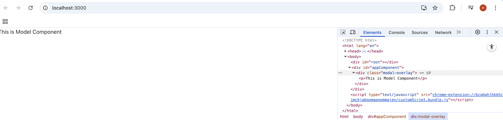

- `createPortal` helps render components outside normal parent hierarchy. It’s mostly used for UI elements like modals, tooltips, dropdowns. Maintains React state and event bubbling, even though it’s outside the DOM tree.
- **`createPortal` must use a real DOM node (not a React element)**

```
ReactDOM.createPortal(child, container)
```

- `child`: ✅ Can be a React element.
- `container`: ❗Must be a real DOM element, not a React component or JSX with DOM element like `div`, `p` etc..
- DOM element in JSX

```
//App.jsx
import React from 'react';
import './App.css';
import Model from './components/Modal.jsx';

function App() {
  return (
<div id="appComponent">
      <Model>
        <p>This is Model Component</p>
      </Model>
      </div>
  );
}

export default App;
```

- On browser we get an error

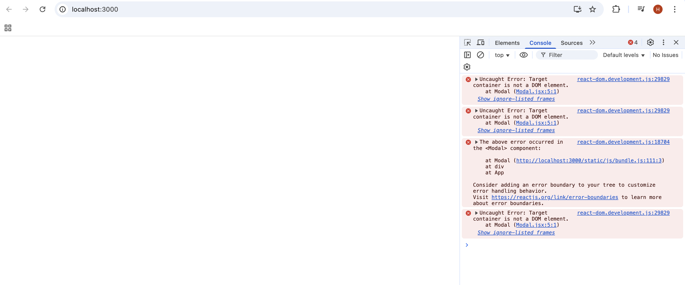

- You can also add real dom element using javascript `document` object.

```
import React from 'react';
import ReactDOM from 'react-dom';
import './App.css';
import Model from './components/Modal.jsx';


const container = document.createElement('div');
container.id = 'appComponent';
document.body.appendChild(container);

ReactDOM.createPortal(<div>Text</div>, container); // ✅


function App() {
  return (

      <Model>
        <p>This is Model Component</p>

      </Model>
  );
}

export default App;
```

- On browser

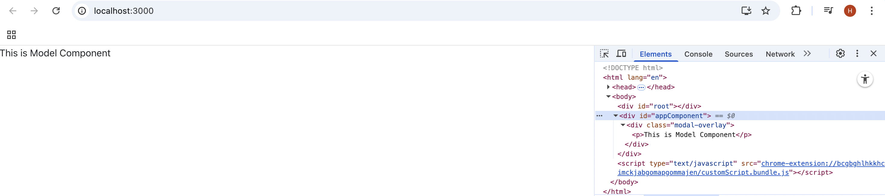

- `createPortal` only works with real DOM nodes, like those from `document.getElementById()` or `document.createElement()`. Using a JSX tag as the container (like `<div></div>`) won’t work — it’s just a virtual React element at that point.

## React Router

- When you visit websites you can typically append a path after the domain name like, slash `/welcome` and that loads, for example, the `welcome` page of a website. And if you then type a different URL into the browser address bar, or if you click a link that changes the URL, for example, to `/product`, a different page gets loaded. So the visible content of the website changes.

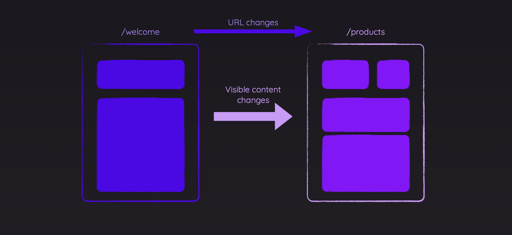

- That's what Routing is all about. Different URL paths load different content on the screen. Now, traditionally, you would implement Routing by simply loading different HTML files for different paths, and that is how you would build a **multi-page application** which you typically would build without ReactJS.

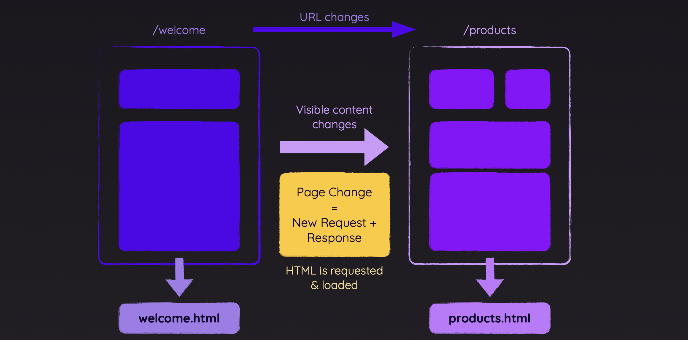

- Now, with that, you get different content for different paths, but the disadvantage is that you always have to fetch new content. A new HTTP request is sent and a new response is received, and that can kind of break the user flow. It can introduce some lag and slow down your website and it can therefore lead to a bad user experience.
- So that's why we might wanna build a single page application when we're building more complex user interfaces. With those, you send only one initial HTML request and then this HTML file with a bunch of extra JavaScript is downloaded, and thereafter the extra JavaScript code that runs on the client will actually take care about adjusting what the user sees on the screen.

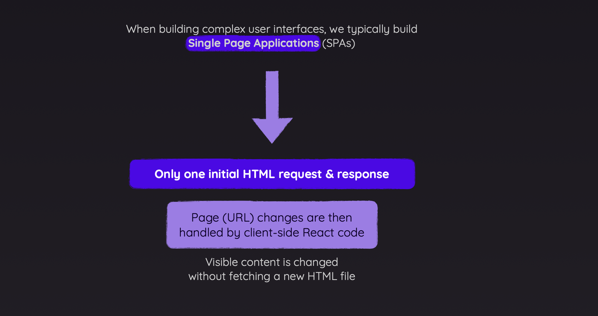


- That's how single page applications work. We can support path changes in the URL and load different content based on the path. We can add client-side React code that basically watches the currently active URL and that triggers whenever the URL changes, and that then leads to different content being displayed on the screen when the URL changes. So instead of loading new HTML files from the backend, we could add some client-side code that simply watches the URL and then loads a different React component when that URL changes.
- Lets consider Geeks for Geeks website.


<video controls src="Images/2024-3.mp4" title="title"></video>


- If you see whenever we click on any menu title on the page, the whole page is rendered or loaded. This is not a single page application.

- Consider below youtube website


<video controls src="Images/2024-2.mp4" title="title" ></video>

- When you click on the any of the title, the page is not render or loaded, the content are only getting change. This is an example of single page application.
- React Router is a library for managing navigation in React applications, especially single-page applications (SPAs). In a typical SPA, there's only one HTML file, and React dynamically updates the content based on user interactions without reloading the page.
- Without a single-page application (SPA), each time you navigate to a new page, the browser sends a new request to the server. The server then responds with the full HTML, CSS, and JavaScript for that specific page. This traditional approach is known as multi-page application (MPA) architecture, where every page load is a separate HTTP request and response cycle, which can sometimes feel slower and less seamless.
- In a single-page application (SPA) with React Router, however, only the initial request loads the entire page and the essential assets (like HTML, CSS, and JavaScript). After that, navigation between "pages" is handled within the app itself. React Router manages the routes and decides which component to display based on the URL path, without sending a request back to the server. This means:
  - **No additional full-page loads**: Only the needed component updates, making the app feel faster.
  - **More fluid user experience**: There's no flash of white screen or reloading as users navigate, because the routing and component rendering happen entirely on the client side (in the browser).
- First lets install react router

```
npm install react-router-dom@latest
```

- Continuing the text utility application, lets create an `About` page content using a new component.

```
import React from "react";

export default function About(){
    return (
        <div className="accordion" id="accordionExample">
  <div className="accordion-item">
    <h2 className="accordion-header" id="headingOne">
      <button className="accordion-button" type="button" data-bs-toggle="collapse" data-bs-target="#collapseOne" aria-expanded="true" aria-controls="collapseOne">
        Accordion Item #1
      </button>
    </h2>
    <div id="collapseOne" className="accordion-collapse collapse show" labelled="headingOne" data-bs-parent="#accordionExample">
      <div className="accordion-body">
        <strong>This is the first item's accordion body.</strong> It is shown by default, until the collapse plugin adds the appropriate classes that we use to style each element. These classes control the overall appearance, as well as the showing and hiding via CSS transitions. You can modify any of this with custom CSS or overriding our default variables. It's also worth noting that just about any HTML can go within the <code>.accordion-body</code>, though the transition does limit overflow.
      </div>
    </div>
  </div>
  <div className="accordion-item">
    <h2 className="accordion-header" id="headingTwo">
      <button className="accordion-button collapsed" type="button" data-bs-toggle="collapse" data-bs-target="#collapseTwo" aria-expanded="false" aria-controls="collapseTwo">
        Accordion Item #2
      </button>
    </h2>
    <div id="collapseTwo" className="accordion-collapse collapse" labelled="headingTwo" data-bs-parent="#accordionExample">
      <div className="accordion-body">
        <strong>This is the second item's accordion body.</strong> It is hidden by default, until the collapse plugin adds the appropriate classes that we use to style each element. These classes control the overall appearance, as well as the showing and hiding via CSS transitions. You can modify any of this with custom CSS or overriding our default variables. It's also worth noting that just about any HTML can go within the <code>.accordion-body</code>, though the transition does limit overflow.
      </div>
    </div>
  </div>
  <div className="accordion-item">
    <h2 className="accordion-header" id="headingThree">
      <button className="accordion-button collapsed" type="button" data-bs-toggle="collapse" data-bs-target="#collapseThree" aria-expanded="false" aria-controls="collapseThree">
        Accordion Item #3
      </button>
    </h2>
    <div id="collapseThree" className="accordion-collapse collapse" labelled="headingThree" data-bs-parent="#accordionExample">
      <div className="accordion-body">
        <strong>This is the third item's accordion body.</strong> It is hidden by default, until the collapse plugin adds the appropriate classes that we use to style each element. These classes control the overall appearance, as well as the showing and hiding via CSS transitions. You can modify any of this with custom CSS or overriding our default variables. It's also worth noting that just about any HTML can go within the <code>.accordion-body</code>, though the transition does limit overflow.
      </div>
    </div>
  </div>
</div>
    );
}
```

- Instead of `<a>` anchor tag we need to use `Link` and instead of `href` we need to use `to`.

```
import React from 'react';
import PropTypes from 'prop-types';
import {Link} from 'react-router-dom'

export default function Navbar({navTitle,tab1,tab2}){
    return (
        <>
        <nav className="navbar navbar-expand-lg navbar-light bg-light">
            <Link className="navbar-brand" to="/">{navTitle}</Link>
        <button className="navbar-toggler" type="button" data-toggle="collapse" data-target="#navbarSupportedContent" aria-controls="navbarSupportedContent" aria-expanded="false" aria-label="Toggle navigation">
            <span className="navbar-toggler-icon"></span>
        </button>

        <div className="collapse navbar-collapse" id="navbarSupportedContent">
            <ul className="navbar-nav mr-auto">
            <li className="nav-item active">
                <Link className="nav-link" to="/"> {tab1} <span className="sr-only">(current)</span></Link>
            </li>
            <li className="nav-item">
                <Link className="nav-link" to="/about"> {tab2} </Link>
            </li>
            </ul>
            <form className="form-inline my-2 my-lg-0">
            <input className="form-control mr-sm-2" type="search" placeholder="Search" aria-label="Search"/>
            <button className="btn btn-outline-success my-2 my-sm-0" type="submit">Search</button>
            </form>
        </div>
        </nav>
        </>
    );
}

Navbar.propTypes={
    navTitle: PropTypes.string.isRequired,
    tab1: PropTypes.string.isRequired,
    tab2: PropTypes.string.isRequired
}
// Navbar.defaultProps={
//     navTitle: "Some Default Value",
//     tab1: "Some Tab1",
//     tab2: "Some Tab2"
// }
```

- In **App.js**, we have mentioned the routes whenever the user clicks on certain tab.

```
import React from 'react';
import './App.css';
import About from './components/About';
import Navbar from './components/Navbar';
import TextInput from './components/TextInput';
import { BrowserRouter as Router, Routes, Route } from 'react-router-dom';
import TextFilters from './components/TextFilters';
import Timer from './components/Timer';

function App() {
  return (
    <Router>
      <Navbar navTitle="Text Utilities" tab1="Home" tab2="About" tab3="Text Filtration" tab4="Timer"/>
      <div className="container">
        <Routes>
          <Route path="/" element={<TextInput />} />
          <Route path="/about" element={<About />} />
          <Route path="/filter" element={<TextFilters />} />
          <Route path="/timer" element={<Timer />} />
        </Routes>
      </div>
    </Router>
  );
}

export default App;
```

- `BrowserRouter`: Wraps your application and enables routing functionality. 
- `Link`: Renders an anchor tag to navigate between routes without reloading the page.
- `Routes` and `Route`: Define the routes for your application. Each Route maps a URL path to a component.
- Before using `npm start` you need to use `set NODE_OPTIONS=--openssl-legacy-provider`.
- On browser

<video controls src="Images/2024-4.mp4" title="title"></video>


>[!NOTE]
> - In React Router v6 (`react-router-dom v6`), the `Switch` component has been replaced with the `Routes` component. 

- There is also another way to defined routing where we use `createBrowserRoute`. The above approach seems to be used in older react dom version.

```
import { createBrowserRouter, RouterProvider } from 'react-router-dom';
import './App.css';
import About from './components/About';
import TextFilters from './components/TextFilters';
import TextInput from './components/TextInput';
import Timer from './components/Timer';


// createBrowserRouter is used for defining routes in React Router v6.4+. It takes an array of route 
// objects and returns a router instance that can be used with the Router component.
const router = createBrowserRouter([
  {
    path: "/",
    element: <TextInput />
  },
  {
    path: "/about",
    element: <About />
  },
  {
    path: "/filter",
    element: <TextFilters />
  },
  {
    path: "/timer",
    element: <Timer />
  }
]);


// RouterProvider is used to provide the router instance to the React application. It is a component that wraps the entire application and allows the use of routing features like navigation, route matching, and rendering components based on the current URL.
// This is typically used in conjunction with the createBrowserRouter function to define the routes for the application.
function App() {
  return (

        <RouterProvider router={router} />
    
  );
}

export default App;
```

- On browser

<video controls src="Images/about/router/2025-1.mov" title="title"></video>

- Now if you see, we are not able to get the navigation bar. Now to add those, we need to define a new component `<RootLayout>`.

```
//RootLayout.jsx
import { Outlet } from "react-router-dom";
import Navbar from "./Navbar";


export const NavBarProps = {
  navTitle: "Text Utilities",
  tab1: "Home",
  tab2: "About",
  tab3: "Text Filtration",
  tab4: "Timer"
};

// RootLayout is a component that serves as the main layout for the application.
// It includes a Navbar component and an Outlet for rendering nested routes.
// Outlet is a placeholder that will be replaced by the content of the current route.
// Basically the URL path will be matched with the routes defined in the App.js file, and the corresponding component will be rendered inside the Outlet.
// That component will become Outlet's child component.

function RootLayout(props) {
  return (
    <>
      <Navbar {...NavBarProps} />
      <div style={{ padding: '20px' }}>
        <Outlet />
      </div>
    </>
  );
}

export default RootLayout;


//App.jsx
import { createBrowserRouter, RouterProvider } from 'react-router-dom';
import './App.css';
import About from './components/About';
import Navbar from './components/Navbar';
import TextFilters from './components/TextFilters';
import TextInput from './components/TextInput';
import Timer from './components/Timer';
import RootLayout from './components/RootLayout';


// createBrowserRouter is used for defining routes in React Router v6.4+. It takes an array of route 
// objects and returns a router instance that can be used with the Router component.
const router = createBrowserRouter([
  {
    // The path property defines the URL path for the route.
    // The element property specifies the React component that should be rendered when the route matches.
    // The children property is an array of nested routes that will be rendered within the parent route's component.
    // <RootLayout /> is a component that serves as the layout for the application, providing a consistent structure across different pages.
    path: "/",
    element: <RootLayout />,
    children: [
      {
    path: "/",
    element: <TextInput />
  },   
      {
    path: "/about",
    element: <About />
  },
  {
    path: "/filter",
    element: <TextFilters />
  },
  {
    path: "/timer",
    element: <Timer />
  }
]
  }
]);


// RouterProvider is used to provide the router instance to the React application. It is a component that wraps the entire application and allows the use of routing features like navigation, route matching, and rendering components based on the current URL.
// This is typically used in conjunction with the createBrowserRouter function to define the routes for the application.
function App() {
  return (

        <RouterProvider router={router} />
    
  );
}

export default App;
```

- On browser, we are able to get navigation bar along with routes

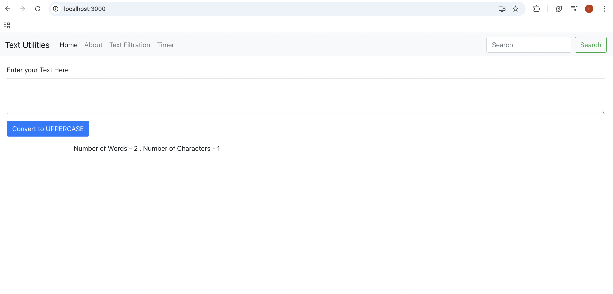

- Now if enter any random path on our url, we may get below error page

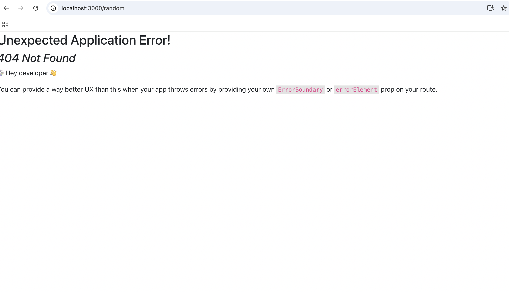


- Now of course, it's not unlikely, that over time visitors might accidentally, or, due to erroneous links provided by us, visit pages that they shouldn't visit, that simply don't exist. And therefore, you might want to prepare a default error page that's shown in situations like this. To do that we could let's create a `ErrorPage` component.

```
//ErrorPage.jsx

export default function ErrorPage() {
    return (
        <div style={styleForErrorPage}>
            <style>{keyframes}</style>
            <h1 style={glowText}>Oops!</h1>
            <div style={neonBar}></div>
            <p style={glowSubText}>Sorry, an unexpected error has occurred.</p>
            <p style={glowSubText}>We are working to fix this issue. Please try again later.</p>
        </div>
    );
}
```

- The `react-router-dom` package tells us where we can add the special error element property? that is to our route definitions, to define which page should be loaded if an error is created. For that, we can go to our route definitions and we could add it under `errorElement`.

```
//App.jsx

import { createBrowserRouter, RouterProvider } from 'react-router-dom';
import './App.css';
import About from './components/About';
import Navbar from './components/Navbar';
import TextFilters from './components/TextFilters';
import TextInput from './components/TextInput';
import Timer from './components/Timer';
import RootLayout from './components/RootLayout';
import ErrorPage from './components/ErrorPage';


// createBrowserRouter is used for defining routes in React Router v6.4+. It takes an array of route 
// objects and returns a router instance that can be used with the Router component.
const router = createBrowserRouter([
  {
    // The path property defines the URL path for the route.
    // The element property specifies the React component that should be rendered when the route matches.
    // The children property is an array of nested routes that will be rendered within the parent route's component.
    // <RootLayout /> is a component that serves as the layout for the application, providing a consistent structure across different pages.
    path: "/",
    element: <RootLayout />,
    errorElement: <ErrorPage />,
    children: [
      {
    path: "/",
    element: <TextInput />
  },   
      {
    path: "/about",
    element: <About />
  },
  {
    path: "/filter",
    element: <TextFilters />
  },
  {
    path: "/timer",
    element: <Timer />
  }
]
  }
]);


// RouterProvider is used to provide the router instance to the React application. It is a component that wraps the entire application and allows the use of routing features like navigation, route matching, and rendering components based on the current URL.
// This is typically used in conjunction with the createBrowserRouter function to define the routes for the application.
function App() {
  return (

        <RouterProvider router={router} />
    
  );
}

export default App;
```

- When we enter a URL that doesn't exist, the `react-router-dom` package will generate an error, and that error will automatically bubble up to our root route definition.
- On browser

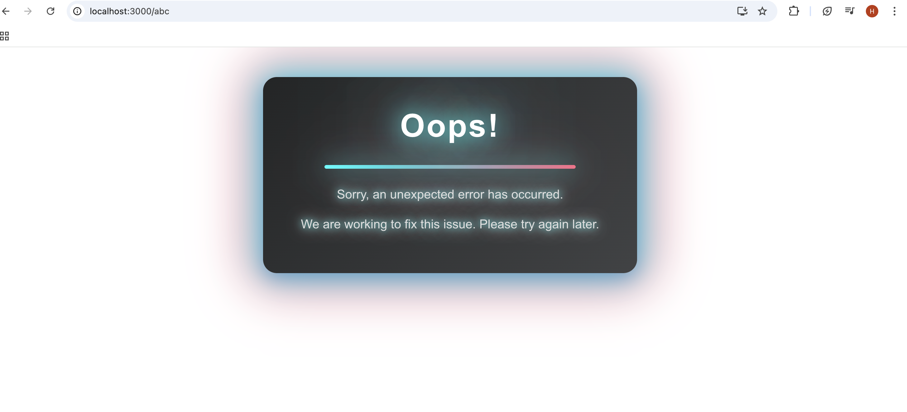

### `NavLink`

- Currently in `NavBar.js`, we are using `Link`, let's add some css which will show active link.

```
//App.css

.nav-link {
  color: #010202;
  text-decoration: none;
  margin: 0 10px;
}
.nav-link:hover {
  font-weight: bold;
  text-decoration: underline;
}

// Existing NavBar.js

import PropTypes from 'prop-types';
import { Link } from 'react-router-dom';


export default function Navbar({navTitle,tab1,tab2,tab3,tab4}){
    return (
        <>
        <nav className="navbar navbar-expand-lg navbar-light bg-light">
            <Link className="navbar-brand" to="/">{navTitle}</Link>
        <button className="navbar-toggler" type="button" data-toggle="collapse" data-target="#navbarSupportedContent" aria-controls="navbarSupportedContent" aria-expanded="false" aria-label="Toggle navigation">
            <span className="navbar-toggler-icon"></span>
        </button>

        <div className="collapse navbar-collapse" id="navbarSupportedContent">
            <ul className="navbar-nav mr-auto">
            <li className="nav-item active">
                <Link className="nav-link" to="/" > {tab1} <span className="sr-only">(current)</span></Link>
            </li>
            <li className="nav-item">
                <Link className="nav-link" to="/about"> {tab2} </Link>
            </li>

            <li className="nav-item">
                <Link className="nav-link" to="/filter"> {tab3} </Link>
            </li>
            <li className="nav-item">
                <Link className="nav-link" to="/timer"> {tab4} </Link>
            </li>
            </ul>
            <form className="form-inline my-2 my-lg-0">
            <input className="form-control mr-sm-2" type="search" placeholder="Search" aria-label="Search"/>
            <button className="btn btn-outline-success my-2 my-sm-0" type="submit">Search</button>
            </form>
        </div>
        </nav>
        </>
    );
}

Navbar.propTypes={
    navTitle: PropTypes.string.isRequired,
    tab1: PropTypes.string.isRequired,
    tab2: PropTypes.string.isRequired
}
// Navbar.defaultProps={
//     navTitle: "Some Default Value",
//     tab1: "Some Tab1",
//     tab2: "Some Tab2"
// }
```

- On browser

<video controls src="Images/about/router/2025-2.mov" title="title"></video>

- If you see, our we were able to click on table and we were also able to see the underlined tab but our design for the active tab on the menu does not retain. This can be fixed by adding some additional logic, but we have another choice which is using `NavLink`.
- Both `Link` and `NavLink` let you navigate without a page refresh. `NavLink` is preferred when you want to highlight the currently active link (like highlighting a tab or menu item). Let's implement `NavLink`.

```
//NavBar.js

import PropTypes from 'prop-types';
import { NavLink } from 'react-router-dom';

export default function Navbar({navTitle,tab1,tab2,tab3,tab4}){
    return (
        <>
        <nav className="navbar navbar-expand-lg navbar-light bg-light">
            <NavLink className="navbar-brand" to="/">{navTitle}</NavLink>
        <button className="navbar-toggler" type="button" data-toggle="collapse" data-target="#navbarSupportedContent" aria-controls="navbarSupportedContent" aria-expanded="false" aria-label="Toggle navigation">
            <span className="navbar-toggler-icon"></span>
        </button>

        <div className="collapse navbar-collapse" id="navbarSupportedContent">
            <ul className="navbar-nav mr-auto">
            <li className="nav-item active">
                <NavLink to="/" end className={({isActive})=> isActive? "nav-link active": "nav-link"}>  {tab1} <span className="sr-only">(current)</span></NavLink>
            </li>
            <li className="nav-item">
                <NavLink to="/about" end className={({isActive})=> isActive? "nav-link active": "nav-link"} > {tab2} </NavLink>
            </li>

            <li className="nav-item">
                <NavLink to="/filter" end className={({isActive})=> isActive? "nav-link active": "nav-link"}> {tab3} </NavLink>
            </li>
            <li className="nav-item">
                <NavLink to="/timer" end className={({isActive})=> isActive? "nav-link active": "nav-link"}> {tab4} </NavLink>
            </li>
            </ul>
            <form className="form-inline my-2 my-lg-0">
            <input className="form-control mr-sm-2" type="search" placeholder="Search" aria-label="Search"/>
            <button className="btn btn-outline-success my-2 my-sm-0" type="submit">Search</button>
            </form>
        </div>
        </nav>
        </>
    );
}

Navbar.propTypes={
    navTitle: PropTypes.string.isRequired,
    tab1: PropTypes.string.isRequired,
    tab2: PropTypes.string.isRequired
}
// Navbar.defaultProps={
//     navTitle: "Some Default Value",
//     tab1: "Some Tab1",
//     tab2: "Some Tab2"
// }


//App.css

.nav-link {
  color: #010202;
  text-decoration: none;
  margin: 0 10px;
}
.nav-link:hover {
  font-weight: bold;
  text-decoration: underline;
}
.nav-link.active {
  font-weight: bold;
  text-decoration: underline;
  font-style: italic;
}
```

- On browser

<video controls src="Images/about/router/2025-3.mov" title="title"></video>


- Here, `className` will consist of function, which gets an object from `NavLink`. This object contains `isActive` variable when destruct. So when we write

```
<NavLink
  to="/about"
  className={({ isActive }) => isActive ? "nav-link active" : "nav-link"}
>
  About
</NavLink>
```

- React router automatically calls that function and passes an object that looks like

```
{
  isActive: true,   // true if the current route matches the link
  isPending: false, // (if you're using data loading/navigation)
}
```

- You can destructure this object directly

```
({ isActive }) => ...
```

- `isActive` variable is automatically passed by `NavLink`. You can style the link differently when it's the current route.


>[!NOTE]
> - `NavLink` destructs the object and gives `isActive` variable only into function `className={({isActive})=> isActive? "nav-link active": "nav-link"}`.


- In React Router, the `end` prop on a `<NavLink>` controls how strictly the path should be matched. When you use

```
<NavLink to="/" end>
```

- You're telling React Router, match only the exact path `/` — not `/about`, `/filter`, `/anything`. Without `end`, `/` would also match all nested paths like `/about`, `/filter`, etc., because they start with `/` and all tabs would become active if clicked once.
- Use `NavLink` when:
  - You want to highlight the current page in the navbar
  - You need dynamic styling based on the route
  - You're building tabs, sidebars, or navbars with active indicators

### `useNavigate`

- In React Router, `useNavigate()` is a hook that lets you programmatically navigate between routes — just like a user would click a link, but from your code.
- Let's see an example in `TextInput`

```
//TextInput.js
import { useState } from 'react';
import { useNavigate } from 'react-router-dom';

export default function TextInput(){
    const [inputUser,SetInputUser]=useState(" ");
    const OnChangeEvent=(event)=>{
        SetInputUser(event.target.value);
    }
    const OnClickEvent=()=>{
        SetInputUser(inputUser.toUpperCase());
    }
    const navigate = useNavigate();
    const handleNavigation = () => {
        navigate("/about");
    };
    return(
        <div>
        <div className="form-group">
        <label htmlFor="exampleFormControlTextarea1">Enter your Text Here </label>
        <textarea className="form-control" value={inputUser}  onChange={OnChangeEvent} id="exampleFormControlTextarea1" rows="3"></textarea>
        </div>
        <button type="button" onClick={OnClickEvent} className="btn btn-primary">Convert to UPPERCASE</button>

        <div className="container my-3">
            <p> Number of Words - {inputUser.split(" ").length} , Number of Characters - {inputUser.length}</p>
        </div>

            <button onClick={handleNavigation}>Go to About</button>
        </div>
    );
}
```

- On browser

<video controls src="Images/about/router/2025-4.mov" title="title"></video>


- Other navigation purposes that can be use with `useNavigate` are

```
navigate(-1); // go back
navigate(1);  // go forward
navigate('/about', { replace: true });
//replace: true replaces the current entry in the history stack (like history.replace()), so the back button won't return to the previous route.
```

>[!NOTE]
> - `useNavigate` is only for internal navigation. `useNavigate('/about')` or `useNavigate('/dashboard')` works only within your React Router app.
> - We cannot navigate external urls like `useNavigate("www.google.com")`. To open external URL we can use `window.location.href`.

## Dynamic Routes

- Dynamic Routing means defining routes that can change based on URL parameters — like `/users/:id` or `/product/:productId`. Instead of hardcoding every possible route, you use URL parameters to create flexible, reusable routes.
- Example of dynamic router

```
<Route path="/user/:id" element={<UserProfile />} />
```

- Here, `:id` is a dynamic segment. You could visit `/user/1`, `/user/99` — all go to the same `UserProfile` component, but with different `id` loading data of specific user.
- Now in the URl, we are sending dynamic segment, but how to retrieve it? that is using `useParam`, let's see an complete example
- Let's create a new component `DisplayUser`

```
import { useParams } from "react-router-dom";

export default function DisplayUser() {

    const params = useParams();
    // Extract userId from the URL parameters
    const userId = params.userId;

    const userList = [
        { id: 1, name: "John Doe", email: "john.gmail.com" },
        { id: 2, name: "Jane Smith", email: "smith.gmail.com" },
        { id: 3, name: "Alice Johnson", email: "alice.gmail.com" },
        { id: 4, name: "Bob Brown", email: "bob.gmail.com" }
    ];
    // Find the user with the matching userId
    const user = userList.find((user) => user.id === parseInt(userId));

  return (
    <div>
        {user ? (
            <div>
            <h2>User Details</h2>
            <p><strong>ID:</strong> {user.id}</p>
            <p><strong>Name:</strong> {user.name}</p>
            <p><strong>Email:</strong> {user.email}</p>
            </div>
        ) : (
            <p>User not found.</p>
        )}
    </div>
  );
}
```

- In `App.js`, add a new route

```

import { createBrowserRouter, RouterProvider } from 'react-router-dom';
import './App.css';
import About from './components/About';
import Navbar from './components/Navbar';
import TextFilters from './components/TextFilters';
import TextInput from './components/TextInput';
import Timer from './components/Timer';
import RootLayout from './components/RootLayout';
import ErrorPage from './components/ErrorPage';
import DisplayUser from './components/DisplayUser';


// createBrowserRouter is used for defining routes in React Router v6.4+. It takes an array of route 
// objects and returns a router instance that can be used with the Router component.
const router = createBrowserRouter([
  {
    // The path property defines the URL path for the route.
    // The element property specifies the React component that should be rendered when the route matches.
    // The children property is an array of nested routes that will be rendered within the parent route's component.
    // <RootLayout /> is a component that serves as the layout for the application, providing a consistent structure across different pages.
    path: "/",
    element: <RootLayout />,
    errorElement: <ErrorPage />,
    children: [
      {
    path: "/",
    element: <TextInput />
  },   
      {
    path: "/about",
    element: <About />
  },
  {
    path: "/filter",
    element: <TextFilters />
  },
  {
    path: "/timer",
    element: <Timer />
  },
  {
    path: "/user/:userId",
    element: <DisplayUser />
  }
]
  }
]);


// RouterProvider is used to provide the router instance to the React application. It is a component that wraps the entire application and allows the use of routing features like navigation, route matching, and rendering components based on the current URL.
// This is typically used in conjunction with the createBrowserRouter function to define the routes for the application.
function App() {
  return (

        <RouterProvider router={router} />
    
  );
}

export default App;
```

- On browser

<video control src="Images/about/router/2025-5.mov" title="title"></video>


- React Router provides the `useParams` hook to access these dynamic values inside the component. If the URL is `/user/42`, then `id` will be `42`.
- `useParams()` returns strings, even if the value looks like a number.

### Absolute Path vs Relative Path

- In the context of React Router DOM, absolute vs relative paths refer to how you define the route path in components like `<Route>`, `<Link>`, `<NavLink>`, `<Navigate>`, and `useNavigate`

1. Absolute Path in React Router

  - Starts with `/` (a leading slash).
  - It defines the path from the root of your app, regardless of the current URL.
  - Always points to the same location.

```
<Link to="/about" />  // Always goes to http://yourdomain.com/about
```

2. Relative Path in React Router

  - Does NOT start with `/`.
  - It is relative to the current route URL.
  - Useful when building nested routes or when inside a sub-route.

```
Suppose you are currently on /dashboard:


<Link to="settings" />  // Goes to /dashboard/settings
<Link to="../home" />   // Goes one level up: /home
useNavigate()("edit");     // If you're at /user/123, it goes to /user/123/edit
useNavigate()("../list");  // Goes to /user/list
```


- When defining our routes, we define the paths for which they should be active. We got this root (`path: "/"`) wrapper route, here, and then we got a couple of child routes inside of that route.

```
const router = createBrowserRouter([
  {
    path: "/",
    element: <RootLayout />,
    errorElement: <ErrorPage />,
    children: [
      {
    path: "/",
    element: <TextInput />
  },   
      {
    path: "/about",
    element: <About />
  },
  {
    path: "/filter",
    element: <TextFilters />
  },
  {
    path: "/timer",
    element: <Timer />
  },
  {
    path: "/user/:userId",
    element: <DisplayUser />
  }
]
  }
]);
```


- Now actually, all the child paths defined here are absolute paths because they all start with a `/`. This simply means that they're always seen from after the domain name. If we changed this wrapper path to `/root` and reload the page, when get an error.

```
const router = createBrowserRouter([
  {

    path: "/root",
    element: <RootLayout />,
    errorElement: <ErrorPage />,
    children: [
      {
    path: "/",
    element: <TextInput />
  },   
      {
    path: "/about",
    element: <About />
  },
  {
    path: "/filter",
    element: <TextFilters />
  },
  {
    path: "/timer",
    element: <Timer />
  },
  {
    path: "/user/:userId",
    element: <DisplayUser />
  }
]
  }
]);
```

- On browser

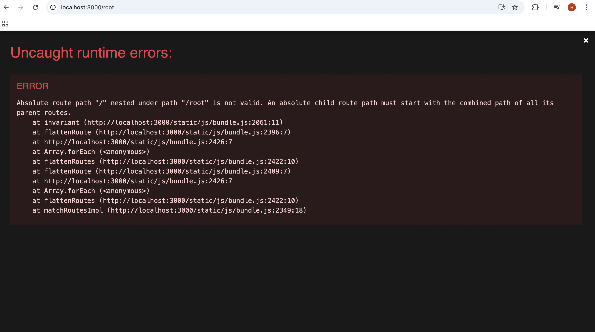

- If we just type in just `/root`, we don't see anything on the screen. So the problem here is we have absolute paths written because they're starting with a `/` and if we change it to `/root` we're saying that the parent route should handle all pages that start with `/root`, but then the child pages actually don't start with `/root`.
- Now this issue can be resolved by using relative path.

```
const router = createBrowserRouter([
  {
    path: "/root",
    element: <RootLayout />,
    errorElement: <ErrorPage />,
    children: [
      {
    path: "",
    element: <TextInput />
  },   
      {
    path: "about",
    element: <About />
  },
  {
    path: "filter",
    element: <TextFilters />
  },
  {
    path: "timer",
    element: <Timer />
  },
  {
    path: "user/:userId",
    element: <DisplayUser />
  }
]
  }
]);
```

- Even after apply relative path changes, we would see our custom error page.

<video controls src="Images/about/router/2025-6.mov" title="title"></video>

- This is because we need to update our `NavLink` as well to relative path.

```
// Previously all NavLink start from absolute path ('/about','/timer' etc..) as well as useNavigate

// TextInput.jsx
navigate("about");

...
<nav className="navbar navbar-expand-lg navbar-light bg-light">
            <NavLink className="navbar-brand" to="">{navTitle}</NavLink>
        <button className="navbar-toggler" type="button" data-toggle="collapse" data-target="#navbarSupportedContent" aria-controls="navbarSupportedContent" aria-expanded="false" aria-label="Toggle navigation">
            <span className="navbar-toggler-icon"></span>
        </button>

        <div className="collapse navbar-collapse" id="navbarSupportedContent">
            <ul className="navbar-nav mr-auto">
            <li className="nav-item active">
                <NavLink to="" end className={({isActive})=> isActive? "nav-link active": "nav-link"}>  {tab1} <span className="sr-only">(current)</span></NavLink>
            </li>
            <li className="nav-item">
                <NavLink to="about" end className={({isActive})=> isActive? "nav-link active": "nav-link"} > {tab2} </NavLink>
            </li>

            <li className="nav-item">
                <NavLink to="filter" end className={({isActive})=> isActive? "nav-link active": "nav-link"}> {tab3} </NavLink>
            </li>
            <li className="nav-item">
                <NavLink to="timer" end className={({isActive})=> isActive? "nav-link active": "nav-link"}> {tab4} </NavLink>
            </li>
... remaining codes
```

- On browser

<video controls src="Images/about/router/2025-7.mov" title>

- Now, when defining routes like this, this simply means that these paths defined here are appended after the path of the wrapper route. So if we have a child route with a relative path, then React Router will take a look at the path of the parent route and append the child route path after the parent route path.
- Having the root route as absolute path (`/`) and child route as relative path also works.

```
const router = createBrowserRouter([
  {
    path: "/",
    element: <RootLayout />,
    errorElement: <ErrorPage />,
    children: [
      {
    path: "",
    element: <TextInput />
  },   
      {
    path: "about",
    element: <About />
  },
  {
    path: "filter",
    element: <TextFilters />
  },
  {
    path: "timer",
    element: <Timer />
  },
  {
    path: "user/:userId",
    element: <DisplayUser />
  }
]
  }
]);
```

- On browser

<video controls src="Images/about/router/2025-8.mov" title="title"></video>

- Now we also have `/user` page where we provided `id` as param and display user details

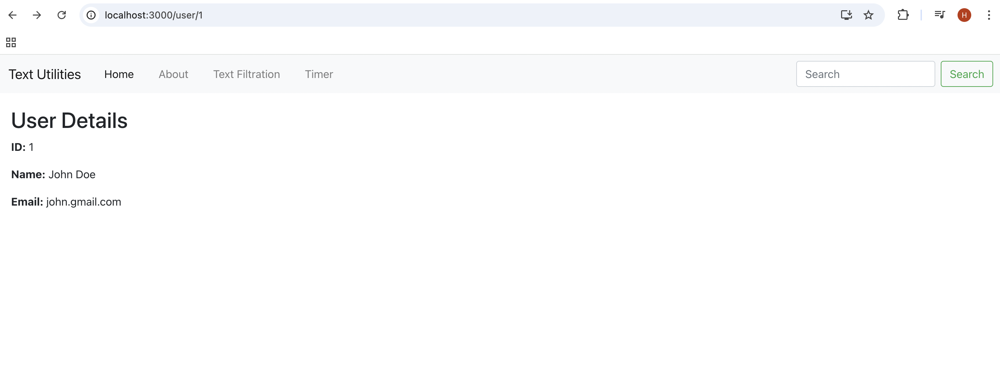

- Let's add a home link

```
import { Link, useParams } from "react-router-dom";

export default function DisplayUser() {

    const params = useParams();
    // Extract userId from the URL parameters
    const userId = params.userId;

    const userList = [
        { id: 1, name: "John Doe", email: "john.gmail.com" },
        { id: 2, name: "Jane Smith", email: "smith.gmail.com" },
        { id: 3, name: "Alice Johnson", email: "alice.gmail.com" },
        { id: 4, name: "Bob Brown", email: "bob.gmail.com" }
    ];
    // Find the user with the matching userId
    const user = userList.find((user) => user.id === parseInt(userId));

  return (
    <div>
        {user ? (
            <div>
            <h2>User Details</h2>
            <p><strong>ID:</strong> {user.id}</p>
            <p><strong>Name:</strong> {user.name}</p>
            <p><strong>Email:</strong> {user.email}</p>
            </div>
        ) : (
            <p>User not found.</p>
        )}
        <Link to="..">Go Back to Home</Link>
    </div>
  );
}
```

- Now when we click on `Go Back to Home` it takes us from `http://localhost:3000/user/1` to `http://localhost:3000/`. Now let's say we wanted to step to `http://localhost:3000/user` (though we don't have this page for `/user` so we expect an error page if we landed up on `http://localhost:3000/user`), how to do so? so here we can use a attribute `relative="path"`.

```
import { Link, useParams } from "react-router-dom";

export default function DisplayUser() {

    const params = useParams();
    // Extract userId from the URL parameters
    const userId = params.userId;

    const userList = [
        { id: 1, name: "John Doe", email: "john.gmail.com" },
        { id: 2, name: "Jane Smith", email: "smith.gmail.com" },
        { id: 3, name: "Alice Johnson", email: "alice.gmail.com" },
        { id: 4, name: "Bob Brown", email: "bob.gmail.com" }
    ];
    // Find the user with the matching userId
    const user = userList.find((user) => user.id === parseInt(userId));

  return (
    <div>
        {user ? (
            <div>
            <h2>User Details</h2>
            <p><strong>ID:</strong> {user.id}</p>
            <p><strong>Name:</strong> {user.name}</p>
            <p><strong>Email:</strong> {user.email}</p>
            </div>
        ) : (
            <p>User not found.</p>
        )}
        <Link to=".." relative="path">Go Back</Link>
    </div>
  );
}
```

- On browser when clicked on `Go Back` it will step back to `/user` instead of `/`

<video controls src="Images/about/router/2025-9.mov" title="title"></video>

- The default mode for `relative` is `route` which redirects to root route.


### Index Route

- An index route is the default child component rendered at a parent route when no child path is specified. In React Router DOM, an index route is a special kind of child route that renders when no other child route matches — it acts like the "default" route inside a nested route.

```
const router = createBrowserRouter([
  {
    path: "/",
    element: <RootLayout />,
    errorElement: <ErrorPage />,
    children: [
      {
    index: true, // This indicates that this route should match the root path ("/").
    element: <TextInput />
  },   
      {
    path: "about",
    element: <About />
  },
  {
    path: "filter",
    element: <TextFilters />
  },
  {
    path: "timer",
    element: <Timer />
  },
  {
    path: "user/:userId",
    element: <DisplayUser />
  }
]
  }
]);
```

### `loader` & `useLoaderData`

- These are part of Data APIs introduced to make data fetching easier and more powerful in React Router. `loader` is a function that fetches data before the component renders. `useLoaderData()` is a hook that reads the data returned by the loader.
- Normally, you'd fetch data inside your component using `useEffect`, like this

```
useEffect(() => {
  fetchData().then(setData);
}, []);
```

- But with React Router’s loader, you fetch data in advance (before showing the page), so:
  - ✅ No loading flashes
  - ✅ No extra code inside your component
  - ✅ Works well with route-based data
- A sample example could be fetching data and using it

```
const router = createBrowserRouter([
  {
    path: "/",
    element: <RootLayout />,
    errorElement: <ErrorPage />,
    children: [
      {
    index: true, // This indicates that this route should match the root path ("/").
    element: <FetchUser />,
    loader: {async () => {
    const res = await fetch("/api/user"); // Call API and fetch the data
    return res.json(); // 👈 returned data available to component
  }}
      }]
  }
]);


// FetchUser.jsx

import { useLoaderData } from 'react-router-dom';

function FetchUser() {
  const user = useLoaderData(); // 👈 grabs data returned by the loader
  return <h1>Welcome {user.name}!</h1>;
}
```

- So you don't need to use `useEffect` + `useState` to fetch data. Better user experience (data is ready when page loads). Works great with nested routes


## Types of Component

- In React, there are two primary ways to create components function and class components. Each has its own syntax and use cases.
- All the above implementation are functional based implementation. Lets understand class based components.

### Class Components

- Class-based components are JavaScript ES6 classes that extend from `React.Component`. They have access to state, `props` and lifecycle methods and are traditionally used when complex logic and state management are needed.
- A class-based component must extend `React.Component` (or `React.PureComponent` for optimized rendering).
- They include a `render()` method, which returns JSX elements.
- Lets create a new tab as `TextFilters` on our Navigation bar using class based component.

```
import React , {Component} from "react";

class TextFilters extends Component{
    render(){
        return (
            <div>This is a Filter Class</div>
        );
    }
}

export default TextFilters;
```

- In the `Navbar` function we need to add a new navigation list.

```
            <li className="nav-item">
                <Link className="nav-link" to="/filter"> {tab3} </Link>
            </li>
```

- An in **App.js** we need to add a new Route

```
          <Route path="/filter" element={<TextFilters />} />
```

- On browser

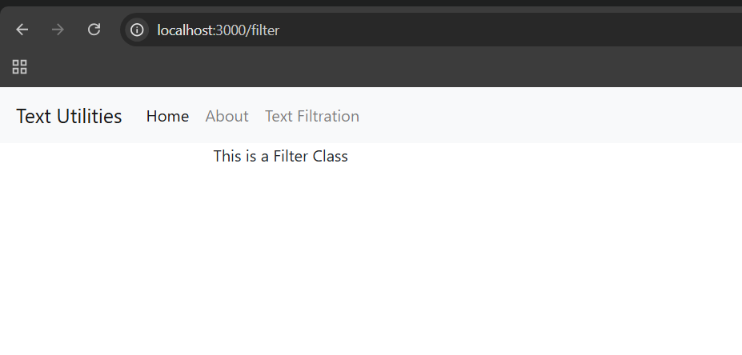

- Lets add state into our class component.

```
import React, { Component } from "react";

class TextFilters extends Component {
    constructor(props) {
        super(props); // Call the superclass constructor
        // Initialize the state
        this.state = {
            inputUser: ""
        };
    }
    // Event handler for handling changes in the textarea
    onChangeEvent = (event) => {
        this.setState({ inputUser: event.target.value });
    };

    render() {
        return (
            <div>
                <h2>This is a Filter Class</h2>
                <div className="form-group">
                    <label htmlFor="exampleFormControlTextarea1">Enter your Text Here</label>
                    <textarea
                        className="form-control"
                        value={this.state.inputUser}
                        onChange={this.onChangeEvent}
                        id="exampleFormControlTextarea1"
                        rows="3"
                    ></textarea>
                </div>
                <p>Your input: {this.state.inputUser}</p>
            </div>
        );
    }
}

export default TextFilters;
```

- **In class-based components, state is typically initialized in the constructor. You define `state` as an object where each property represents a piece of state the component will manage and `your state will always be an object unlike in function component we can defined boolean, int etc..`**. For example:

```
constructor(props) {
    super(props); // Call the parent class constructor
    this.state = {
        inputUser: "", // Initial state for the input
        anotherStateVariable: 0 // You can add more state variables as needed
    };
}
```

- **You define all the variables that will hold the component's state inside the `this.state` object in the constructor**. This is how you set up the component's internal state, which can be changed over time based on user interactions or lifecycle events.
- To change the value you need to always use `this.setState` in class component. It accepts a new object with the new state value.
You can also initialize state directly using class property .
- While it's common to pass `props` to a class component, you do not always need to use them. Props are used to pass data from a parent component to a child component. If your component needs to access `props`, you'll pass them into the constructor.
- `this.props` in your constructor, you must pass `props` to `super().` However, if you're not using `props`, you can still call `super()` without arguments, but it’s a good practice to include it to ensure proper initialization.

- On browser

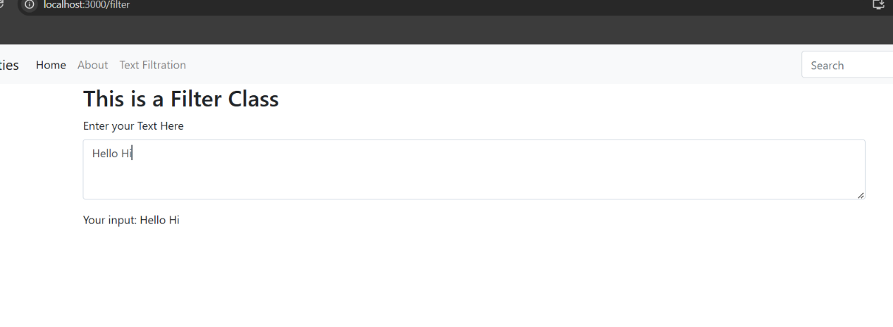

- There is another way to get `props` from your parent component without creating constructor. When we extend `Component` class it gives `props` properties, which we can use using `this` reference. Example

```
import React, { Component } from "react";

class ABC extends Component{

  render(){
    <h1> My name is {this.props.name} </h1>
  }
}
```


>[!NOTE]
> - The Class-Based Components exist because they were required in the past. In the past, which means prior to React 16.8 there were scenarios and use cases where you needed Class-Based Components. Specifically when dealing with State and with side effects, you had to use Class-Based Components.
> - Traditionally, prior to React 16.8, you could not change State in Functional Components and you couldn't really handle side effects there either. That changed with React 16.8 because that React version introduced a concept called React Hooks.
> - These are functions for Functional Components, which bring features to Functional Components, which previously were reserved for Class-Based Components. And indeed, Class-Based Components can't use React Hooks.


>[!IMPORTANT]
> - Class based components can generate side effects based on lifecycle of component. Unlike function component, it can't use hooks like `useEffect`.

## Lifecycle of Class Component

- In React, a component lifecycle refers to the series of stages a component goes through from when it's created to when it’s removed from the DOM. These stages include initialization, updating, and unmounting. Understanding the lifecycle is important because it allows you to manage state and side effects at specific points in a component's existence.
- The lifecycle of a class component can be broken down into three main phases:

- **Mounting**: This phase occurs when the component is being created and inserted into the DOM.
  - **Constructor**: This is where you initialize state and bind methods.
  - `componentDidMount()`: This method is called immediately after the component is added to the DOM. It's often used for fetching data or setting up subscriptions. It

- **Updating**: This phase happens when a component's state or props change. This can occur due to user actions, network responses, or parent component updates.
  - `componentDidUpdate(prevProps, prevState)`: This method is called immediately after updating occurs. It receives the previous props and state, allowing you to compare and respond accordingly.
  - `shouldComponentUpdate(nextProps, nextState)`: This method allows you to prevent unnecessary updates by returning `false` if the component doesn't need to re-render.
  - `getSnapshotBeforeUpdate(prevProps, prevState)`: This method allows you to capture some information (like scroll position) from the DOM right before the changes are applied.

- **Unmounting**: This phase occurs when a component is being removed from the DOM.

  - `componentWillUnmount()`: This method is called right before the component is removed from the DOM. It's often used for cleanup tasks, such as invalidating timers or canceling network requests.


- We can correlate these lifecycle with React hook `useEffect`

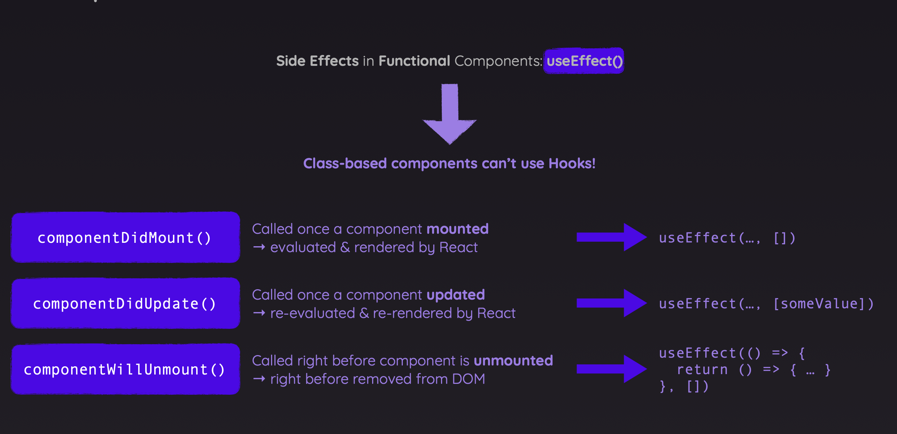


- Lets see example in class component.

```
import React, { Component } from "react";

class TextFilters extends Component {
    constructor(props) {
        super(props); // Call the superclass constructor
        // Initialize the state
        this.state = {
            inputUser: ""
        };
    }

    // Lifecycle method that runs after the component mounts
    componentDidMount() {
        console.log("Component has mounted.");
    }

    // Lifecycle method that runs when the component updates
    componentDidUpdate(prevProps, prevState) {
        if (prevState.inputUser !== this.state.inputUser) {
            console.log("Component has updated. New input:", this.state.inputUser);
        }
    }

    // Lifecycle method that runs just before the component unmounts
    componentWillUnmount() {
        console.log("Component is about to unmount.");
    }

    shouldComponentUpdate(nextProps, nextState) {
        return true; // Allows the component to update
    }
    
    // Event handler for handling changes in the textarea
    onChangeEvent = (event) => {
        this.setState({ inputUser: event.target.value });
    };

    render() {
        return (
            <div>
                <h2>This is a Filter Class</h2>
                <div className="form-group">
                    <label htmlFor="exampleFormControlTextarea1">Enter your Text Here</label>
                    <textarea
                        className="form-control"
                        value={this.state.inputUser}
                        onChange={this.onChangeEvent}
                        id="exampleFormControlTextarea1"
                        rows="3"
                    ></textarea>
                </div>
                <p>Your input: {this.state.inputUser}</p>
            </div>
        );
    }
}

export default TextFilters;
```

- On browser

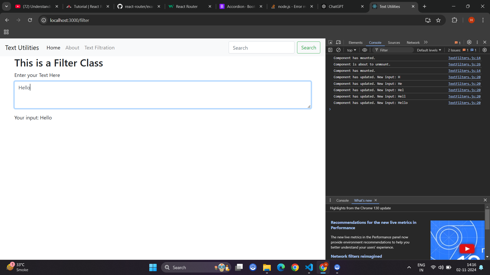

- Now when you switch to another menu, the component gets **unmounted**.

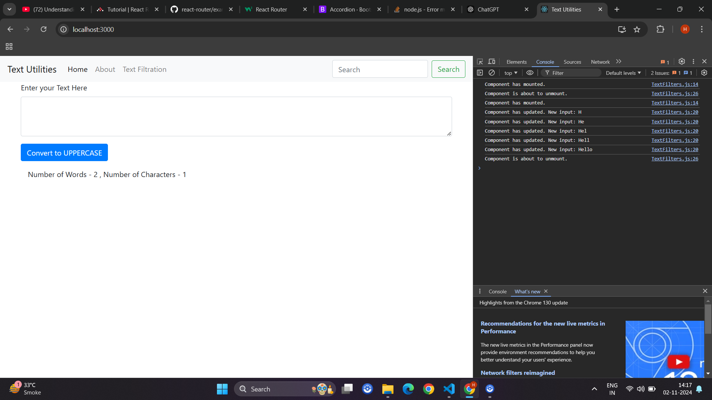

- **Every React component has a lifecycle, and may manage state and/or have side effects depending on its functionality. Not every component needs to manage state. Some components are purely presentational and receive data through `props`, without maintaining their own internal state. Similarly, not all components have side effects. Side effects are actions that interact with the outside world, like fetching data, updating the DOM directly, or subscribing to events. Components that only render UI based on props might not need side effects.**
- State is a JavaScript object that holds data relevant to a component. In class components, you typically manage state using the component's constructor and `this.setState()` whereas in functional component we use `useState` hook set method. The state can hold various values, and when the state changes, the component re-renders.
- Side effects refer to operations that affect other parts of the application or have an effect outside the function being executed. Examples include data fetching, subscriptions, manually changing the DOM, logging, etc. In class components, side effects are managed through lifecycle methods (as discussed), while in functional components, the `useEffect` hook is used.

## Hooks

- Functional components in React also have lifecycle capabilities, but they use hooks instead of lifecycle methods found in class components. Additionally, state management in functional components is handled with the `useState` hook, and side effects can be managed using the `useEffect` hook.
- Lifecycle in Functional Components
  - **Mounting**: Similar to the `componentDidMount` lifecycle method in class components, the `useEffect` hook can be used to perform actions when the component mounts.
  - **Updating**: The `useEffect` hook can also act like `componentDidUpdate` when dependencies change. You can specify which state or props changes should trigger the effect.
  - **Unmounting**: You can return a cleanup function from the `useEffect` hook, which acts like `componentWillUnmount` in class components.
- Functional components use hooks to manage state and lifecycle events. `useState` is used to manage state, and `useEffect` is used for handling lifecycle events, including mounting, updating, and unmounting. This modern approach allows for a more concise and readable way to manage component behavior compared to class components.
- Hooks in React allow the functional components to use states and manage side effects. They were first introduced in React 16.8, and let developers to hook into the state and other React features without having to write a class. They provide a cleaner and more concise way to handle state and side effects in React applications.
- Lets see example of `useEffect` used hooks.

```
import React, { useState, useEffect } from 'react';

const Timer = () => {
    const [seconds, setSeconds] = useState(0);

    // This effect runs every second, simulating a timer
    useEffect(() => {
        const interval = setInterval(() => {
            setSeconds(prevSeconds => prevSeconds + 1);
        }, 1000);

        // Cleanup function to clear the interval when the component unmounts
        return () => clearInterval(interval);
    }, []); // Empty dependency array means this runs once when the component mounts

    return (
        <div>
            <h1>Timer: {seconds} seconds</h1>
        </div>
    );
};

export default Timer;
```

- This component sets up a timer that increments every second. When the component unmounts, the timer is cleared to prevent memory leaks.


<video controls src="Images/2024-5.mp4" title="title" ></video>


- There are other hooks as well which can be found on internet.

## React Internal Working

- The DOM, or Document Object Model, is a representation of the HTML structure that allows JavaScript to interact with and manipulate the elements on a webpage. Each HTML element is a node in the DOM tree, with parent-child relationships based on their nesting in the HTML code.

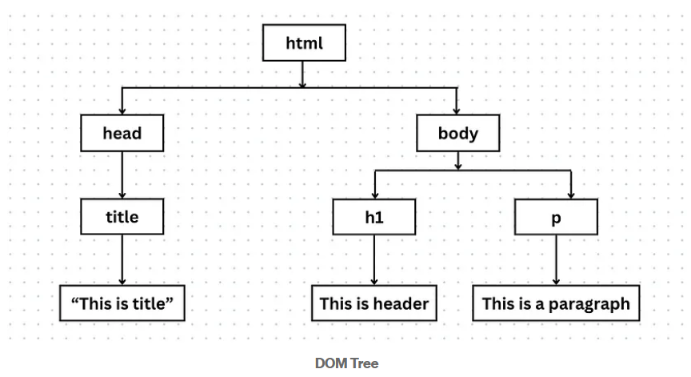

- Web browsers utilize the DOM tree to represent and manipulate HTML documents, which enables easy identification and positioning of elements within the browser’s display.
- However, modifying or making changes to DOM elements is a resource intensive and time-consuming process. When a DOM element is altered, the browser has to recalculate the element’s size and position, as well as repaint the screen. This process can be slow, especially for larger applications, because even minor updates might cause extensive re-rendering and repainting of the entire UI.
- React introduces the **Virtual DOM** to mitigate the performance issues associated with the Real DOM.
- **Virtual DOM Representation**: When you create a React component, React builds a lightweight copy of the Real DOM in memory, called the Virtual DOM. This is essentially a JavaScript object that represents the structure of the UI.
- **Component Updates**: When the state of a component changes (for example, due to user interaction), React doesn't immediately update the Real DOM. Instead, it updates the Virtual DOM first.
- **Diffing Algorithm**: After updating the Virtual DOM, React compares the updated Virtual DOM with the previous version of the Virtual DOM to determine what has changed. This process is known as diffing.
  - React uses an efficient algorithm to find out the minimal number of changes required by comparing nodes. It operates under the assumption that components with the same key will have similar structure and can be compared more quickly.
- **Batch Updates**: Once React has identified what has changed, it batches these updates and applies them to the Real DOM in one go. This minimizes the number of direct manipulations on the Real DOM, which is the slowest part of the process.
- **Reconciliation**: This process of updating the Real DOM based on changes detected in the Virtual DOM is called reconciliation. React intelligently decides whether to update, insert, or remove elements from the Real DOM based on the changes it finds in the Virtual DOM.
- How React Implements This
  - **React Elements**: These are plain objects representing the component's structure. When you write JSX, React creates these elements.
  - **Reconciliation Process**: When a component’s state or props change: A new Virtual DOM tree is created based on the updated component. React compares the new Virtual DOM tree with the old one. It generates a list of changes (deltas) that need to be made to the Real DOM.
- **Every time if a component is change a new virtual dom is created**.
- When you update a component's state (for example, using `setState` in a class component or a state setter function in a functional component) or when the `props` change (due to parent component updates), React initiates a re-render of that component.
- During this re-render, React calls the `render` method (in class components) or the function component itself (in functional components). This results in a new Virtual DOM tree being created based on the updated state and props. **Each time a component renders, it produces a new Virtual DOM representation**.
- After creating the new Virtual DOM, React compares it with the previous Virtual DOM tree (the one from the last render). This process is called diffing.
- The diffing algorithm identifies **what has changed between the two Virtual DOM trees**. It looks for differences in nodes, attributes, and structure.
- Based on the results of the diffing process, **React determines the minimal set of updates required to apply to the Real DOM**. React then applies only those updates to the Real DOM, rather than re-rendering the entire UI.
- Example to Illustrate the Process

**1. Initial Render**:
  - Let's say you have a simple counter component that displays a count of 0.

**2. User Action**:
  - When a user clicks a button to increment the count. The state changes from 0 to 1.

**3. Virtual DOM Creation**:
  - React creates a new Virtual DOM tree that represents the updated count. New Virtual DOM: `{ type: 'div', props: { count: 1 } }`

**4. Diffing**: 
  - React compares the new Virtual DOM with the old one. Old Virtual DOM: `{ type: 'div', props: { count: 0 } }`. The diffing algorithm detects that the count has changed.

**5. Updating Real DOM**:
  - React updates the corresponding Real DOM node to reflect the new count. Real DOM now shows `<div>1</div>` instead of `<div>0</div>`.

- Every Change Triggers a New Virtual DOM. Every time a component's state or props change, React generates a new Virtual DOM tree.
- The diffing process ensures that only the parts of the Real DOM that have changed are updated, minimizing the performance impact.
- This method allows React to efficiently manage updates to the UI, providing a fast and responsive user experience without requiring the entire UI to be re-rendered from scratch

### Benefits of Virtual DOM and Reconciliation

- Performance: Minimizes direct manipulations of the Real DOM, leading to improved performance and smoother UI updates.
- Efficiency: Only updates parts of the DOM that actually changed, reducing the need for reflows and repaints.
- Declarative UI: You describe what your UI should look like for any given state, and React takes care of making the necessary updates.


## Functional vs Class Component

| **Functional Components**                                                            | **Class Components**                              |
|--------------------------------------------------------------------------------------------------------|------------------------------------------------------------------------------------------------|
| A functional component is just a plain JavaScript pure function that accepts props as an argument | A class component requires you to extend from React. Component and create a render function    |
| No render method used                                                                             | It must have the render() method returning JSX                                                 |
| Also known as Stateless components                                                                | Also known as Stateful components                                                              |
| React lifecycle methods (for example, componentDidMount) cannot be used in functional components.  | React lifecycle methods can be used inside class components (for example, componentDidMount).  |
| Constructors are not used.                                                                        | Constructor is used as it needs to store state.                                                |


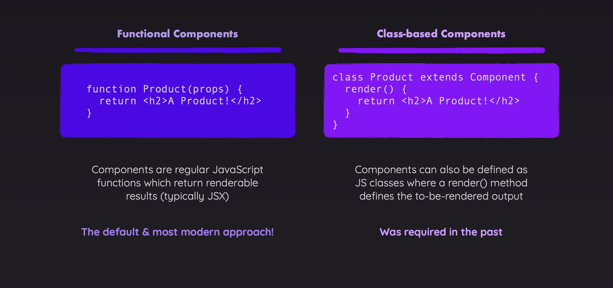


## Which to prefer? Functional or Class?

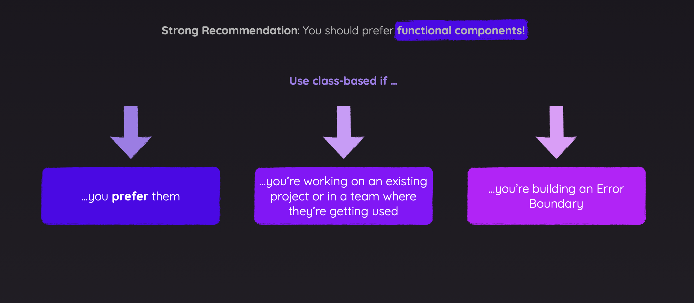

## Error Boundaries for Class based Components

- Error boundaries are React components that catch JavaScript errors occurring anywhere in their child component tree. They log these errors and display a fallback UI instead of the component tree that crashed. This prevents the entire application from crashing due to an error in one component.
- An Error Boundary is a React component that catches JavaScript runtime errors anywhere in its child component tree, logs the error, and displays a fallback UI instead of crashing the whole application.
- Let's consider a simple example what happens when we don't use Error boundaries.

```
//App.jsx

import BuggyComponent from './components/BuggyComponent';

function App() {
  return (
    <div>
      <h1>React Error Boundary Demo</h1>

      {/* The risky component which throws error*/}
        <BuggyComponent />
    </div>
  );
}

export default App;

//BuggyComponent.jsx

import React, { useState } from 'react';

function BuggyComponent() {
  const [triggerError, setTriggerError] = useState(false);

  if (triggerError) {
    // Simulate a render-time error
    throw new Error("I crashed!");
  }

  return (
    <div>
      <h3>This is a buggy component</h3>
      <button onClick={() => setTriggerError(true)}>Crash Me</button>
    </div>
  );
}

export default BuggyComponent;
```

- On browser

<video controls src="Images/about/2025-error-boundary.mov" title="title"></video>

- By writing `throw new Error("I crashed!");` we are generating an error and this error bubble up the call stack. So we pass it through all these components, and if it's not handled anywhere, this will crash our application.
- We can't handle like normal `try-catch` block at it works only for a functions in javascript. Now to resolve this we will use Error Boundary. So let's create a component for Error boundary.

```
// ErrorBoundary.jsx
import React from 'react';

class ErrorBoundary extends React.Component {
  constructor(props) {
    super(props);
    this.state = { hasError: false, error: null, errorInfo: null };
  }

  // Catch errors in children
  componentDidCatch(error, errorInfo) {
    this.setState({
      hasError: true,
      error: error,
      errorInfo: errorInfo
    });

    // You can also log to an error reporting service here
    console.error("Caught by ErrorBoundary:", error, errorInfo);
  }

  render() {
    if (this.state.hasError) {
      return (
        <div style={{ padding: 20, backgroundColor: '#fdd' }}>
          <h2>Something went wrong.</h2>
          <details style={{ whiteSpace: 'pre-wrap' }}>
            {this.state.error && this.state.error.toString()}
            <br />
            {this.state.errorInfo.componentStack}
          </details>
        </div>
      );
    }

    return this.props.children; // Render children if no error
  }
}

export default ErrorBoundary;

//App.jsx
import ErrorBoundary from './components/ErrorBoundary';
import BuggyComponent from './components/BuggyComponent';

function App() {
  return (
    <div>
      <h1>React Error Boundary Demo</h1>

      {/* Wrap only the risky component */}
      <ErrorBoundary>
        <BuggyComponent />
      </ErrorBoundary>

      {/* This part of the UI won't crash if BuggyComponent fails */}
      <p>This part of the UI is safe.</p>
    </div>
  );
}

export default App;
```

- On browser

<video controls src="Images/about/2025-error-boundary1.mov" title="title"></video>


| Concept               | Meaning                                                                     |
| --------------------- | --------------------------------------------------------------------------- |
| **Error Boundary**    | React component that handles JavaScript errors in child components          |
| **`componentDidCatch`** | Lifecycle method to log errors and update state. It gets triggered when the child component throws error                            |
| **Fallback UI**       | Displayed when an error is caught based on chaging the state via `componentDidCatch`                                      |


- You can create multiple `ErrorBoundarys` around different components for more granular error handling.


>[!NOTE]
> - Why do we get this below react error UI image even after adding error boundary?
>
> 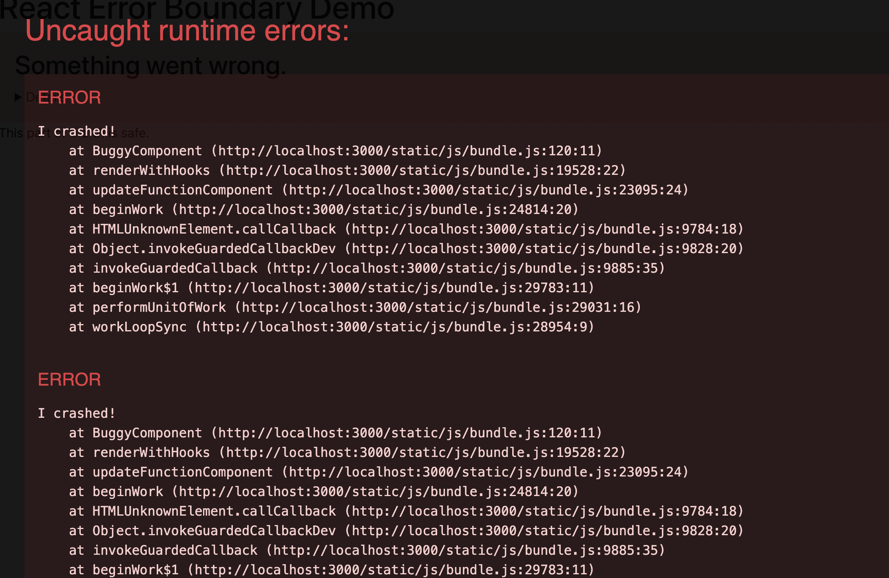
>
> - In development mode, React uses a special tool called "React Error Overlay" (in Create React App and other tools like Vite) to visibly show developers that a runtime error has occurred. This is intended behavior during development so you can:
> 1. Immediately spot the issue
> 2. View detailed stack traces
> 3. Debug efficiently
> - That’s why, even with a proper ErrorBoundary, you still see the red screen during development.
> - In production builds, this red overlay does NOT appear. Instead:
>   - The error is caught silently by your ErrorBoundary
>   - Only the fallback UI you defined in the `render()` method is shown to the user


- Learn more concepts on [React](React-II.md)
