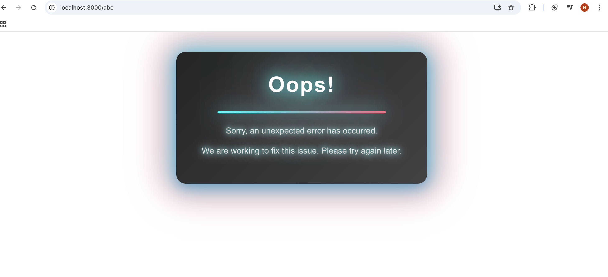

# React Concepts

## Prop Drilling

- Prop drilling in React refers to the process of passing data down through multiple levels of nested components via props, even when intermediate components do not need the data themselves. It arises when a deeply nested child component requires access to data held by a distant ancestor component.


- For example, the app component might render a Shop and Header component and these components has child Components and other nested Components. You'll also need to manage some state and if the value is being used by your child component you then need to share it through props and also update it with help of props. This often means that you need to pass that shared data through multiple layers of Components. And that is something that's called prop drilling.
- You are passing props through multiple Components, even though most Components don't directly need that data. They just pass it on to some child component. And that can be a problem because this it makes your Components a bit less reusable because they always must be used in a place where they can get that shared data. And it also means that you have to write a lot of extra boilerplate code because you need to accept and destructure a prop in a component and then forward it to a component just to then maybe repeat that entire process.


### Component Composition

- So consider below nester component code.

```
//App.jsx

import React from 'react';
import MyComponent from './components/MyComponent';
function App() {

  function onClickHandler() {
    console.log('Function handler called!');
  }
  return (
<MyComponent onClickHandler={onClickHandler} >

</MyComponent> 
  );
}

export default App;

//MyComponent.jsx

import ChildComponentOfMyComponent from './ChildComponentOfMyComponent.jsx';
export default function MyComponent({ onClickHandler }) {
  return (
    <div>
      <h1>My Component</h1>
      <p>This is a simple component that uses a function handler.</p>
      <ChildComponentOfMyComponent onClickHandler={onClickHandler}></ChildComponentOfMyComponent>
    </div>
  );
}

// ChildComponentOfMyComponent.jsx

export default function MyComponent({ onClickHandler }) {
    return (
        <div>
        <button onClick={()=>onClickHandler()}>Click me!</button>
        </div>
    );
}
```

- On browser

<video controls src="2025-1.mov" title="title"></video>


- Here, we are passing the `onClickHandler` to `MyComponent` which does not uses it. This is a scenario of prop drilling. To solve it let's use component composition.

```
//App.js

import React from 'react';
import ChildComponentOfMyComponent from './components/ChildComponentOfMyComponent.jsx';
import MyComponent from './components/MyComponent';
function App() {

  function onClickHandler() {
    console.log('Function handler called!');
  }
  return (
<MyComponent>
{
  <ChildComponentOfMyComponent onClickHandler={onClickHandler}></ChildComponentOfMyComponent>
}
</MyComponent> 
  );
}

export default App;

// MyComponent.jsx

import ChildComponentOfMyComponent from './ChildComponentOfMyComponent.jsx';
export default function MyComponent({ children }) {
  return (
    <div>
      <h1>My Component</h1>
      <p>This is a simple component that uses a function handler.</p>
      {children}
    </div>
  );
}

// ChildComponentOfMyComponent.jsx

export default function MyComponent({ onClickHandler }) {
    return (
        <div>
        <button onClick={()=>onClickHandler()}>Click me!</button>
        </div>
    );
}
```


- On browser

<video controls src="2025-1.mov" title="title"></video>

- Composition means you build components by combining other components — passing elements or components as `children` or as props.
- Instead of deeply nested props, you can use composition components to avoid prop drilling by injecting components or behavior into a container component.
- Instead of passing data through every level, you can compose components in such a way that the needed logic or UI is provided directly where it's used.
- You typically don't want to use this composition for all your component layers. Because it would mean that in the end, all your components just end up in the app component and all the other components are just wrapper components.


### Context API

- The Context API is a feature in React that allows you to share data (like a global variable) across your entire app — without passing `props` manually at every level.
- It’s like saying *Hey React, here’s some data (like a theme mode or user). Any component that wants it can just grab it — no need to drill it down*.
- Simple analogy could be thinking context api as Wi-fi. Instead of giving internet access (props) through a long wire (prop drilling) to each device (component), you just turn on the Wi-Fi (Context) and now any device (component) in the range can connect directly.


- Let's create a folder `/store`. In React's Context API, a `store` is used to hold the data that you want to share across multiple components. It is essentially a container for your application's state.

>[!NOTE]
> - `/store` is just a convention followed in most react applications. You can give any name whatever you like.

- `MyContext.jsx`

```
import { createContext } from "react";

export const MyContext = createContext()
```

- Now inside `createContext` the value of it can be anything, string, boolean, arrays, object or function etc... Let's create an object.

```
import { createContext } from "react";

export const MyContext = createContext({
    items:[]
});
```

- The next step now is to provide it to this application and to our components. We need to provide this context to our application and we need to wrap it around parts of that application, parts of our component tree, so that those wrapped components can access this value which we're providing here.
-  And then as a next step, you should go to a component that contains all the other components that will need to use this context. So therefore the `App.jsx` component is a great place to wrap header and shop with our context so that those components or their child components can use that context.

```
//App.js

import React from 'react';
import ChildComponentOfMyComponent from './components/ChildComponentOfMyComponent.jsx';
import MyComponent from './components/MyComponent';
import { MyContext } from './components/store/MyContext.jsx';
function App() {

  function onClickHandler() {
    console.log('Function handler called!');
  }
  return (
    <MyContext>
      <MyComponent>
      {
        <ChildComponentOfMyComponent onClickHandler={onClickHandler}></ChildComponentOfMyComponent>
      }
      </MyComponent> 
    </MyContext>
  );
}

export default App;
```

- So we have wrapped `MyContext` component on the `App`.

>[!NOTE]
> - For older react version (<19). We need to wrap the component using `Provider` to access a nested property. Below is an example of if
>
>```
>    <MyContext.Provider>
>      <MyComponent>
>      {
>        <ChildComponentOfMyComponent onClickHandler={onClickHandler}></ChildComponentOfMyComponent>
>      }
>      </MyComponent> 
>    </MyContext.Provider>
>  );
> ```
>
> - The `Provider` property also works for the latest react version

- Now we have created conrext, let's start to consume it.

```
//ChildComponentOfMyComponent.jsx

import { useContext } from "react";
import { MyContext } from "./store/MyContext";

export default function ChildComponentOfMyComponent({ onClickHandler }) {
    const { items } = useContext(MyContext); //Destructure items from context
    return (
        <div>
            {items.length > 0 ? (
                <ul>
                    {items.map((item, index) => (
                        <li key={index}>{item}</li>
                    ))}
                </ul>
            ) : (
                <p>No items available</p>
            )}
        <button onClick={()=>onClickHandler()}>Click me!</button>
        </div>
    );
}
```

- Now to use context, we need to use `useContext` hook. `useContext` is a React Hook that enables functional components to access `context` values. It consumes the context object returned by `React.createContext` and subscribes the component to context changes. When the context value updates, React re-renders the component, ensuring it always has the latest data.
- Alternatively, you can also use `use` hook.

```
//ChildComponentOfMyComponent.jsx
import { use } from "react";
import { MyContext } from "./store/MyContext";

export default function ChildComponentOfMyComponent() {
    const { items } = use(MyContext); //Destructure items from context
    return (
        <div>
            {items.length > 0 ? (
                <ul>
                    {items.map((item, index) => (
                        <li key={index}>{item}</li>
                    ))}
                </ul>
            ) : (
                <p>No items available</p>
            )}
        </div>
    );
}
```

- The difference between `use` and `useContext` is that, `useContext` hook cannot be used under conditional statements whereas `use` can.

```
// Cannot do this using useContext ❌
    if(true){
        const { items } = useContext(MyContext); //Destructure items from context
    }
```

>[!NOTE]
> - `use` hook is available on react 19+ version.

- Now below is `App.jsx` and `MyComponent.jsx`.

```
//App.jsx

import React from 'react';
import MyComponent from './components/MyComponent';
import { MyContext } from './components/store/MyContext.jsx';
function App() {

  return (
    <MyContext.Provider>
      <MyComponent>
      </MyComponent>
    </MyContext.Provider>
  );
}

export default App;

//MyComponent.jsx
import ChildComponentOfMyComponent from './ChildComponentOfMyComponent.jsx';
export default function MyComponent() {
  return (
    <div>
      <h1>My Component</h1>
      <p>This is a simple component that uses a function handler.</p>
      <ChildComponentOfMyComponent />
    </div>
  );
}

//
```

- On browser


- Why do we need to add `value` inside the provider? Why Not Just `createContext()` and Expect Auto-Data? when we create context

```
export const MyContext = createContext({});
```

- We just define the context, react doesn't know:
  - What state you're managing?
  - What functions you want to share?

- The `value` prop in a context provider is what will be available to components that call `useContext(MyContext)`. So you must include:
  - Any state (like `items`) you want to share
  - Any function you want others to use
- This tells React *These are the things I want to share globally.*
- When you create a Context object with a default shape (i.e., you provide key attributes like items, etc.), you enable autocompletion and type hints in most modern code editors (like VS Code).

```
export const MyContext = createContext({
    items:[]
});
```

- It does not defined value of state or function.
- Now since we have added `items: ['Item 1', 'Item 2', 'Item 3']` , we can only read it's value. Let's create a state of if, so whenever button is clicked, items will be added into the `items` array.

```
//App.js

import React from 'react';
import MyComponent from './components/MyComponent';
import { MyContext } from './components/store/MyContext.jsx';
function App() {

  // Create state to hold the items
  const [items, setItems] = React.useState(['Item 1', 'Item 2', 'Item 3']);

  // Create a function to handle on click event and add a new item
  function onClickHandler() {
    setItems((prevItems) => {
      return [...prevItems, `Item ${prevItems.length + 1}`];
    });
  }
  return (
    <MyContext.Provider value={{ items: ['Item 1', 'Item 2', 'Item 3'] }}> 
      <MyComponent>
      </MyComponent> 
    </MyContext.Provider>
  );
}

export default App;
```

- Now, let's add the new state `items` which has `useState` and `onClickHandler` function into context value. Now in the `ChildComponentOfMyComponent` we are displaying list of items, so now add a button there.

```
import { use, useContext } from "react";
import { MyContext } from "./store/MyContext";

export default function ChildComponentOfMyComponent() {
    const { items } = useContext(MyContext); //Destructure items from context
    return (
        <div>
            <button onClick={onClickHandler}>Add Item</button>
            {items.length > 0 ? (
                <ul>
                    {items.map((item, index) => (
                        <li key={index}>{item}</li>
                    ))}
                </ul>
            ) : (
                <p>No items available</p>
            )}
        </div>
    );
}
```

- Now we need to use context value and call the function `onClickHandler`. But when we see the auto suggestion while typing in `ChildComponentOfMyComponent`, we cannot see the `onClickHandler`


- Now let's update context

```
//MyContext.jsx

import { createContext } from "react";

export const MyContext = createContext({
    items:[],
    onClickHandler: () => {},
});
```

- Now we can see the function name in the suggestion


- Updating the `onClickHandler` into the provider value.

```
//App.jsx

import React from 'react';
import MyComponent from './components/MyComponent';
import { MyContext } from './components/store/MyContext.jsx';
function App() {

  // Create state to hold the items
  const [items, setItems] = React.useState(['Item 1', 'Item 2', 'Item 3']);

  // Create a function to handle on click event and add a new item
  function onClickHandler() {
    setItems((prevItems) => {
      return [...prevItems, `Item ${prevItems.length + 1}`];
    });
  }
  return (
    <MyContext.Provider value={{ items, onClickHandler }}>
      <MyComponent>
      </MyComponent> 
    </MyContext.Provider>
  );
}

export default App;

//MyComponent.jsx

import ChildComponentOfMyComponent from './ChildComponentOfMyComponent.jsx';
export default function MyComponent() {
  return (
    <div>
      <h1>My Component</h1>
      <p>This is a simple component that uses a function handler.</p>
      <ChildComponentOfMyComponent />
    </div>
  );
}

//ChildComponentOfMyComponent.jsx

import { useContext } from "react";
import { MyContext } from "./store/MyContext";

export default function ChildComponentOfMyComponent() {
    const { items } = useContext(MyContext); //Destructure items from context
    const { onClickHandler } = useContext(MyContext); //Destructure onClickHandler from context
    return (
        <div>
            <button onClick={()=>onClickHandler()}>Add Item</button>
            {items.length > 0 ? (
                <ul>
                    {items.map((item, index) => (
                        <li key={index}>{item}</li>
                    ))}
                </ul>
            ) : (
                <p>No items available</p>
            )}
        </div>
    );
}
```


- On browser

<video controls src="2025-2.mov" title="title"></video>

- This is how we link our state with context and use state via context. There is an alternative way to use context that is using `Context_Name.Consumer`.
- The React Context Consumer is a component that allows you to subscribe to context changes within a React application. It is used in conjunction with the Context Provider to access data that has been shared across the component tree.

```
import { MyContext } from "./store/MyContext";

export default function ChildComponentOfMyComponent() {
    return (
        <MyContext.Consumer>
            {(context) => {
                const { items, onClickHandler } = context;
                return (
                    <div>
                        <button onClick={() => onClickHandler()}>Add Item</button>
                        {items.length > 0 ? (
                            <ul>
                                {items.map((item, index) => (
                                    <li key={index}>{item}</li>
                                ))}
                            </ul>
                        ) : (
                            <p>No items available</p>
                        )}
                    </div>
                );
            }}
        </MyContext.Consumer>
    );
}
// This component uses the MyContext.Consumer to access the context values.
```

- On browser

<video controls src="2025-2.mov" title="title"></video>

- The Context Consumer expects a function as its child. This function receives the current context value  (`context`) as its argument and returns the JSX that should be rendered.

>[!TIP]
> - Using `Consumer` approach may be cumbersome so many react applications uses the standard approach i.e using `useContext`.

- **React context re-renders the component which consumes the context**. When the value passed to `<MyContext.Provider value={...}>` changes (by identity).
- All components using u`seContext(MyContext)` or `<MyContext.Consumer>` will re-render if the value they receive from the context is different.
- Also every time the parent re-renders, a new object is created, so context consumers re-render too — even if `items` and `onClickHandler` are the same.
- In your `App` component, there could be a possibilities that you might have different state values that should be shared through those different contexts. And you would therefore end up with a lot of logic in your app component since that is typically your root component and has access to all the components. 
- There could be multiple context as well also each context will have its own different state. So managing all these in one single `App` component can be cumbersome.
- And therefore there is an alternative approach an alternative pattern, which you'll see in many React projects, which allows you to get all this context related data management out of the app component into a separate context component.
- So insider our context, we can share component function as well like below

```
//MyContext.jsx

import React, { createContext } from "react";

export const MyContext = createContext({
    items:[],
    onClickHandler: () => {},
});


export const MyProviderValue = ({ children }) => {
    // Create state to hold the items
    const [items, setItems] = React.useState(['Item 1', 'Item 2', 'Item 3']);

    // Create a function to handle on click event and add a new item
    function onClickHandler() {
        setItems((prevItems) => {
            return [...prevItems, `Item ${prevItems.length + 1}`];
        });
    }
    return (
        <MyContext.Provider value={{ items, onClickHandler }}>
            {children}
        </MyContext.Provider>
    );
}

//App.jsx
import React from 'react';
import MyComponent from './components/MyComponent';
import { MyProviderValue } from './components/store/MyContext.jsx';
function App() {

  return (
    <MyProviderValue>
      <MyComponent>
      </MyComponent>
      </MyProviderValue>
    );
}

export default App;
```

- On browser works the same way

<video controls src="2025-2.mov" title="title"></video>


## Reducer Hook (`useReducer`)

- Imagine you're building a counter app:
  - `+` button increases the count.
  - `-` button decreases the count.
  - `Reset` button resets the count.
- You could use multiple `useState` like below.

```
import React, { useState } from 'react';
import './App.css';

const buttonStyle = {
  backgroundColor: '#4CAF50', /* Green */
  border: 'none',
  color: 'white',
  padding: '15px 32px',
  textAlign: 'center',
  textDecoration: 'none',
  display: 'inline-block',
  fontSize: '16px',
  margin: '4px 10px',
  cursor: 'pointer',
};

const h2Style = {
  color: '#4CAF50',
  fontSize: '24px',
  margin: '20px 0',
};
function App() {
  const [count, setCount] = useState(0);

  return (
    <div>
      <h2 style={h2Style}>Count: {count}</h2>
      <button style={buttonStyle} onClick={() => setCount(count + 1)}>+</button>
      <button style={buttonStyle} onClick={() => setCount(count - 1)}>-</button>
      <button style={buttonStyle} onClick={() => setCount(0)}>Reset</button>
    </div>
  );
}

export default App;
```

- On browser

<video controls src="2025-3.mov" title="title"></video>


- Now let's say during the increment button (`+`) if the count exceeds greater than than 10, we need to reset the value to 0, such logic needs to be implemented.

```
      <button style={buttonStyle} onClick={() => (count<10?setCount(count + 1): setCount(0))}>+</button>
```

- Here, if the value is greater than 10 we are setting it to 0. So our **next state of `count` depends on previous state of `count`**.
- Now let's say if there is more complex logic for increment, like doubling the value or adding more complex logic. Such things were need to embedded within a function handler. Now if multiple states are there and each state as complex logic, we need to create different functions and composed those logic into it.
- `useReducer` is a React hook that helps manage complex state logic in your component. It's like an upgraded version of `useState`, especially useful when:
  - The next state depends on the previous state.
  - You have multiple related pieces of state.
  - You want to make state updates more structured and predictable.
- `useReducer` gives you one place to manage all those state with their corresponding logic. It is an alternative to `useState` and is particularly useful when the next state depends on the previous state or when dealing with multiple sub-values.
- `useReducer` accepts a reducer function and an initial state as arguments and returns the current state and a dispatch function. The dispatch function is used to send actions to the reducer, which then calculates the new state based on the current state and the action type.

```
const [state, dispatch] = useReducer(reducer, initialState);
```

- The reducer function takes the current state and an action as arguments and returns the new state based on logic. Let's see example

```
//App.jsx
import React, { useReducer } from 'react';
import './App.css';

const buttonStyle = {
  backgroundColor: '#4CAF50', /* Green */
  border: 'none',
  color: 'white',
  padding: '15px 32px',
  textAlign: 'center',
  textDecoration: 'none',
  display: 'inline-block',
  fontSize: '16px',
  margin: '4px 10px',
  cursor: 'pointer',
};

const h2Style = {
  color: '#4CAF50',
  fontSize: '24px',
  margin: '20px 0',
};

// All Logic for each state is in the reducer function
function countReducer(state, action) {
  if (state.count >= 10 && action.type === 'increment') {
    return { count: 0 };
  }
  switch (action.type) {
    case 'increment':
      return { count: state.count + 1 };
    case 'decrement':
      return { count: state.count - 1 };
    case 'reset':
      return { count: 0 };
    default:
      throw new Error();
  }
}

function App() {
  const [state, countDispatch] = useReducer(countReducer, {count: 0});

  return (
    <div>
      <h2 style={h2Style}>Count: {state.count}</h2>
      <button style={buttonStyle} onClick={()=>countDispatch({type: 'increment'})}>+</button>
      <button style={buttonStyle} onClick={() => countDispatch({type: 'decrement'})}>-</button>
      <button style={buttonStyle} onClick={() => countDispatch({type:'reset'})}>Reset</button>
    </div>
  );
}

export default App;
```

- On browser

<video controls src="2025-4.mov" title="title"></video>


- `countReducer` is a reducer and it is a pure function (no side effects) that takes the current state and an action, and returns a new state.
- `useReducer`:
  - Takes the reducer function and initial state (`{ count: 0 }`).
  - Returns:
    - `state`: current state value.
    - `countDispatch`: function used to send actions like `increment`, `decrement`, etc.
- You call `dispatch({ type: 'increment' })` to tell the reducer what to do. dispatch() to send an action to the reducer.
The action is usually an object with a `type` field, and sometimes a `payload` or any attribute you want.

```
dispatch({ type: 'increment' });
dispatch({ type: 'set-name', payload: 'Alice' });
dispatch({ anything: 'increment'});
```
- The reducer sees this action and decides how to update the state.
- `useReducer` keeps your state logic in one place and makes the code more maintainable as the app grows.

### How does dispatch know that render should be called? How is the state passed and it gets updated?

- Under the hood when we write

```
const [state, dispatch] = useReducer(reducer, initialState);
```

- React remembers:
  - The current state
  - The reducer function bind to that state
- When you call `dispatch(action)` react calls your reducer function with the current state and the action:

```
const newState = reducer(currentState, action);
```
- React compares the old state vs the new state. If the state has changed, React re-renders the component with the new state. Your component function runs again.
- It gets the latest state from React's internal system.
- `dispatch` doesn't know about rendering directly. It just triggers the reducer function, and React takes care of the rest. If the state changes, React re-renders that component.

## Side Effect & `useEffect`

- Side effects in React refer to actions or operations performed within a component that interact with the outside world or affect other parts of the application beyond the component's own scope.
- Examples of Side Effects are

| Side Effect                               | Uses Browser API? | Example APIs Used                                   |
| ----------------------------------------- | ----------------- | --------------------------------------------------- |
| **Fetching data from an API**             | ✅ Yes             | `fetch()`, `XMLHttpRequest`, etc.                   |
| **Changing the DOM manually**             | ✅ Yes             | `document.querySelector()`, `innerHTML`             |
| **Setting a timer**                       | ✅ Yes             | `setTimeout()`, `setInterval()`                     |
| **Working with local storage or cookies** | ✅ Yes             | `localStorage`, `sessionStorage`, `document.cookie` |
| **Subscribing to events or sockets**      | ✅ Yes             | `WebSocket`, `EventSource`, `addEventListener()`    |

- React wants to keep rendering pure — which means
  - Rendering should only depend on `props` and `state`.
  - It should not directly talk to the outside world.

### Infinite Rendering Loop

- An infinite rendering loop in React occurs when a component continuously re-renders itself without stopping, eventually leading to a crash. This usually happens when a state update triggers a re-render, and the re-render, in turn, causes another state update, creating a cycle.
- Example

```
import React, { useState } from 'react';

function InfiniteLoopComponent() {
  const [count, setCount] = useState(0);

  // Problem: Updating state directly in the component body
  setCount(count + 1); 

  return (
    <div>
      <p>Count: {count}</p>
    </div>
  );
}

export default InfiniteLoopComponent;
```

- In this example, the `setCount(count + 1)` line is executed every time the component renders. This updates the `count` state, which then triggers a re-render. This creates an infinite loop of renders and state updates.
- To handle scenarios like the one described above, React provides a powerful hook called `useEffect`

### `useEffect`

- `useEffect` is a hook in React that allows you to perform side effects in function components. `useEffect` function takes two arguments:, a function containing the code for the side effect, and an optional array of dependencies. Let's see an example

```
import React from 'react'
import {useState, useEffect} from 'react'

export default function App() {
  const [count, setCount] = useState(0)

  useEffect(() => {
    console.log('Then UseEffect gets Executed')
    setCount(count + 1)
  }, [])

  console.log('First Component Renders')
  return (
    <div>
      <p>Count: {count}</p>
    </div>
  )
}
```

- On browser



- The `useEffect()` runs after the first render. You can safely do side effects here without breaking React’s rendering.
- `useEffect` function takes two arguments:

1. Effect function
    -  The first argument of `useEffect` is a function containing the code for the side effect. This function, commonly referred to as the "effect function," is executed after the component renders for the first time and after every subsequent render.
    - The `useEffect` hook ensures that the data fetching operation only occurs once, when the component mounts, preventing the infinite rendering loop (due to the empty dependency array `[]`)

```
useEffect(() => {
  // Only runs once on first render
  fetchData();
}, []); // Empty array = run once
```

2. Dependency array
    - The second argument of `useEffect` is an optional array of dependencies. It specifies the values (variables or state) that the effect function depends on. When any of the dependencies change between renders, the effect function will be re-executed.

```
useEffect(() => {
    setCount(count + 1); // This changes state
  }, [count]); // ...which triggers the effect again! And this repeats forever 🔁 = Infinite Loop, so add condition on it


useEffect(() => {
  if (count < 5) {
    setCount(count + 1);
  }
}, [count]);
```

- Another example of dependency array is let’s say you have a component that receives a `userId` and you want to fetch that user’s details only when the userId changes.

```
import React, { useState, useEffect } from "react";

function UserProfile({ userId }) {
  const [userData, setUserData] = useState(null);

  useEffect(() => {
    // ✅ Run this effect only when `userId` changes
    if (!userId) return;

    // Side effect: Fetch user data
    fetch(`https://jsonplaceholder.typicode.com/users/${userId}`)
      .then((res) => res.json())
      .then((data) => setUserData(data))
      .catch((error) => console.error("Error fetching user:", error));
  }, [userId]); // 🔁 Dependency array

  return (
    <div>
      <h2>User Profile</h2>
      {userData ? (
        <div>
          <p><strong>Name:</strong> {userData.name}</p>
          <p><strong>Email:</strong> {userData.email}</p>
        </div>
      ) : (
        <p>Loading user data...</p>
      )}
    </div>
  );
}
```

- It runs the first time when the component mounts (if `userId` exists). It runs again only when the `userId` value changes.


| Line                                  | What it's doing                                     |
| ------------------------------------- | --------------------------------------------------- |
| `useEffect(() => { ... }, [userId]);` | This runs the effect **only when `userId` changes** |
| `if (!userId) return;`                | Avoid fetching if userId is `null` or `undefined`   |
| `fetch(...)`                          | This is the side effect — using a browser API       |
| `setUserData(data)`                   | Updates state → triggers re-render                  |


>[!IMPORTANT]
> ### Not all side effects need `useEffect`.
> - Some code can (and should) run inside event handlers or functions, not as effects. Let's take an example
> - The side effect (saving to `localStorage`) only happens when the button is clicked. No need to use `useEffect`.
>
> ```
> function SaveName() {
>   const [name, setName] = useState("");
> 
>   const handleSave = () => {
>     localStorage.setItem("username", name); // SIDE EFFECT!
>   };
> 
>   return (
>     <>
>       <input value={name} onChange={(e) => setName(e.target.value)} />
>       <button onClick={handleSave}>Save</button>
>     </>
>   );
> }
> ```
>
> - If side effects can be resolve using event handler or functions, then **avoid `useEffect`**.


### `useEffect` clean up function

#### Analogy

- You're throwing a party at your house (your React component). At the start of the party, you hire a DJ (your side effect).
- If you forget to tell the DJ to stop when the party ends (component unmounts), the DJ will keep playing music forever, bothering your neighbors (causing memory leaks or unexpected behavior).
- But if you tell the DJ, “Thanks, we’re done!” (cleanup function), everything ends smoothly.
- When you use `useEffect`, sometimes you start something (like a timer, event listener, or subscription). A cleanup function is used to stop that thing when your component is no longer active.
- 🤯 What Happens Without a Cleanup Function? Let’s say you add a `setInterval` to print something every second.

```
useEffect(() => {
  setInterval(() => {
    console.log("Tick");
  }, 1000);
}, []);
```

- It keeps ticking every second. Even if your component is removed, the interval is still running! This uses memory and may cause multiple intervals stacking up (memory leak).
- So using cleanup function we can remove the interval

```
useEffect(() => {
  const intervalId = setInterval(() => {
    console.log("Tick");
  }, 1000);

  // ✅ Cleanup function to stop the interval
  return () => {
    clearInterval(intervalId);
  };
}, []);
```

- When the component is removed or effect re-runs, the interval is cleared. No memory leaks or weird logs happening after the component is gone.
- Another example that can cause memory leaks is adding an event listener

```
❌ Without Clean up Function

useEffect(() => {
  window.addEventListener('resize', () => {
    console.log('Window resized!');
  });
}, []);
```

- You add a new listener every time the component mounts. If the component is mounted/unmounted multiple times (e.g., in a tabbed app), you’ll get many listeners attached = memory leak.

```
✅ With Clean up Function
useEffect(() => {
  const handleResize = () => {
    console.log('Window resized!');
  };
  
  window.addEventListener('resize', handleResize);

  return () => {
    window.removeEventListener('resize', handleResize);
  };
}, []);
```

- Now every time the component unmounts, it removes the listener. No leak, no multiple console logs.

1. Component loads for the first time
    - The `useEffect` runs after render.
    - You set up an interval, event listener, or something similar.

2. Component is removed from the screen (unmounts)
    - If you don’t use a cleanup function, the interval or listener keeps running → 💥 memory leak or buggy behavior.
    - If you do use a cleanup function (inside r`eturn () => {...}`), React automatically runs it to stop those side effects → ✅ safe and clean.

3. Component is shown again (re-mount) 
    - `useEffect` runs again.
    - If you didn’t clean up before, now you’ve added a second interval or listener (and it stacks).
    - If you did clean up, everything starts fresh.


- **So when our React component loads, useEffect runs. Since it won't re-run without any dependencies, it may cause memory leaks when the component unmounts, as the interval or listener remains active. So the cleanup function helps clean those up when the component unmounts.**

>[!IMPORTANT]
> - Even if the component doesn’t unmount, but the dependencies change (in the useEffect dependency array), React will:
>   - Run the cleanup function first.
>   - Then run the `useEffect` again with new values.
> - So cleanup also runs when the effect re-runs, not just on unmount.


## `useMemo` for Context API for unncessary Re-rendering


## `React.StrictMode`

- `React.StrictMode` is a useful component for highlighting potential problems in an application.
- Strict mode is a set of development tools that help you catch potential problems in your code before they become actual bugs. When you enable strict mode in your React application, you’re essentially telling React to turn on a bunch of extra checks and warnings that are designed to help you write better code.
- These checks and warnings can catch things like:
  - Components with side effects
  - Deprecated or unsafe lifecycle methods
  - Unsafe use of certain built in functions
  - Duplicate keys in lists


https://chatgpt.com/c/6816fdbf-82a4-8009-8e6a-37ed3c5cfef1
https://medium.com/@codeofrelevancy/what-is-strict-mode-in-react-cc8b51fb6096

TO be continue later