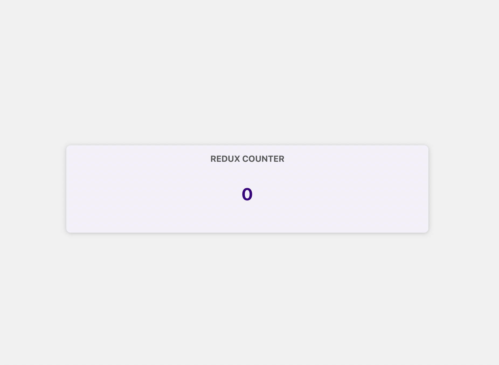

# About Redux

- What is Redux? Redux is a state management library that helps you manage and share data (called "state") across components in a predictable and centralized way.
- Think of it like a global storage box that React components can use to read from or write to.

## Different types of States


- We have seen React's State Management Hooks like `useState` or `useReducer` so that we can tell React that some data changed and so that it then updates the UI. But we can split the definition of state into three main kinds of state.

1. Local State
    - Local state is state so data which changes that affects UI which belongs to a single component. And for example, if we listen to a user input and we use `useState` to store that input with every keystroke in a state variable. Or we have a button that toggles some detailed field.
    - So if we click that button we show the details if we click it again we hide them. That would be local state. And typically we manage such local state inside of a single component with `useState`

2. Cross-component State
    - Now we also often have state that affects not just one component but multiple components. That would be cross component state.
    - For example, if we have a button that opens or closes a modal overlay such a modal component might affect multiple components. So then we have multiple components working together to display and hide a modal. And we can also implement that with `useState` or `useReducer` we then just need to pass props around so we need to build those prop chains or do this prop drilling as it's also called where we pass drops across multiple components where we also might pass functions as props across multiple components
    - That's not bad or anything like that it's just a little bit more complex than local state.


3. App-wide State
    - Sometimes we also have State that does not just affect multiple components but basically all components of an application. Now when that happens we could call this app-wide state
    - An example here would be user authentication. If we logged in we might need to change the navigation bar because we now show new options or menu on application and we also certainly affect a lot of other components which now show more or less data.
    - We can also manage this with the `useState`, `useReducer` and then by passing state values like prop-drilling


- Now for cross-component and app-wide state passing around data and updating function fruit props can become cumbersome though. And that's why we came across about React Context. React Context is a built in feature in React that makes managing cross-component or application wide state easier. So that's one way of simplifying cross-component and app-wide state management.
- Redux solves the same problem. So both React Context and Redux are there to help us manage such cross-component or app-wide States.
- **`But Why do we need Redux if we already have React Context for managing state that affects multiple components?`**

### React Context Potential Disadvantages


- One potential disadvantage is that with React Context, you can have a very complex setup and managing state with React Context can become quite complex. And that definitely depends on the kind of application you're building.
- For a lot of small or medium-sized applications that will very likely not be a problem. But if you're building a large application an enterprise level application with a lot of components and a lot of things going on, then when using React Context, you can end up with code like this


- Where you have a lot of different pieces of Context,  lot of different States that affect multiple components or the entire app, and therefore a lot of different Context Provider components which you built for managing these states. And you can end up with deeply nested JSX code
- Either using this way or you could just use one big Context and one Context Provider component for a managing the entire state and all the different kinds of state of your application.


- But that could lead in a large Context Provider component which manages a lot of different things, and therefore itself becomes quite difficult to maintain and manage because it's doing a lot of things. You might end up with a large Context that cares about authentication, theming, user input, if a modal should be displayed or not, and maybe a lot of other things as well.
- You can absolutely face this problem in real react projects you might be working on, and therefore this is one potential disadvantage.
- Another potential disadvantage could be performance. We have an official quote by a member of their React team, who basically says that the React Context, **that React Context is great for low-frequency updates like changing a theme, or maybe also authentication, but it's not that great if your data changes a lot**.


- So he says that React Context is not really a great replacement for Redux in all scenarios, in all cases. So therefore Redux is an alternative for React Context.


>[!NOTE]
> - Typically for application wide-state, you will only use one of the two, but then you could be using Redux for the general application wide-state and still use Context for selected multi-component states which are important in parts of your application.
> - So mixing and matching like that would also be possible


## How Redux Works?

- Redux is like a central control room that manages all the data (state) of your app. Instead of data being scattered in different components, Redux keeps everything in one place, so it's easier to manage and debug.
- Well, Redux is all about having one Central data or state store, in your application. **You have exactly one store. You never have more than one store.** It's one store, for all your state for your entire application.
- So in this store, you would store authentication state theming, maybe some user input state you wanna save, whatever it is. Whichever cross component or app wide state you have, it goes into this one store.
- Let's understand some concepts in redux.


- So we have this Central Data Store that we can use it from inside our components. Because if some data there changes, we wanna know about that change to the react components so that the UI gets update accordingly.
- All the components must set up subscription to our Central Store. They subscribe to the store, and whenever the data changes, the store notifies components, and then components can get the data they need, and they can then use it in UI.
- So data changes from time to time. So how do we change data into stored in? Here's one very important rule. **Components, never directly manipulate the store data.** So we have that subscription, but we don't have a data flow in the other direction. So how will the data or state would get changed? we use a concept called reducers.
- We have a reducer function is responsible, for mutating the data or state. So for changing the store data. This reducer function is **not** `useReducer()` hook. Reducer functions in general, are just a general concept. Reducer functions are functions, which takes some input, and then transform that input, they reduce it, and spit out a new output a new result. So we have a reducer function, which is responsible for updating the store data.


- We know component can subscribe to the data but do we now connect components and that reducer function? Because ultimately, it will of course be the components that should trigger a data change. We have `actions` and components `dispatch` actions. And therefore we could also say that components trigger, certain actions. Now an action is really just a simple JavaScript object, which describes the kind of operation, the reducers should perform. Therefore, Redux then forwards actions to the reducer, reads that description of the desired operation, and then this operation is performed by the reducer.
- So components dispatch actions, which describe what should be done, but don't do it directly, then these actions are forwarded to the reducer, the reducer then does what the action wants, the reducer to do. And then the reducer, spits out a new state, which effectively will replace the existing state in that Central Data Store. And when that happens, when that state in that data store is updated, subscribing components are notified, so that they can update their UI.
- That's how Redux works.
- Let's see a simplest implementation of Redux. So let's create a new folder `simple-example-redux`. Let's create a simple javascript file `redux-demo.js`. Run below command to create a `package.json`.

```
npm init -y
```

- The flag `-y` answers `Yes` to all default question which is asked in the CMD. Now let's install redux.

```
npm install redux
```

- `redux-demo.js` will be executed as `NodeJS` and not normal JS file. So now we will import redux and create a store.

```
const redux = require('redux');

// Creating a Store
const store = redux.createStore();
```

- Now let's create a reducer function which will determined what data must be given to the store. The reducer function which takes action and based on the action it will produce new state snapshots.

```
const redux = require('redux');

// Reducer function
/**
 * Here, we define a reducer function that takes the current state and an action,
 * and returns a new state based on the action type.
 * The state is initialized with a default value of { count: 0 }.
 * The reducer handles two action types: 'INCREMENT' and 'DECREMENT'.
 * When 'INCREMENT' is dispatched, it increases the count by 1.
 * When 'DECREMENT' is dispatched, it decreases the count by 1.
 * If the action type is not recognized, it returns the current state unchanged.
 * This is a pure function, meaning it does not have side effects and always returns the same output for the same input.
 */
const reducer = (state = { count: 0 }, action) => {
  switch (action.type) {
    case 'INCREMENT':
      return { count: state.count + 1 };
    case 'DECREMENT':
      return { count: state.count - 1 };
    default:
      return state;
  }
}


// Creating a Store
const store = redux.createStore(reducer); //Passing the reducer to store
```

- The reducer function must have an initial state value when its is loaded `state = { count: 0 }`.
- The reducer function usually returns an object but it can return anything like number, string etc.. Now let's create a subscriber.

```
const redux = require('redux');

// Reducer function
/**
 * Here, we define a reducer function that takes the current state and an action,
 * and returns a new state based on the action type.
 * The state is initialized with a default value of { count: 0 }.
 * The reducer handles two action types: 'INCREMENT' and 'DECREMENT'.
 * When 'INCREMENT' is dispatched, it increases the count by 1.
 * When 'DECREMENT' is dispatched, it decreases the count by 1.
 * If the action type is not recognized, it returns the current state unchanged.
 * This is a pure function, meaning it does not have side effects and always returns the same output for the same input.
 */
const reducer = (state = { count: 0 }, action) => {
  switch (action.type) {
    case 'INCREMENT':
      return { count: state.count + 1 };
    case 'DECREMENT':
      return { count: state.count - 1 };
    default:
      return state;
  }
}


// Creating a Store
const store = redux.createStore(reducer); //Passing the reducer to store

// Subscribe to store updates
// This function will be called whenever the state changes
// It logs the updated state to the console.
const subscription = () => {
  console.log('State updated:', store.getState());
};

store.subscribe(subscription); // Register the subscription function
```

- Now let's modify our state by dispatch.

```
const redux = require('redux');

// Reducer function
/**
 * Here, we define a reducer function that takes the current state and an action,
 * and returns a new state based on the action type.
 * The state is initialized with a default value of { count: 0 }.
 * The reducer handles two action types: 'INCREMENT' and 'DECREMENT'.
 * When 'INCREMENT' is dispatched, it increases the count by 1.
 * When 'DECREMENT' is dispatched, it decreases the count by 1.
 * If the action type is not recognized, it returns the current state unchanged.
 * This is a pure function, meaning it does not have side effects and always returns the same output for the same input.
 */
const reducer = (state = { count: 0 }, action) => {
  switch (action.type) {
    case 'INCREMENT':
      return { count: state.count + 1 };
    case 'DECREMENT':
      return { count: state.count - 1 };
    default:
      return state;
  }
}


// Creating a Store
const store = redux.createStore(reducer); //Passing the reducer to store

// Subscribe to store updates
// This function will be called whenever the state changes
// It logs the updated state to the console.
const subscription = () => {
  console.log('State updated:', store.getState());
};

store.subscribe(subscription); // Register the subscription function


// Dispatching actions modify the state based on the reducer logic. In reducer function,
// we defined how the state should change in response to different actions.
store.dispatch({ type: 'INCREMENT' }); // Dispatch an action to increment the count
store.dispatch({ type: 'INCREMENT' }); // Dispatch another action to increment the count
store.dispatch({ type: 'DECREMENT' }); // Dispatch an action to decrement the count
store.dispatch({ type: 'UNKNOWN' }); // Dispatch an action with an unknown type (no change expected)
// The subscription function will log the updated state after each dispatch
```

- On console

```
State updated: { count: 1 }
State updated: { count: 2 }
State updated: { count: 1 }
State updated: { count: 1 }
```


>[!IMPORTANT]
> - **Redux is not react specific, it can be used with vanilla javascript as well**

### Redux in React

- Let's implement the above counter into react application. Let's create a folder `simple-react-redux` and create a simple react app.
- Run command `npm create vite@latest simple-react-redux-counter -- --template react`. It will create a new react application with help of vite. After navigating to your project directly install the dependencies `npm install`. To start the development server run `npm run dev`.


- Let's modify the `App.jsx`, and create a new component under `/component` folder.

```
//Counter.jsx

import classes from './Counter.module.css';

export default function Counter(){
    return (
     <main className={classes.counter}>
      <h1>Redux Counter</h1>
      <div className={classes.value}>-- COUNTER VALUE --</div>
    </main>
    )
}

//Counter.module.css

.counter {
  margin: 5rem auto;
  box-shadow: 0 1px 8px rgba(0, 0, 0, 0.2);
  width: 40rem;
  border-radius: 8px;
  padding: 1rem;
  text-align: center;
  background-color: #f4f0fa;
}

.counter h1 {
  text-transform: uppercase;
  color: #575757;
  margin: 0;
  font-size: 1rem;
}

.value {
  font-size: 2rem;
  color: #3c0080;
  margin: 2rem 0;
  font-weight: bold;
}

//App.jsx
import Counter from '../component/Counter'
import './App.css'

function App() {

  return (
      <div className="card">
        <Counter />
      </div>
  )
}

export default App
```

- On browser


- Let's setup store and reducer function with help of `redux` library under folder `store`

```
//store.js
import { createStore } from 'redux';

const counterReducer = (state = { counter: 0 }, action) => {
  if (action.type === 'increment') {
    return {
      counter: state.counter + 1,
    };
  }

  if (action.type === 'decrement') {
    return {
      counter: state.counter - 1,
    };
  }

  return state;
};

const store = createStore(counterReducer);

export default store;
```

- Install `react-redux` library as it helps to connect react and redux.
- Now we have set-up our store and to provide our Redux store to the React app, we typically go to `main.jsx` where our `App` component is mentioned, where we rendered the entire app and now import `Provider` from `react-redux` library and pass our react store

```
//main.jsx
import { StrictMode } from 'react'
import { createRoot } from 'react-dom/client'
import { Provider } from 'react-redux'
import App from './App.jsx'
import './index.css'
import store from './store/store.js'
createRoot(document.getElementById('root')).render(
  <Provider store={store}>
  <StrictMode>
    <App />
  </StrictMode>
  </Provider>
)
```

- We wrap, all our root component, with `Provider` and provide this store access to all our component as root is the highest component level. You could also wrap nested components with provider, but only wrapped components and their all child components, and further nested child component will have access to Redux store. If maybe your entire app, needs access to the store, you should typically provide, on root level which is the highest level.
- Now just by wrapping Provider around app, we're not telling to react that which store you need to share across the component, We have a `store` prop in `Provider` which we have to set to the `store` value of our react store and that now provides our Redux store to this react app.
- Now all the child components can tap into that store. They can get data out of the store. They can set up a subscription to that data to be precise, and they also can dispatch actions.
- Now let's use the redux data or state in our `Counter` component. Now here in `Counter` component we show the current counter from the store. To do so we need to use `useSelector` which is hook provided by `react-redux` library. There also is `useStore` hook, which we could use as well which gives us direct access to the store but `useSelector` is a bit more convenient to use because that allows us to then automatically select a part of our state managed by the store.

```
import { useSelector } from 'react-redux';
import classes from './Counter.module.css';
export default function Counter(){

  // useSelector is a hook that allows you to extract data from the Redux store state.
  // It takes a selector function as an argument, which receives the entire state and returns the part of the state you want.
  const counter = useSelector((state) => state.counter);
    return (
     <main className={classes.counter}>
      <h1>Redux Counter</h1>
      <div className={classes.value}>{counter}</div>
    </main>
    )
}
```

- On browser




>[!NOTE]
> - For class-based components, to access the store data we need to use `connect` function provided by `react-redux` library. This function must be wrapper around our class component to connect that class component to the store.


- We need to pass a function to use selector. A function which will be executed by a React Redux. A function which then basically determines which piece of data we wanna extract from the store. Of course at the moment we have a very simple state. Just an object with a counter property. But in bigger applications, you will have more complex states with tons of different properties maybe nested objects and arrays and therefore being able to just get a slice just a tiny part of that overall state object in a easy way is worth a lot and that's what `useSelector` allows us to do.
- The function `(state)` will be executed by react redux and it will pass the redux state and retrieve the part of the state which we required. Now the great thing is that when you use `useSelector`, React Redux will automatically set up a subscription to the Redux store for this component. So your component will be updated and will receive the latest counter automatically whenever that data changes in the Redux store.
- So it's an automatically reactivemand changes to the Redux store will cause **`Counter` component function to be re executed**. So you always have the latest counter.
- If you ever would unmount this component if it would be removed from the DOM for whatever reason, React Redux would also automatically clear the subscription for you. So it manages that subscription for you behind the scenes.
- Now how we can change that data? How can we dispatch actions? now to dispatch action we need to use `useDispatch` hook provided by `react-redux` library.

```
import { useDispatch, useSelector } from 'react-redux';
import classes from './Counter.module.css';

export default function Counter(){

  // useSelector is a hook that allows you to extract data from the Redux store state.
  // It takes a selector function as an argument, which receives the entire state and returns the part of the state you want.
  const counter = useSelector((state) => state.counter);

  // useDispatch is a hook that returns a reference to the dispatch function from the Redux store.
  const dispatch = useDispatch();
  // Dispatching actions to the Redux store
  const incrementHandler = () => {
    dispatch({ type: 'increment' });
  }
  const decrementHandler = () => {
    dispatch({ type: 'decrement' });
  }
    return (
     <main className={classes.counter}>
      <h1>Redux Counter</h1>
      <div className={classes.value}>{counter}</div>
      <div>
        <button onClick={incrementHandler}>Increment</button>
        <button onClick={decrementHandler}>Decrement</button>
      </div>
    </main>
    )
}
```

- On browser

<video controls src="2025-1.mov" title="title"></video>

- When we call `useDispatch` we don't pass any argument to it, but instead, this gives us back a `dispatch` function which you can execute. So `dispatch` is a function, a function which we can call, which will dispatch an action against our Redux store.
- In the increment handler (`incrementHandler`) we want to use this dispatch function and execute it to dispatch a new action. An action is an object with a `type` property and the value for `type` should be one of the identifiers we use in our Redux store reducer which are `increment` or `decrement`.


